<font size="5" color="#f76a57">第3章：数据探索目录:</font><br/>
<div>
    <h3>3.1 数据质量分析</h3>
    <ul>
        <li><a href='#3.1.1F'>3.1.1 缺失值分析</a></li>
        <li><a href='#3.1.2F'>3.1.2 异常值分析</a></li>
        <li><a href='#3.1.3F'>3.1.3 一致性分析</a></li>
    </ul>
    <h3>3.2 数据特征分析</h3>
    <ul>
        <font size="2" color="#FF8C00">
        <li><a href='#3.2.1F'>3.2.1 分布分析</a></li>
        <li><a href='#3.2.2F'>3.2.2 对比分析</a></li>
        <li><a href='#3.2.3F'>3.2.3 统计量分析</a></li>
        <li><a href='#3.2.4F'>3.2.4 周期性分析</a></li>
        <li><a href='#3.2.5F'>3.2.5 贡献度分析</a></li>
        <li><a href='#3.2.6F'>3.2.6 相关性分析</a></li>
        </font>
    </ul>
    <h3>3.3 Python主要数据探索函数</h3>
    <ul>
        <font size="2" color="#FF8C00">
        <li><a href='#3.3.1F'>3.3.1 基本统计特征函数</a></li>
        <li><a href='#3.3.2F'>3.3.2 拓展统计特征函数</a></li>
        <li><a href='#3.3.3F'>3.3.3 统计绘图函数</a></li>
        </font>
    </ul>
</div>

# 3.1 数据质量分析

<h2><a name='3.1.1F'>3.1.1 缺失值分析</a></h2>


```python
 
```

<h2><a name='3.1.2F'>3.1.2 异常值分析</a></h2>


```python
import pandas as pd
```


```python
catering_sale = '../Python数据分析与挖掘实战（第2版）/chapter3/demo/data/catering_sale.xls'
data = pd.read_excel(catering_sale,index_col='日期') # 读取数据，指定“日期”为索引列

data.describe()
```


<div>
<style scoped>
    .dataframe tbody tr th:only-of-type {
        vertical-align: middle;
    }

    .dataframe tbody tr th {
        vertical-align: top;
    }

    .dataframe thead th {
        text-align: right;
    }
</style>
<table border="1" class="dataframe">
  <thead>
    <tr style="text-align: right;">
      <th></th>
      <th>销量</th>
    </tr>
  </thead>
  <tbody>
    <tr>
      <th>count</th>
      <td>200.000000</td>
    </tr>
    <tr>
      <th>mean</th>
      <td>2755.214700</td>
    </tr>
    <tr>
      <th>std</th>
      <td>751.029772</td>
    </tr>
    <tr>
      <th>min</th>
      <td>22.000000</td>
    </tr>
    <tr>
      <th>25%</th>
      <td>2451.975000</td>
    </tr>
    <tr>
      <th>50%</th>
      <td>2655.850000</td>
    </tr>
    <tr>
      <th>75%</th>
      <td>3026.125000</td>
    </tr>
    <tr>
      <th>max</th>
      <td>9106.440000</td>
    </tr>
  </tbody>
</table>
</div>


<p>其中count是非空数值，通过len(data)可以知道数据记录为201条，因此缺失值为1 </p>


```python
# 更直观检测异常值的方法是使用箱型图
import matplotlib.pyplot as plt
plt.rcParams['font.sans-serif'] = ['Arial Unicode MS'] # 用来正常显示中文标签for Mac
plt.rcParams['axes.unicode_minus'] = False # 用来正常显示负号

plt.figure()
p = data.boxplot(return_type='dict')
x = p['fliers'][0].get_xdata()
y = p['fliers'][0].get_ydata()
y.sort()

for i in range(len(x)):
    if i>0:
        plt.annotate(y[i], xy = (x[i],y[i]), xytext=(x[i]+0.05 -0.8/(y[i]-y[i-1]),y[i]))
    else:
        plt.annotate(y[i], xy = (x[i],y[i]), xytext=(x[i]+0.08,y[i]))

plt.show()
```


    
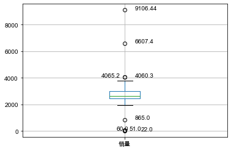
    


{'whiskers': [<matplotlib.lines.Line2D at 0x7ff72a1afed0>, # 上四分位到上界(小于异常值)的线
  <matplotlib.lines.Line2D at 0x7ff72b30c350>],
 'caps': [<matplotlib.lines.Line2D at 0x7ff72b30c790>, # 边界线
  <matplotlib.lines.Line2D at 0x7ff72b30cbd0>],
 'boxes': [<matplotlib.lines.Line2D at 0x7ff72a1afb90>], # 显示四分位数和中位数的置信区间（如果启用的话）（其实就是绕着主体矩形四个顶点环绕一周）
 'medians': [<matplotlib.lines.Line2D at 0x7ff72b315090>], # 每一个box的横隔线
 'fliers': [<matplotlib.lines.Line2D at 0x7ff72b3154d0>], # 所有异常值
 'means': []} # 代表均值的点或线

<h2><a name='3.1.3F'>3.1.3 一致性分析</a></h2>


```python

```

# 3.2 数据特征分析

<p>分布分析能揭示数据的分布特征和分布类型。
对于定量数据(连续)，要想了解其分布形式是对称的还是非对称的、发现某些特大、特小的可疑值。
可以做出频率分布表、绘制频率分布直方图、茎叶图进行直观分析。
对于定性数据(离散)，可以用圆饼图、条形图</p>

<h2><a name='3.2.1F'>3.2.1 分布分析</a></h2>

### 定量数据的分布分析


```python
import pandas as pd
import numpy as np
catering_sale = '../Python数据分析与挖掘实战（第2版）/chapter3/demo/data/catering_fish_congee.xls'
data = pd.read_excel(catering_sale,names=['date','sale']) # 指定’日期‘列为索引

display(data,data.describe())
```


<div>
<style scoped>
    .dataframe tbody tr th:only-of-type {
        vertical-align: middle;
    }

    .dataframe tbody tr th {
        vertical-align: top;
    }

    .dataframe thead th {
        text-align: right;
    }
</style>
<table border="1" class="dataframe">
  <thead>
    <tr style="text-align: right;">
      <th></th>
      <th>date</th>
      <th>sale</th>
    </tr>
  </thead>
  <tbody>
    <tr>
      <th>0</th>
      <td>2014-04-02</td>
      <td>900</td>
    </tr>
    <tr>
      <th>1</th>
      <td>2014-04-03</td>
      <td>1290</td>
    </tr>
    <tr>
      <th>2</th>
      <td>2014-04-04</td>
      <td>420</td>
    </tr>
    <tr>
      <th>3</th>
      <td>2014-04-05</td>
      <td>1710</td>
    </tr>
    <tr>
      <th>4</th>
      <td>2014-04-06</td>
      <td>1290</td>
    </tr>
    <tr>
      <th>...</th>
      <td>...</td>
      <td>...</td>
    </tr>
    <tr>
      <th>85</th>
      <td>2014-06-26</td>
      <td>840</td>
    </tr>
    <tr>
      <th>86</th>
      <td>2014-06-27</td>
      <td>840</td>
    </tr>
    <tr>
      <th>87</th>
      <td>2014-06-28</td>
      <td>1350</td>
    </tr>
    <tr>
      <th>88</th>
      <td>2014-06-29</td>
      <td>1260</td>
    </tr>
    <tr>
      <th>89</th>
      <td>2014-06-30</td>
      <td>2700</td>
    </tr>
  </tbody>
</table>
<p>90 rows × 2 columns</p>
</div>


<div>
<style scoped>
    .dataframe tbody tr th:only-of-type {
        vertical-align: middle;
    }

    .dataframe tbody tr th {
        vertical-align: top;
    }

    .dataframe thead th {
        text-align: right;
    }
</style>
<table border="1" class="dataframe">
  <thead>
    <tr style="text-align: right;">
      <th></th>
      <th>sale</th>
    </tr>
  </thead>
  <tbody>
    <tr>
      <th>count</th>
      <td>90.000000</td>
    </tr>
    <tr>
      <th>mean</th>
      <td>1241.333333</td>
    </tr>
    <tr>
      <th>std</th>
      <td>941.317843</td>
    </tr>
    <tr>
      <th>min</th>
      <td>45.000000</td>
    </tr>
    <tr>
      <th>25%</th>
      <td>420.000000</td>
    </tr>
    <tr>
      <th>50%</th>
      <td>900.000000</td>
    </tr>
    <tr>
      <th>75%</th>
      <td>1792.500000</td>
    </tr>
    <tr>
      <th>max</th>
      <td>3960.000000</td>
    </tr>
  </tbody>
</table>
</div>


```python
bins = list(range(0,4500,500))
labels = ['[0,500)','[500,1000)','[1000,1500)','[1500,2000)',
          '[2000,2500)','[2500,3000)','[3000,3500)','[3500,4000)']

data['sale分层'] = pd.cut(data.sale,bins,labels=labels)

# aggResult = data.groupby(by=['sale分层'])['sale'].agg({'sale':np.size}) pandas版本迭代bug
aggResult = data.groupby(by=['sale分层']).agg(sale=pd.NamedAgg(column='sale',aggfunc='size'))

pAggResult = round(aggResult/aggResult.sum(),2,) * 100
```


```python
import matplotlib.pyplot as plt
plt.figure(figsize=(10,6))
pAggResult['sale'].plot(kind='bar',width=0.8,fontsize=10)
plt.title('季度销售额频率分布直方图',fontsize=20)
plt.show()
```


    
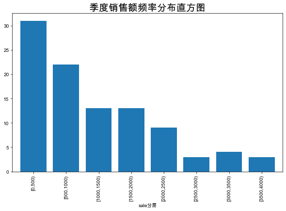
    


### 定性数据的分布分析


```python
catering_dish_profit = '../Python数据分析与挖掘实战（第2版）/chapter3/demo/data/catering_dish_profit.xls'
data = pd.read_excel(catering_dish_profit)
data
```


<div>
<style scoped>
    .dataframe tbody tr th:only-of-type {
        vertical-align: middle;
    }

    .dataframe tbody tr th {
        vertical-align: top;
    }

    .dataframe thead th {
        text-align: right;
    }
</style>
<table border="1" class="dataframe">
  <thead>
    <tr style="text-align: right;">
      <th></th>
      <th>菜品ID</th>
      <th>菜品名</th>
      <th>盈利</th>
    </tr>
  </thead>
  <tbody>
    <tr>
      <th>0</th>
      <td>17148</td>
      <td>A1</td>
      <td>9173</td>
    </tr>
    <tr>
      <th>1</th>
      <td>17154</td>
      <td>A2</td>
      <td>5729</td>
    </tr>
    <tr>
      <th>2</th>
      <td>109</td>
      <td>A3</td>
      <td>4811</td>
    </tr>
    <tr>
      <th>3</th>
      <td>117</td>
      <td>A4</td>
      <td>3594</td>
    </tr>
    <tr>
      <th>4</th>
      <td>17151</td>
      <td>A5</td>
      <td>3195</td>
    </tr>
    <tr>
      <th>5</th>
      <td>14</td>
      <td>A6</td>
      <td>3026</td>
    </tr>
    <tr>
      <th>6</th>
      <td>2868</td>
      <td>A7</td>
      <td>2378</td>
    </tr>
    <tr>
      <th>7</th>
      <td>397</td>
      <td>A8</td>
      <td>1970</td>
    </tr>
    <tr>
      <th>8</th>
      <td>88</td>
      <td>A9</td>
      <td>1877</td>
    </tr>
    <tr>
      <th>9</th>
      <td>426</td>
      <td>A10</td>
      <td>1782</td>
    </tr>
  </tbody>
</table>
</div>


```python
# 绘制饼图
x = data['盈利']
labels = data['菜品名']
plt.figure(figsize=(8,6))
plt.pie(x,labels=labels)
plt.rcParams['font.sans-serif'] = ['Arial Unicode MS']
plt.title('菜品销售量分布(饼图)')
plt.axis('equal')
plt.show()
```


    
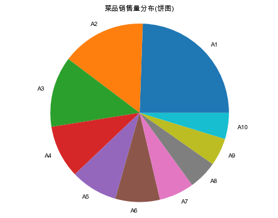
    


```python
# 绘制条形图
x = data['菜品名']
y = data['盈利']

plt.figure(figsize=(8,4))
plt.bar(x,y)
plt.rcParams['font.sans-serif'] = ['Arial Unicode MS']
plt.title('菜品销售量分布(条形图)')
plt.xlabel('菜品')
plt.ylabel('销量')
plt.show()
```


    
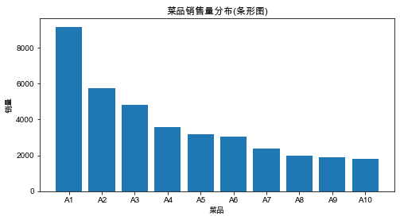
    


<h2><a name='3.2.2F'>3.2.2 对比分析</a></h2>

### 相对数比较


```python
# 部门之间销售金额的比较
import pandas  as pd
import matplotlib.pyplot as plt

data = pd.read_excel('../Python数据分析与挖掘实战（第2版）/chapter3/demo/data/dish_sale.xls')
data
```


<div>
<style scoped>
    .dataframe tbody tr th:only-of-type {
        vertical-align: middle;
    }

    .dataframe tbody tr th {
        vertical-align: top;
    }

    .dataframe thead th {
        text-align: right;
    }
</style>
<table border="1" class="dataframe">
  <thead>
    <tr style="text-align: right;">
      <th></th>
      <th>月份</th>
      <th>A部门</th>
      <th>B部门</th>
      <th>C部门</th>
    </tr>
  </thead>
  <tbody>
    <tr>
      <th>0</th>
      <td>1月</td>
      <td>8.00</td>
      <td>7.70</td>
      <td>5.3</td>
    </tr>
    <tr>
      <th>1</th>
      <td>2月</td>
      <td>6.00</td>
      <td>6.50</td>
      <td>5.2</td>
    </tr>
    <tr>
      <th>2</th>
      <td>3月</td>
      <td>6.89</td>
      <td>7.90</td>
      <td>5.8</td>
    </tr>
    <tr>
      <th>3</th>
      <td>4月</td>
      <td>6.10</td>
      <td>7.50</td>
      <td>6.2</td>
    </tr>
    <tr>
      <th>4</th>
      <td>5月</td>
      <td>6.05</td>
      <td>8.00</td>
      <td>5.9</td>
    </tr>
    <tr>
      <th>5</th>
      <td>6月</td>
      <td>6.01</td>
      <td>7.40</td>
      <td>5.5</td>
    </tr>
    <tr>
      <th>6</th>
      <td>7月</td>
      <td>6.60</td>
      <td>7.50</td>
      <td>6.1</td>
    </tr>
    <tr>
      <th>7</th>
      <td>8月</td>
      <td>6.40</td>
      <td>7.00</td>
      <td>5.7</td>
    </tr>
    <tr>
      <th>8</th>
      <td>9月</td>
      <td>5.80</td>
      <td>7.20</td>
      <td>5.4</td>
    </tr>
    <tr>
      <th>9</th>
      <td>10月</td>
      <td>6.70</td>
      <td>6.60</td>
      <td>5.5</td>
    </tr>
    <tr>
      <th>10</th>
      <td>11月</td>
      <td>6.60</td>
      <td>6.65</td>
      <td>5.6</td>
    </tr>
    <tr>
      <th>11</th>
      <td>12月</td>
      <td>5.30</td>
      <td>5.40</td>
      <td>5.2</td>
    </tr>
  </tbody>
</table>
</div>


```python
plt.rcParams['font.sans-serif'] = ['Arial Unicode MS'] # 用来正常显示中文标签for Mac

plt.figure(figsize=(8,4))
plt.plot(data['月份'],data['A部门'],color='green',label='A部门',marker='o')
plt.plot(data['月份'],data['B部门'],color='red',label='B部门',marker='s')
plt.plot(data['月份'],data['C部门'],color='skyblue',label='C部门',marker='x')

plt.legend() # 显示图例
plt.ylabel('销售额(万元)')
plt.show()
```


    
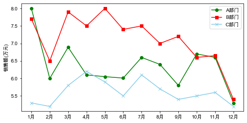
    


```python
# B部门各年份之间销售额的比较
data = pd.read_excel('../Python数据分析与挖掘实战（第2版）/chapter3/demo/data/dish_sale_b.xls')
data
```


<div>
<style scoped>
    .dataframe tbody tr th:only-of-type {
        vertical-align: middle;
    }

    .dataframe tbody tr th {
        vertical-align: top;
    }

    .dataframe thead th {
        text-align: right;
    }
</style>
<table border="1" class="dataframe">
  <thead>
    <tr style="text-align: right;">
      <th></th>
      <th>月份</th>
      <th>2014年</th>
      <th>2013年</th>
      <th>2012年</th>
    </tr>
  </thead>
  <tbody>
    <tr>
      <th>0</th>
      <td>1月</td>
      <td>7.90</td>
      <td>7.70</td>
      <td>5.3</td>
    </tr>
    <tr>
      <th>1</th>
      <td>2月</td>
      <td>6.00</td>
      <td>6.50</td>
      <td>5.2</td>
    </tr>
    <tr>
      <th>2</th>
      <td>3月</td>
      <td>6.89</td>
      <td>7.90</td>
      <td>5.8</td>
    </tr>
    <tr>
      <th>3</th>
      <td>4月</td>
      <td>7.30</td>
      <td>7.50</td>
      <td>6.2</td>
    </tr>
    <tr>
      <th>4</th>
      <td>5月</td>
      <td>7.60</td>
      <td>8.00</td>
      <td>5.9</td>
    </tr>
    <tr>
      <th>5</th>
      <td>6月</td>
      <td>7.20</td>
      <td>7.40</td>
      <td>5.5</td>
    </tr>
    <tr>
      <th>6</th>
      <td>7月</td>
      <td>7.40</td>
      <td>7.50</td>
      <td>6.1</td>
    </tr>
    <tr>
      <th>7</th>
      <td>8月</td>
      <td>7.80</td>
      <td>7.00</td>
      <td>5.7</td>
    </tr>
    <tr>
      <th>8</th>
      <td>9月</td>
      <td>7.00</td>
      <td>7.20</td>
      <td>5.4</td>
    </tr>
    <tr>
      <th>9</th>
      <td>10月</td>
      <td>6.70</td>
      <td>6.60</td>
      <td>5.5</td>
    </tr>
    <tr>
      <th>10</th>
      <td>11月</td>
      <td>6.60</td>
      <td>6.65</td>
      <td>5.6</td>
    </tr>
    <tr>
      <th>11</th>
      <td>12月</td>
      <td>6.30</td>
      <td>6.40</td>
      <td>5.2</td>
    </tr>
  </tbody>
</table>
</div>


```python
plt.figure(figsize=(8,4))
plt.plot(data['月份'],data['2012年'],color='green',label='2012年',marker='o')
plt.plot(data['月份'],data['2013年'],color='red',label='2013年',marker='s')
plt.plot(data['月份'],data['2014年'],color='skyblue',label='2014年',marker='x')

plt.legend() # 显示图例
plt.ylabel('销售额(万元)')
plt.show()
```


    
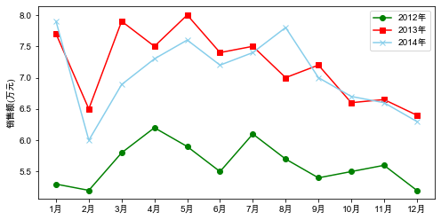
    


<h2><a name='3.2.3F'>3.2.3 统计量分析</a></h2>


```python
# 餐饮销量数据统计量分析
import pandas as pd

catering_sale = '../Python数据分析与挖掘实战（第2版）/chapter3/demo/data/catering_sale.xls'
data = pd.read_excel(catering_sale,index_col = '日期') # 指定“日期”为索引列
data
```


<div>
<style scoped>
    .dataframe tbody tr th:only-of-type {
        vertical-align: middle;
    }

    .dataframe tbody tr th {
        vertical-align: top;
    }

    .dataframe thead th {
        text-align: right;
    }
</style>
<table border="1" class="dataframe">
  <thead>
    <tr style="text-align: right;">
      <th></th>
      <th>销量</th>
    </tr>
    <tr>
      <th>日期</th>
      <th></th>
    </tr>
  </thead>
  <tbody>
    <tr>
      <th>2015-03-01</th>
      <td>51.0</td>
    </tr>
    <tr>
      <th>2015-02-28</th>
      <td>2618.2</td>
    </tr>
    <tr>
      <th>2015-02-27</th>
      <td>2608.4</td>
    </tr>
    <tr>
      <th>2015-02-26</th>
      <td>2651.9</td>
    </tr>
    <tr>
      <th>2015-02-25</th>
      <td>3442.1</td>
    </tr>
    <tr>
      <th>...</th>
      <td>...</td>
    </tr>
    <tr>
      <th>2014-08-06</th>
      <td>2915.8</td>
    </tr>
    <tr>
      <th>2014-08-05</th>
      <td>2618.1</td>
    </tr>
    <tr>
      <th>2014-08-04</th>
      <td>2993.0</td>
    </tr>
    <tr>
      <th>2014-08-03</th>
      <td>3436.4</td>
    </tr>
    <tr>
      <th>2014-08-02</th>
      <td>2261.7</td>
    </tr>
  </tbody>
</table>
<p>201 rows × 1 columns</p>
</div>


```python
data = data[(data['销量'] > 400) & (data['销量'] < 5000)] # 过滤异常数据
statistics = data.describe() # 保存基本统计量
statistics
```


<div>
<style scoped>
    .dataframe tbody tr th:only-of-type {
        vertical-align: middle;
    }

    .dataframe tbody tr th {
        vertical-align: top;
    }

    .dataframe thead th {
        text-align: right;
    }
</style>
<table border="1" class="dataframe">
  <thead>
    <tr style="text-align: right;">
      <th></th>
      <th>销量</th>
    </tr>
  </thead>
  <tbody>
    <tr>
      <th>count</th>
      <td>195.000000</td>
    </tr>
    <tr>
      <th>mean</th>
      <td>2744.595385</td>
    </tr>
    <tr>
      <th>std</th>
      <td>424.739407</td>
    </tr>
    <tr>
      <th>min</th>
      <td>865.000000</td>
    </tr>
    <tr>
      <th>25%</th>
      <td>2460.600000</td>
    </tr>
    <tr>
      <th>50%</th>
      <td>2655.900000</td>
    </tr>
    <tr>
      <th>75%</th>
      <td>3023.200000</td>
    </tr>
    <tr>
      <th>max</th>
      <td>4065.200000</td>
    </tr>
  </tbody>
</table>
</div>


```python
statistics.loc['range'] = statistics.loc['max'] - statistics.loc['min'] # 极差
statistics.loc['var'] = statistics.loc['std'] / statistics.loc['mean'] # 变异系数
statistics.loc['dis'] = statistics.loc['75%'] - statistics.loc['25%'] # 四分位数间距

statistics
```


<div>
<style scoped>
    .dataframe tbody tr th:only-of-type {
        vertical-align: middle;
    }

    .dataframe tbody tr th {
        vertical-align: top;
    }

    .dataframe thead th {
        text-align: right;
    }
</style>
<table border="1" class="dataframe">
  <thead>
    <tr style="text-align: right;">
      <th></th>
      <th>销量</th>
    </tr>
  </thead>
  <tbody>
    <tr>
      <th>count</th>
      <td>195.000000</td>
    </tr>
    <tr>
      <th>mean</th>
      <td>2744.595385</td>
    </tr>
    <tr>
      <th>std</th>
      <td>424.739407</td>
    </tr>
    <tr>
      <th>min</th>
      <td>865.000000</td>
    </tr>
    <tr>
      <th>25%</th>
      <td>2460.600000</td>
    </tr>
    <tr>
      <th>50%</th>
      <td>2655.900000</td>
    </tr>
    <tr>
      <th>75%</th>
      <td>3023.200000</td>
    </tr>
    <tr>
      <th>max</th>
      <td>4065.200000</td>
    </tr>
    <tr>
      <th>range</th>
      <td>3200.200000</td>
    </tr>
    <tr>
      <th>var</th>
      <td>0.154755</td>
    </tr>
    <tr>
      <th>dis</th>
      <td>562.600000</td>
    </tr>
  </tbody>
</table>
</div>


<h2><a name='3.2.4F'>3.2.4 周期性分析</a></h2>


```python
import pandas as pd
import matplotlib.pyplot as plt

df_normal = pd.read_csv('../Python数据分析与挖掘实战（第2版）/chapter3/demo/data/user.csv')
df_normal.head()
```


<div>
<style scoped>
    .dataframe tbody tr th:only-of-type {
        vertical-align: middle;
    }

    .dataframe tbody tr th {
        vertical-align: top;
    }

    .dataframe thead th {
        text-align: right;
    }
</style>
<table border="1" class="dataframe">
  <thead>
    <tr style="text-align: right;">
      <th></th>
      <th>Date</th>
      <th>Eletricity</th>
    </tr>
  </thead>
  <tbody>
    <tr>
      <th>0</th>
      <td>2012/2/1</td>
      <td>6200</td>
    </tr>
    <tr>
      <th>1</th>
      <td>2012/2/2</td>
      <td>6440</td>
    </tr>
    <tr>
      <th>2</th>
      <td>2012/2/3</td>
      <td>6440</td>
    </tr>
    <tr>
      <th>3</th>
      <td>2012/2/4</td>
      <td>4293</td>
    </tr>
    <tr>
      <th>4</th>
      <td>2012/2/5</td>
      <td>2146</td>
    </tr>
  </tbody>
</table>
</div>


```python
plt.rcParams['font.sans-serif'] = ['Arial Unicode MS'] # 用来正常显示中文标签for Mac

plt.figure(figsize=(8,4))
plt.plot(df_normal['Date'],df_normal['Eletricity'])
plt.xlabel('日期')
plt.ylabel('每日电量')
plt.title('正常用户电量趋势')

# 设置x轴刻度间隔
x_major_locator = plt.MultipleLocator(7)
ax = plt.gca()
ax.xaxis.set_major_locator(x_major_locator)

plt.show()
```


    
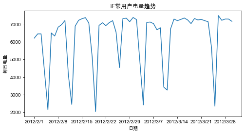
    


```python
# 窃电用户用电趋势分析
df_steal = pd.read_csv('../Python数据分析与挖掘实战（第2版）/chapter3/demo/data/Steal user.csv')
df_steal.head()
```


<div>
<style scoped>
    .dataframe tbody tr th:only-of-type {
        vertical-align: middle;
    }

    .dataframe tbody tr th {
        vertical-align: top;
    }

    .dataframe thead th {
        text-align: right;
    }
</style>
<table border="1" class="dataframe">
  <thead>
    <tr style="text-align: right;">
      <th></th>
      <th>Date</th>
      <th>Eletricity</th>
    </tr>
  </thead>
  <tbody>
    <tr>
      <th>0</th>
      <td>2012/2/1</td>
      <td>6100</td>
    </tr>
    <tr>
      <th>1</th>
      <td>2012/2/2</td>
      <td>6312</td>
    </tr>
    <tr>
      <th>2</th>
      <td>2012/2/3</td>
      <td>6240</td>
    </tr>
    <tr>
      <th>3</th>
      <td>2012/2/4</td>
      <td>4293</td>
    </tr>
    <tr>
      <th>4</th>
      <td>2012/2/5</td>
      <td>3346</td>
    </tr>
  </tbody>
</table>
</div>


```python
plt.figure(figsize=(10,9))
plt.plot(df_steal['Date'],df_steal['Eletricity'])

plt.xlabel('日期')
plt.ylabel('每日电量')
plt.title('窃电用户电量趋势')

# 设置x轴刻度间隔
x_major_locator = plt.MultipleLocator(7)
ax = plt.gca()
ax.xaxis.set_major_locator(x_major_locator)

plt.rcParams['font.sans-serif'] = ['Arial Unicode MS'] # 用来正常显示中文标签for Mac


plt.show()
```


    
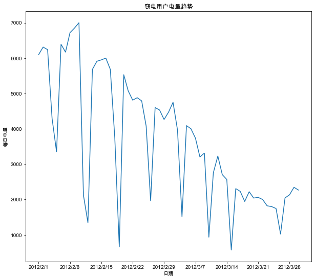
    


<h2><a name='3.2.5F'>3.2.5 贡献度分析</a></h2>


```python
# 菜品盈利数据帕累托图
import pandas as pd

# 初始化参数
dish_profit = '../Python数据分析与挖掘实战（第2版）/chapter3/demo/data/catering_dish_profit.xls'
data = pd.read_excel(dish_profit,index_col='菜品名')
data = data['盈利'].copy()
data.sort_values(ascending=False)
```


    菜品名
    A1     9173
    A2     5729
    A3     4811
    A4     3594
    A5     3195
    A6     3026
    A7     2378
    A8     1970
    A9     1877
    A10    1782
    Name: 盈利, dtype: int64


```python
import matplotlib.pyplot as plt

plt.rcParams['font.sans-serif'] = ['Arial Unicode MS'] # 用来正常显示中文标签for Mac
plt.rcParams['axes.unicode_minus'] = False # 用来正常显示负号

plt.figure()

data.plot(kind='bar')
plt.ylabel('盈利(元)')

p = 1.0* data.cumsum() / data.sum()
p.plot(color='r',secondary_y=True,style='-o',linewidth=2)
plt.ylabel('盈利(比例)')

plt.annotate(format(p[6],'.4%'),xy=(6,p[6]),xytext=(6.4,p[6]*0.8),
             arrowprops=dict(facecolor='black',shrink=0.05,width=2,headwidth=6))

plt.show()
```


    
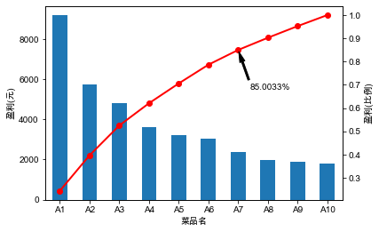
    


<h2><a name='3.2.6F'>3.2.6 相关性分析</a></h2>


```python
# 餐饮销量数据相关性分析
import pandas as pd

catering_sale = '../Python数据分析与挖掘实战（第2版）/chapter3/demo/data/catering_sale_all.xls'
data = pd.read_excel(catering_sale,index_col = '日期')

data.head()
```


<div>
<style scoped>
    .dataframe tbody tr th:only-of-type {
        vertical-align: middle;
    }

    .dataframe tbody tr th {
        vertical-align: top;
    }

    .dataframe thead th {
        text-align: right;
    }
</style>
<table border="1" class="dataframe">
  <thead>
    <tr style="text-align: right;">
      <th></th>
      <th>百合酱蒸凤爪</th>
      <th>翡翠蒸香茜饺</th>
      <th>金银蒜汁蒸排骨</th>
      <th>乐膳真味鸡</th>
      <th>蜜汁焗餐包</th>
      <th>生炒菜心</th>
      <th>铁板酸菜豆腐</th>
      <th>香煎韭菜饺</th>
      <th>香煎罗卜糕</th>
      <th>原汁原味菜心</th>
    </tr>
    <tr>
      <th>日期</th>
      <th></th>
      <th></th>
      <th></th>
      <th></th>
      <th></th>
      <th></th>
      <th></th>
      <th></th>
      <th></th>
      <th></th>
    </tr>
  </thead>
  <tbody>
    <tr>
      <th>2015-01-01</th>
      <td>17</td>
      <td>6</td>
      <td>8</td>
      <td>24</td>
      <td>13.0</td>
      <td>13</td>
      <td>18</td>
      <td>10</td>
      <td>10</td>
      <td>27</td>
    </tr>
    <tr>
      <th>2015-01-02</th>
      <td>11</td>
      <td>15</td>
      <td>14</td>
      <td>13</td>
      <td>9.0</td>
      <td>10</td>
      <td>19</td>
      <td>13</td>
      <td>14</td>
      <td>13</td>
    </tr>
    <tr>
      <th>2015-01-03</th>
      <td>10</td>
      <td>8</td>
      <td>12</td>
      <td>13</td>
      <td>8.0</td>
      <td>3</td>
      <td>7</td>
      <td>11</td>
      <td>10</td>
      <td>9</td>
    </tr>
    <tr>
      <th>2015-01-04</th>
      <td>9</td>
      <td>6</td>
      <td>6</td>
      <td>3</td>
      <td>10.0</td>
      <td>9</td>
      <td>9</td>
      <td>13</td>
      <td>14</td>
      <td>13</td>
    </tr>
    <tr>
      <th>2015-01-05</th>
      <td>4</td>
      <td>10</td>
      <td>13</td>
      <td>8</td>
      <td>12.0</td>
      <td>10</td>
      <td>17</td>
      <td>11</td>
      <td>13</td>
      <td>14</td>
    </tr>
  </tbody>
</table>
</div>


```python
# data.corr() 相关系数矩阵，任意两款菜式之间的相关系数
# data.corr()['百合酱蒸凤爪'] 只显示“百合酱蒸凤爪”与其他菜式的相关系数
# data['百合酱蒸凤爪'].corr(data['翡翠蒸香茜饺']) 计算‘百合酱蒸凤爪’与‘翡翠蒸香茜饺’的相关系数
display(data.corr(),data.corr()['百合酱蒸凤爪'],data['百合酱蒸凤爪'].corr(data['翡翠蒸香茜饺']))
```


<div>
<style scoped>
    .dataframe tbody tr th:only-of-type {
        vertical-align: middle;
    }

    .dataframe tbody tr th {
        vertical-align: top;
    }

    .dataframe thead th {
        text-align: right;
    }
</style>
<table border="1" class="dataframe">
  <thead>
    <tr style="text-align: right;">
      <th></th>
      <th>百合酱蒸凤爪</th>
      <th>翡翠蒸香茜饺</th>
      <th>金银蒜汁蒸排骨</th>
      <th>乐膳真味鸡</th>
      <th>蜜汁焗餐包</th>
      <th>生炒菜心</th>
      <th>铁板酸菜豆腐</th>
      <th>香煎韭菜饺</th>
      <th>香煎罗卜糕</th>
      <th>原汁原味菜心</th>
    </tr>
  </thead>
  <tbody>
    <tr>
      <th>百合酱蒸凤爪</th>
      <td>1.000000</td>
      <td>0.009206</td>
      <td>0.016799</td>
      <td>0.455638</td>
      <td>0.098085</td>
      <td>0.308496</td>
      <td>0.204898</td>
      <td>0.127448</td>
      <td>-0.090276</td>
      <td>0.428316</td>
    </tr>
    <tr>
      <th>翡翠蒸香茜饺</th>
      <td>0.009206</td>
      <td>1.000000</td>
      <td>0.304434</td>
      <td>-0.012279</td>
      <td>0.058745</td>
      <td>-0.180446</td>
      <td>-0.026908</td>
      <td>0.062344</td>
      <td>0.270276</td>
      <td>0.020462</td>
    </tr>
    <tr>
      <th>金银蒜汁蒸排骨</th>
      <td>0.016799</td>
      <td>0.304434</td>
      <td>1.000000</td>
      <td>0.035135</td>
      <td>0.096218</td>
      <td>-0.184290</td>
      <td>0.187272</td>
      <td>0.121543</td>
      <td>0.077808</td>
      <td>0.029074</td>
    </tr>
    <tr>
      <th>乐膳真味鸡</th>
      <td>0.455638</td>
      <td>-0.012279</td>
      <td>0.035135</td>
      <td>1.000000</td>
      <td>0.016006</td>
      <td>0.325462</td>
      <td>0.297692</td>
      <td>-0.068866</td>
      <td>-0.030222</td>
      <td>0.421878</td>
    </tr>
    <tr>
      <th>蜜汁焗餐包</th>
      <td>0.098085</td>
      <td>0.058745</td>
      <td>0.096218</td>
      <td>0.016006</td>
      <td>1.000000</td>
      <td>0.308454</td>
      <td>0.502025</td>
      <td>0.155428</td>
      <td>0.171005</td>
      <td>0.527844</td>
    </tr>
    <tr>
      <th>生炒菜心</th>
      <td>0.308496</td>
      <td>-0.180446</td>
      <td>-0.184290</td>
      <td>0.325462</td>
      <td>0.308454</td>
      <td>1.000000</td>
      <td>0.369787</td>
      <td>0.038233</td>
      <td>0.049898</td>
      <td>0.122988</td>
    </tr>
    <tr>
      <th>铁板酸菜豆腐</th>
      <td>0.204898</td>
      <td>-0.026908</td>
      <td>0.187272</td>
      <td>0.297692</td>
      <td>0.502025</td>
      <td>0.369787</td>
      <td>1.000000</td>
      <td>0.095543</td>
      <td>0.157958</td>
      <td>0.567332</td>
    </tr>
    <tr>
      <th>香煎韭菜饺</th>
      <td>0.127448</td>
      <td>0.062344</td>
      <td>0.121543</td>
      <td>-0.068866</td>
      <td>0.155428</td>
      <td>0.038233</td>
      <td>0.095543</td>
      <td>1.000000</td>
      <td>0.178336</td>
      <td>0.049689</td>
    </tr>
    <tr>
      <th>香煎罗卜糕</th>
      <td>-0.090276</td>
      <td>0.270276</td>
      <td>0.077808</td>
      <td>-0.030222</td>
      <td>0.171005</td>
      <td>0.049898</td>
      <td>0.157958</td>
      <td>0.178336</td>
      <td>1.000000</td>
      <td>0.088980</td>
    </tr>
    <tr>
      <th>原汁原味菜心</th>
      <td>0.428316</td>
      <td>0.020462</td>
      <td>0.029074</td>
      <td>0.421878</td>
      <td>0.527844</td>
      <td>0.122988</td>
      <td>0.567332</td>
      <td>0.049689</td>
      <td>0.088980</td>
      <td>1.000000</td>
    </tr>
  </tbody>
</table>
</div>


    百合酱蒸凤爪     1.000000
    翡翠蒸香茜饺     0.009206
    金银蒜汁蒸排骨    0.016799
    乐膳真味鸡      0.455638
    蜜汁焗餐包      0.098085
    生炒菜心       0.308496
    铁板酸菜豆腐     0.204898
    香煎韭菜饺      0.127448
    香煎罗卜糕     -0.090276
    原汁原味菜心     0.428316
    Name: 百合酱蒸凤爪, dtype: float64


    0.009205803051836475


# 3.3 Python主要数据探索函数

<h2><a name='3.3.1F'>3.3.1基本统计函数</a></h2>

<div align='center'><font size='3' color='#e38b00'>pandas主要统计特征函数</font></div>

| 方法名 | 函数功能 | 使用格式 |
| :--- | :--- | :--- |
| sum() | 计算数据样本的总和(按列计算) | D.sum() |
| mean() | 计算数据样本的算术平均数 | D.mean() |
| var() | 计算数据样本的方差 | D.var() |
| std() | 计算数据样本的标准差 | D.std() |
| corr() | 计算数据样本的Spearman(Pearson)相关系数矩阵 | D.corr(method='pearson);S1.corr(S2,method='pearson') |
| cov() | 计算数据样本的协方差矩阵 | D.cov();S1.cov(S2) |
| skew() | 样本值的偏度(三阶矩) | D.skew() |
| kurt() | 样本值的峰度(四阶矩 | D.kurt() |
| describe() | 给出样本的基本描述 | D.describe() |

<p><font color='#b10053'>* D可以为DataFrame或者Series/S均为Series</font></p>


```python
# 计算两个列向量的相关系数
import pandas as pd

D = pd.DataFrame([range(1,8),range(2,9)]) # 生成样本D，一行为1～7，一行为2～8

S1 = D.loc[0] # 提取第一行
S2 = D.loc[1] # 提取第二行

# D.corr(method='spearman') 计算相关系数矩阵
# S1.corr(S2,method='pearson') 计算S1，S2的相关系数
display(D.corr(method='spearman'),S1.corr(S2,method='pearson'))
```


<div>
<style scoped>
    .dataframe tbody tr th:only-of-type {
        vertical-align: middle;
    }

    .dataframe tbody tr th {
        vertical-align: top;
    }

    .dataframe thead th {
        text-align: right;
    }
</style>
<table border="1" class="dataframe">
  <thead>
    <tr style="text-align: right;">
      <th></th>
      <th>0</th>
      <th>1</th>
      <th>2</th>
      <th>3</th>
      <th>4</th>
      <th>5</th>
      <th>6</th>
    </tr>
  </thead>
  <tbody>
    <tr>
      <th>0</th>
      <td>1.0</td>
      <td>1.0</td>
      <td>1.0</td>
      <td>1.0</td>
      <td>1.0</td>
      <td>1.0</td>
      <td>1.0</td>
    </tr>
    <tr>
      <th>1</th>
      <td>1.0</td>
      <td>1.0</td>
      <td>1.0</td>
      <td>1.0</td>
      <td>1.0</td>
      <td>1.0</td>
      <td>1.0</td>
    </tr>
    <tr>
      <th>2</th>
      <td>1.0</td>
      <td>1.0</td>
      <td>1.0</td>
      <td>1.0</td>
      <td>1.0</td>
      <td>1.0</td>
      <td>1.0</td>
    </tr>
    <tr>
      <th>3</th>
      <td>1.0</td>
      <td>1.0</td>
      <td>1.0</td>
      <td>1.0</td>
      <td>1.0</td>
      <td>1.0</td>
      <td>1.0</td>
    </tr>
    <tr>
      <th>4</th>
      <td>1.0</td>
      <td>1.0</td>
      <td>1.0</td>
      <td>1.0</td>
      <td>1.0</td>
      <td>1.0</td>
      <td>1.0</td>
    </tr>
    <tr>
      <th>5</th>
      <td>1.0</td>
      <td>1.0</td>
      <td>1.0</td>
      <td>1.0</td>
      <td>1.0</td>
      <td>1.0</td>
      <td>1.0</td>
    </tr>
    <tr>
      <th>6</th>
      <td>1.0</td>
      <td>1.0</td>
      <td>1.0</td>
      <td>1.0</td>
      <td>1.0</td>
      <td>1.0</td>
      <td>1.0</td>
    </tr>
  </tbody>
</table>
</div>


    1.0


```python
# 计算6x5随机矩阵的协方差矩阵
import numpy as np
D = pd.DataFrame(np.random.randn(6,5))

display(D.cov(),D.kurt())
```


<div>
<style scoped>
    .dataframe tbody tr th:only-of-type {
        vertical-align: middle;
    }

    .dataframe tbody tr th {
        vertical-align: top;
    }

    .dataframe thead th {
        text-align: right;
    }
</style>
<table border="1" class="dataframe">
  <thead>
    <tr style="text-align: right;">
      <th></th>
      <th>0</th>
      <th>1</th>
      <th>2</th>
      <th>3</th>
      <th>4</th>
    </tr>
  </thead>
  <tbody>
    <tr>
      <th>0</th>
      <td>0.429872</td>
      <td>-0.119974</td>
      <td>0.105690</td>
      <td>-0.491922</td>
      <td>-0.196725</td>
    </tr>
    <tr>
      <th>1</th>
      <td>-0.119974</td>
      <td>0.309938</td>
      <td>-0.207065</td>
      <td>0.146799</td>
      <td>0.482871</td>
    </tr>
    <tr>
      <th>2</th>
      <td>0.105690</td>
      <td>-0.207065</td>
      <td>0.351422</td>
      <td>0.158777</td>
      <td>-0.296442</td>
    </tr>
    <tr>
      <th>3</th>
      <td>-0.491922</td>
      <td>0.146799</td>
      <td>0.158777</td>
      <td>1.163255</td>
      <td>0.236151</td>
    </tr>
    <tr>
      <th>4</th>
      <td>-0.196725</td>
      <td>0.482871</td>
      <td>-0.296442</td>
      <td>0.236151</td>
      <td>0.763513</td>
    </tr>
  </tbody>
</table>
</div>


    0    4.731063
    1    0.069482
    2   -1.767796
    3   -1.248088
    4   -0.325073
    dtype: float64


<h2><a name='3.3.2F'>3.3.2拓展统计特征函数</a></h2>

<p>累计计算(cum)和滚动计算(pd.rolling_)</p></br>
<p>其中，cum系列函数是作为DataFrame或Series对象的方法出现，因此命令格式为D.cumsum()，而rolling_系列函数是pandas的函数，不是DataFrame或Series对象的方法，因此，它们的使用形式为pd.rolling_mean(D,k)，意思是每k列计算一次均值</p>


```python
D = pd.Series(range(0,10)) # 构造Series，内容为0～19共20个数

# D.cumsum() 给出前n项和
# D.rolling(2).sum() 依次对相邻两项求和

display(D.cumsum(),D.rolling(2).sum())
```


    0     0
    1     1
    2     3
    3     6
    4    10
    5    15
    6    21
    7    28
    8    36
    9    45
    dtype: int64


    0     NaN
    1     1.0
    2     3.0
    3     5.0
    4     7.0
    5     9.0
    6    11.0
    7    13.0
    8    15.0
    9    17.0
    dtype: float64


<h2><a name='3.3.3F'>3.3.3统计绘图函数</a></h2>

<div align='center'><font size='3' color='#e38b00'>pandas主要统计绘图函数</font></div>

| 绘图函数名 | 绘图函数功能 | 使用格式 |
| :--- | :--- | :--- |
| plot() | 绘制线性二维图，折线图 | plt.plot(x,y,S$)^{1}$ D.plot(kind='bar') |
| pie() | 绘制饼图 | plt.pie(size) |
| hist() | 绘制二维条形直方图，可显示数据的分配情况 | plt.hist(x,y) |
| boxplot() | 绘制样本数据的箱型图 | D.boxplot();D.plot(kind='box') |
| plot(logy=True) | 绘制y轴的对数图形 | D.plot(logx=True);D.plot(logy=True$)^{2}$ |
| plot(yerr=error) | 绘制误差条形图 | D.plot(yerr=error) |

<p><font color='#b10053'>*1 S指定绘制时图形的类型、样式和颜色。'b','r','g','o','+','-','--'</font></p>
<p><font color='#b10053'>*2 对x(y)轴使用对数刻度(以10为底)</font></p>


```python
# 绘图之前需要加载的代码
import matplotlib.pyplot as plt

plt.rcParams['font.sans-serif'] = ['Arial Unicode MS'] # 用来正常显示中文标签for Mac
plt.rcParams['axes.unicode_minus'] = False
plt.figure(figsize=(7,5))
```


    <Figure size 504x360 with 0 Axes>


    <Figure size 504x360 with 0 Axes>


### 绘制一条蓝色的正弦虚线


```python
import numpy as np

x = np.linspace(0,2*np.pi,50) # x坐标输入
y = np.sin(x) # 计算对应x的正弦值

plt.plot(x,y,'bp--') # 控制图形格式为蓝色带星虚线，显示正弦曲线
plt.show()
```


    
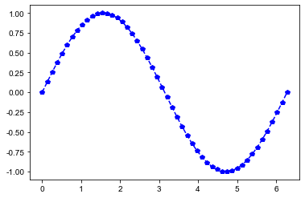
    


### 绘制饼图


```python
labels = 'Frogs','Hogs','Dogs','Logs'
sizes = [15,30,45,10] # 每一块的比例
colors = ['yellowgreen','gold','lightskyblue','lightcoral']
explode = (0 , 0.1 , 0 , 0) # 突出显示，这里仅突出显示'Hogs'

plt.pie(sizes,explode=explode,labels=labels,colors=colors,autopct='%1.1f%%',shadow=True,startangle=90)
plt.axis('equal') # 显示为圆(避免比例压缩为椭圆)
plt.show()
```


    
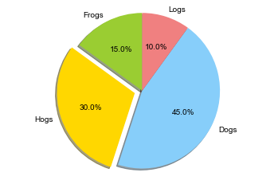
    


### 绘制二维条形直方图


```python
x = np.random.randn(1000) # 1000个服从正态分布的随机数
plt.hist(x,10) # 分成10组绘制直方图
plt.show()
```


    
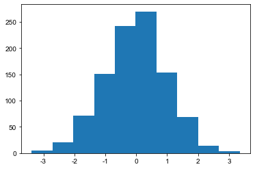
    


### 绘制箱型图


```python
x = np.random.randn(1000) # 1000个服从正态分布的随机数
D = pd.DataFrame([x,x+1]).T # 构造两列的DataFrame
D.plot(kind='box') # 调用Series内置的绘图方法画图，用kind参数指定箱型图(box)

plt.show()
```


    
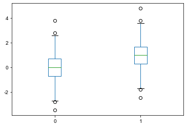
    


### 使用plot(logy=True)函数进行绘图


```python
x = pd.Series(np.exp(np.arange(20))) # data
plt.figure(figsize=(8,9))
ax1 = plt.subplot(2,1,1)
x.plot(label='原始数据图',legend=True)

ax1 = plt.subplot(2,1,2)
x.plot(logy=True,label='对数数据图',legend=True)

plt.show()
```


    
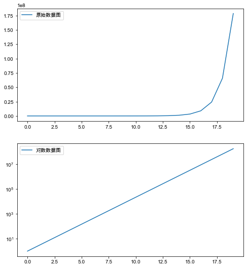
    


### 绘制误差棒图


```python
error = np.random.randn(10) # 定义误差列
y = pd.Series(np.sin(np.arange(10))) # 均值数据列
y.plot(yerr=error) # 绘制误差图

plt.show
```


    <function matplotlib.pyplot.show(close=None, block=None)>


    
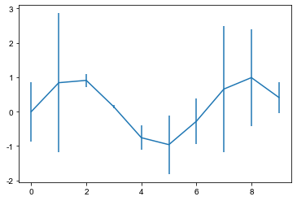
    

