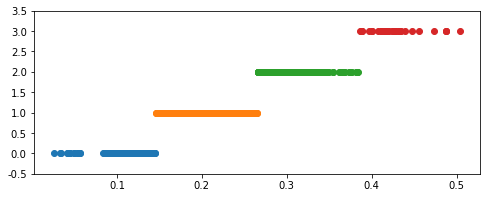
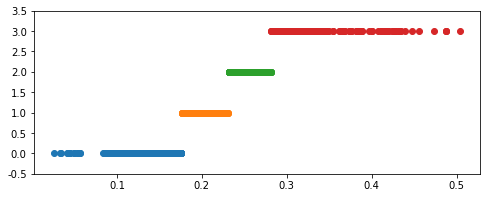
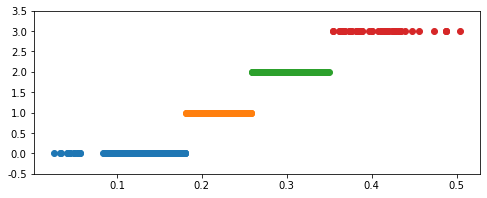

<font size="5" color="#f76a57">第4章 数据预处理目录:</font><br/>
<div>
    <h3>4.1 数据清洗</h3>
    <ul>
        <li><a href='#4.1.1F'>4.1.1 缺失值处理</a></li>
        <li><a href='#4.1.2F'>4.1.2 异常值处理</a></li>
    </ul>
    <h3>4.2 数据集成</h3>
    <ul>
        <font size="2" color="#FF8C00">
        <li><a href='#4.2.1F'>4.2.1 实体识别</a></li>
        <li><a href='#4.2.2F'>4.2.2 冗余属性识别</a></li>
        <li><a href='#4.2.3F'>4.2.3 数据变换</a></li>
        <li><a href='#4.2.4F'>4.2.4 简单函数变换</a></li>
        <li><a href='#4.2.5F'>4.2.5 规范化</a></li>
        <li><a href='#4.2.6F'>4.2.6 连续属性离散化</a></li>
        <li><a href='#4.2.6F'>4.2.7 属性构造</a></li>
        <li><a href='#4.2.6F'>4.2.8 小波变换</a></li>
        </font>
    </ul>
    <h3>4.3 Python主要数据探索函数</h3>
    <ul>
        <font size="2" color="#FF8C00">
        <li><a href='#4.3.1F'>4.3.1 属性规约</a></li>
        <li><a href='#4.3.2F'>4.3.2 数值规约</a></li>
        </font>
    </ul>
    <h3>4.4 Python主要数据预处理函数</h3>
</div>

<h2><a name='4.1.1F'>4.1.1 缺失值处理</a></h2>

<p>处理缺失值的方法可分为3类：删除记录、数据插补、不处理。其中常用处理插补</p>
<div align='center'>
    <font size='3' color='#e38b00'>
    常用的数据插补方法
    </font>
</div>

| 插补方法 | 方法描述 |
| :--- | :--- |
| 均值/中位数/众数 | 根据属性值的类型，用该属性取值的平均数/中位数/众数进行插补 |
| 使用固定值 | 将缺失的属性用一个常量替换 |
| 最近临插补 | 在记录中找到与缺失样本最接近的样本的该属性值插补 |
| 回归方法 | 对带有缺失值的变量，根据已有数据与其有关的其他变量(因变量)的数据建立拟合模型来预测缺失的属性值 |
| 插值法 | 插值法是利用已知点建立合适的插值函数$f(x)$，未知值由对应点$x_i$求出的函数$f(x_{i})$近似代替 |

<div align='center'>拉格朗日插值多项式</div>
$$ y=\sum_{i=0}^{n} y_{i} \left ( \prod_{j=0,j\neq i}^{n} \frac{x-x_{j}}{x_{i}-x_{j}} \right ) $$
<hr>
<div align='center'>牛顿插值多项式</div>
$$ N_{n}\left ( x \right )=f\left [ x_{0} \right ]w_{0}\left ( x \right )+f\left [ x_{0},x_{1} \right ]w_{1}\left ( x \right )+...+f\left [ x_{0},x_{1},...,x_{n} \right ]w_{n}\left ( x \right ) $$
<div align='center'>余项公式</div>
$$ R_{n}\left ( x \right ) = f\left [ x,x_{0},x_{1},...,x_{n} \right ]w_{n+1}\left ( x \right ) $$

### 用拉格朗日插值对缺失值进行插补


```python
import pandas as pd
from scipy.interpolate import lagrange

inputfile = '../Python数据分析与挖掘实战（第2版）/chapter4/demo/data/catering_sale.xls'
outputfile = './tmp/ch4_sales.xls' # 输出数据路径

data = pd.read_excel(inputfile)
data.head()
```


```python
data['销量'][(data['销量'] < 400) | (data['销量'] > 5000)] = None # 过滤异常值，将其变为空值
```


```python
# 自定义列向量插值函数
# s为列向量，n为被插值的位置，k为取前后的数据个数，默认为5
def ployinterp_column(s,n,k=5):
    # y = s[list(range(n-k,n)) + list(range(n+1,n+1+k))] error!
    y = s.reindex(list(range(n-k, n)) + list(range(n+1, n+1+k))) # 取数
    y = y[y.notnull()] # 剔除空值
    
    return lagrange(y.index,list(y))(n) # 插值并返回插值结果

for i in data.columns:
    for j in range(len(data)):
        if (data[i].isnull())[j]:
            data[i][j] = ployinterp_column(data[i],j)

data.to_excel(outputfile)
```


```python
data_test = pd.read_excel(outputfile)
data
```

<h2><a name='4.1.2F'>4.1.2 异常值处理</a></h2>

<div align='center'>
    <font size='3' color='#e38b00'>
    异常值处理的常用方法
    </font>
</div>

| 异常值处理方法 | 方法描述 |
| :--- | :--- |
| 删除含有异常值的记录 | 直接将含有异常值的记录删除 |
| 视为缺失值 | 将异常值视为缺失值，利用缺失值处理的方法进行处理 |
| 平均值修正 | 可用前后两个观测值的平均值修正该异常值 |

# 4.2 数据集成

<h2><a name='4.2.1F'>4.2.1 实体识别</a></h2>

<ol>
    <li>同名异义</li>
    <li>异名同义</li>
    <li>单位不统一</li>
</ol>

<h2><a name='4.2.2F'>4.2.2 冗余属性识别</a></h2>

数据集成往往导致数据冗余<br>
1) 同一属性多次出现
2）同一属性命名不一致导致重复

<h2><a name='4.2.3F'>4.2.3 数据变换</a></h2>

将数据转换成‘适当的’形式

<h2><a name='4.2.4F'>4.2.4 简单函数变换</a></h2>

$$ x^{'}=x^{2} $$
$$ x^{'}=\sqrt{x} $$
$$ x^{'}=log(x) $$
$$ \bigtriangledown f(x_{k}) = f(x_{k+1})-f(x_{k}) $$

<h2><a name='4.2.5F'>4.2.5 规范化</a></h2>

<div align='center'>最小-最大规范化</div>
$$ x^{*}=\frac{x-mim}{max-min} $$
<hr>

<div align='center'>零-均值规范化</div>
$$ x^{*}=\frac{x-\bar{x}}{\sigma} $$
<hr>

<div align='center'>小数定标规范化</div>
$$ x^{*}=\frac{x}{10^{k}} $$
<hr>

### 数据规范化


```python
import pandas as pd
import numpy as np

datafile = '../Python数据分析与挖掘实战（第2版）/chapter4/demo/data/normalization_data.xls'
data = pd.read_excel(datafile,header=None)
data
```


```python
# (data - data.min()) / (data.max() - data.min()) 最小-最大规范化
# (data - data.mean()) / data.std() 零-均值规范化
# data / 10 ** np.ceil(np.log10(data.abs().max())) 小数定标规范化

display((data - data.min()) / (data.max() - data.min()),(data - data.mean()) / data.std(),data / 10 ** np.ceil(np.log10(data.abs().max())))
```

<h2><a name='4.2.6F'>4.2.6 连续属性离散化</a></h2>

### 数据离散化


```python
import pandas as pd
import numpy as np

datafile = '../Python数据分析与挖掘实战（第2版）/chapter4/demo/data/discretization_data.xls'
data = pd.read_excel(datafile)
data = data['肝气郁结证型系数'].copy()

data
```


    0      0.056
    1      0.488
    2      0.107
    3      0.322
    4      0.242
           ...  
    925    0.284
    926    0.103
    927    0.287
    928    0.296
    929    0.169
    Name: 肝气郁结证型系数, Length: 930, dtype: float64


```python
k = 4
d1 = pd.cut(data,k,labels=range(k)) # 等宽离散化，各个类别依次命名为0,1,2,3
```


```python
# 等频离散化
w = [1.0*i/k for i in range(k+1)]
w = data.describe(percentiles=w)[4:4+k+1]
w[0] = w[0] * (1-1e-10)
d2 = pd.cut(data,w,labels=range(k))

d2
```


    0      0
    1      3
    2      0
    3      3
    4      2
          ..
    925    3
    926    0
    927    3
    928    3
    929    0
    Name: 肝气郁结证型系数, Length: 930, dtype: category
    Categories (4, int64): [0 < 1 < 2 < 3]


```python
from sklearn.cluster import KMeans

kmodel = KMeans(n_clusters=k)

kmodel.fit(np.array(data).reshape((len(data),1)))
c = pd. DataFrame(kmodel.cluster_centers_).sort_values(0) # 输出聚类中心，并且排序(默认是随机排序)
w = c.rolling(2).mean() # 相邻两项求中点，最为边界点
w = w.dropna()
w = [0] + list(w[0]) + [data.max()] # 加上首末边界点
d3 = pd.cut(data,w,labels=range(k))

def cluster_plot(d,k):
    import matplotlib.pyplot as plt
    plt.rcParams['axes.unicode_minus'] = False
    
    plt.figure(figsize=(8,3))
    for j in range(0,k):
        plt.plot(data[d==j],[j for i in d[d==j]],'o')
        
    plt.ylim(-0.5,k-0.5)
    return plt
```


```python
cluster_plot(d1,k).show()
cluster_plot(d2,k).show()
cluster_plot(d3,k).show()
```


    

    


    

    


    

    


<h2><a name='4.2.7F'>4.2.7 属性构造</a></h2>

$$ 线损率 = \frac{供如电量-供出电量}{供入电量} \times 100\% $$


```python
import pandas as pd

# 参数初始化
inputfile = '../Python数据分析与挖掘实战（第2版）/chapter4/demo/data/electricity_data.xls'
outputfile = './tmp/ch4_electricity_data.xls'

data = pd.read_excel(inputfile)

data['线损率']  = (data['供入电量'] - data['供出电量']) / data['供入电量']
data.to_excel(outputfile,index=False)
```

<h2><a name='4.2.8F'>4.2.8 小波变换</a></h2>

<div align='center'>
    对小波基函数进行伸缩和平移变换
    $$ \Psi_{a,b}(t)=\frac{1}{\sqrt{|a|}}=\Psi(\frac{t-b}{a}) $$

</div>
<hr>
<div align='center'>
    任意函数f(t)的连续小波变换(CWT)
    $$ W_{f}(a,b)=|a|^{-1/2}\int f(t)\Psi(\frac{t-b}{a})dt $$
</div>

SciPy本身提供了一些信号处理函数，但不够全面，更好的信号处理库是PyWavelets。


```python
inputfile = '../Python数据分析与挖掘实战（第2版）/chapter4/demo/data/leleccum.mat'

from scipy.io import loadmat
mat = loadmat(inputfile)
signal = mat['leleccum'][0]

import pywt
coeffs = pywt.wavedec(signal,'bior3.7',level=5)
coeffs
```


    [array([2415.1478541 , 2395.74470824, 2402.22022728, 2408.90987352,
            2402.22022728, 2395.74470824, 2415.1478541 , 2369.53622493,
            1958.0913368 , 1983.87619596, 1901.68851538, 1651.86483216,
            1482.45129628, 1356.98779058, 1257.4459793 , 1265.75505172,
            1363.66712581, 1427.53767222, 1568.87951307, 1893.80694993,
            2295.89161125, 2555.9239482 , 2778.31817145, 2871.0940301 ,
            2954.38189098, 2981.0281365 , 2986.06286012, 3091.56214184,
            3085.0678644 , 2840.05639099, 2782.74679521, 2776.99922688,
            2833.0658032 , 2907.76710805, 2496.58749928, 2443.95791914,
            2338.50723857, 2394.15834442, 2186.86013504, 2142.10730351,
            2066.37469747, 2097.47366057, 2190.20987484, 2024.82470966,
            1999.88792082, 1761.22260043, 2012.8983115 , 1733.14320566,
            1955.69105593, 2296.53399998, 2332.11621828, 2436.91433782,
            2248.43497823, 1928.01215666, 1900.73383661, 1804.08152916,
            1596.93576991, 1375.26325034, 1301.52662997, 1239.15426738,
            1186.59596164, 1319.79503991, 1366.29061126, 1541.13036373,
            1840.28203581, 2332.24861782, 2493.05709766, 2756.64959852,
            2845.85405655, 2889.08956115, 2900.45305889, 2894.26919258,
            2840.00331868, 2972.87057918, 2734.41261131, 2706.91816977,
            2748.45656461, 2728.48445985, 2699.97766246, 2573.64021822,
            2465.86126471, 2389.76210231, 2228.72532938, 2147.04749027,
            2101.5149566 , 2060.59130892, 2073.90160123, 2125.05661853,
            2006.49905922, 1892.43376708, 1792.18694605, 1688.28436526,
            1759.13437455, 1662.84067347, 2211.37879446, 2298.66750686,
            2229.3528378 , 2250.43556987, 1739.81121296, 1711.93766043,
            1658.80982905, 1343.09569093, 1170.87330461,  930.3307274 ,
             881.12593524,  806.05407736,  796.07602554,  770.19910471,
             746.44388457,  872.75531896, 1072.73155416, 1203.88261161,
            1402.5617364 , 1520.92224501, 1899.51673709, 1836.55406856,
            1874.02882644, 1860.42136727, 1843.63833987, 1803.4998732 ,
            1888.2388324 , 1808.61624732, 1669.61176324, 1589.11409167,
            1454.81743823, 1309.27429412, 1217.19395153, 1155.90443861,
            1100.16891616, 1135.66615726, 1090.30057756, 1175.24958262,
            1265.17133627, 1224.91217397, 1174.91998265, 1124.20079064,
            1081.12884006, 1128.58871491, 1168.71694008, 1687.91722313,
            1793.37627801, 1885.84661105, 1821.46713782, 1836.21073473,
            1850.45948483, 1795.06691925, 1850.45948483, 1836.21073473,
            1821.46713782]),
     array([-5.11468240e+00, -7.78481941e+00, -5.59636066e+00,  5.68434189e-14,
             5.59636066e+00,  7.78481941e+00,  5.11468240e+00, -2.81258232e+00,
             3.26062134e+01,  2.68735619e+01,  1.20971007e+01, -5.07671404e-01,
             7.62522769e+00, -6.84072854e-01, -1.16884926e+01, -1.18088402e+01,
             1.33926665e+01, -2.01235299e+01,  3.48260315e+00, -3.54659040e+00,
             2.01837609e+01,  1.15681152e+01, -1.18638949e+01,  6.84726925e+00,
            -4.11590600e+00, -1.02132760e+01, -1.27666042e+01, -9.20952401e+00,
             2.77461418e+01, -3.98479118e+01,  5.15429218e+01,  6.60716803e+01,
             3.46710408e+01,  5.15409412e+01, -1.97726577e+00, -1.73356501e+01,
            -2.98726832e+01,  6.88709748e+01,  4.13412171e+01, -3.34948636e+00,
            -3.74146943e+00,  1.88164077e+00, -1.79587054e+01, -1.10115156e+01,
             5.35815207e+00, -9.54447993e+00, -3.58666643e+01, -2.27141233e+01,
            -1.10221405e+02, -8.13158319e+01, -7.74112994e+01, -7.01880092e+01,
            -3.44548030e+01, -8.16498691e+00,  2.65900570e+00, -6.23319888e+00,
             4.87340502e+00,  4.68468083e+00,  9.18690091e+00,  1.85430639e+01,
             2.93779255e+00,  2.58783705e+01,  5.40120757e+00,  5.17675770e+01,
             1.61772930e+01,  1.32514251e+01,  6.44356661e+00,  9.97394561e+00,
            -6.32494684e+00, -1.37030499e+01,  7.82329250e+00,  2.65234860e-02,
            -1.50525686e+01, -5.40883815e+00, -3.98406609e+01,  5.40847540e+01,
             4.94428826e+01,  1.69192021e+01,  2.05407784e+01,  6.23907404e+00,
             2.08672203e+00,  1.88346482e+01,  1.65051009e+01, -2.48767801e+01,
             1.21863576e+01,  3.11490193e+01,  6.93708899e+00, -1.01772953e+01,
            -9.74729168e+00,  1.89445313e+01,  7.99277116e+00,  7.44593412e+00,
            -4.47889132e+00, -9.75438570e+01, -9.69116185e+01, -5.69268401e+01,
            -3.98340942e+01, -4.56499591e+01, -1.41379229e+01, -4.08223971e+01,
            -3.17335250e+01, -1.63609602e+00, -4.09533079e+01, -3.34194655e+01,
            -2.24169494e+01, -2.33365528e+01,  1.66316122e+01, -8.71183199e+00,
            -8.09314057e+00, -8.34584196e+00,  3.28930260e+01,  6.08832971e+01,
             1.23425633e+01, -5.44692340e+01, -6.72967848e+01, -2.55981626e+01,
            -1.59700109e+01, -5.97791744e+00, -6.95498159e+00, -1.49507701e+01,
             6.94813379e+01,  2.99780448e+01, -2.88329977e+00,  1.96172085e+01,
             1.07086206e+01,  1.35358732e+00, -9.96476145e+00, -9.87509065e+00,
             3.28294967e-01,  4.38088766e+00,  2.28724457e+00,  7.26065444e+00,
             1.73104487e-01, -9.90509246e-01,  1.12392282e+01,  6.73495793e+00,
            -6.68352711e+00, -2.67788156e+00, -6.92047375e+01, -5.60700568e+01,
            -6.98683373e+01, -6.56027327e+01, -7.28593276e+00, -3.41060513e-13,
             7.28593276e+00,  0.00000000e+00, -7.28593276e+00,  3.41060513e-13,
             7.28593276e+00]),
     array([ 1.56430851e+01,  2.02023201e+01,  1.82896563e+01,  0.00000000e+00,
            -1.82896563e+01, -2.02023201e+01, -1.56430851e+01, -1.46005675e+01,
            -7.44798321e-01, -2.11282888e+00,  2.19996447e+01, -1.06671227e+01,
             2.69256087e+01, -2.33692970e+00,  1.35541469e+01, -2.43215660e+00,
             4.84685147e-01, -1.88743192e+00,  1.77138502e+00, -1.68501577e+00,
            -5.49538628e+00,  1.58632490e+00, -8.81283612e+00, -5.26304374e+00,
             1.27544004e+00,  5.31140221e+00, -6.49338449e+00, -9.24841905e+00,
            -1.09486420e+01, -3.98536720e+00, -1.99031297e-01, -6.30393271e+00,
            -6.00269930e-01, -3.54188885e+00,  1.20236106e+01,  2.25324459e+01,
            -5.70138251e-01,  1.66141956e+00,  7.85343691e+00,  1.27608648e+01,
             4.73461534e+00, -1.92263117e+01, -1.86927439e+01, -1.58702888e+00,
             1.24648941e+00, -1.02858165e-01,  8.35252054e+00, -1.19610249e+01,
             1.49440803e+01,  4.05222500e+00, -7.99088548e+00, -2.35305917e+01,
             1.82636402e+01,  3.31765394e+01, -1.66962711e+01,  1.05308999e+01,
            -6.02086312e+00, -1.19904713e+01, -1.64146942e+01,  2.17213412e+00,
             5.23045420e+00, -5.23692611e+01, -8.08460365e+00,  2.75501419e+00,
            -3.68947228e+00,  1.41090506e+01,  1.10139186e+01, -1.75922276e+01,
            -1.02304321e+02, -1.26369126e+00, -8.60651529e+00,  1.93099696e+00,
            -8.39906884e+00,  7.62630602e-02, -9.56241137e+00, -2.40033413e+01,
            -4.76301617e+00,  6.00018130e+00,  4.12825532e+00,  1.51983201e+01,
            -1.84729607e+01, -3.43520685e+01, -8.88413436e+00,  6.72061783e+00,
             8.33127003e+00, -1.32731100e+01,  2.69320897e+00,  7.67395243e+00,
             7.74752717e+00, -8.08858916e+00, -4.69372887e+01, -9.04595280e+00,
            -2.13330003e+01, -5.31824234e-01, -7.27765361e+00, -2.07763145e+01,
            -1.74314130e+00, -6.21035711e+00, -2.33499364e+00, -5.18884494e+00,
             2.79204430e+01, -6.79902281e+00,  3.38531749e+01,  6.66150791e+00,
             1.12921136e+01, -1.16366159e+00,  1.66622737e+01,  1.43670321e+01,
             2.21695030e+01,  4.94583385e+00, -5.03717999e-01,  2.36897738e+00,
            -8.87948374e+00, -6.80861146e+00, -1.99846922e+00,  2.43601992e+00,
            -8.61128674e+00,  3.88049157e+00, -6.51256224e-01, -2.04359881e+00,
            -9.43907686e+00, -3.75159377e+00, -7.17578534e+00, -1.13455930e+01,
            -8.08729082e-01,  2.95172821e+00,  9.96551805e+00,  7.98473834e+00,
             1.90030827e+00, -3.14800316e-01, -4.99935966e-01, -1.16137873e+01,
            -1.48673979e+01, -5.31393343e+00, -7.36442707e+00, -4.57743607e-01,
            -2.80976705e+00, -5.34477137e-01,  1.98035638e+00,  6.72434677e+00,
            -2.64941743e+00, -1.12137045e+01,  2.55926228e+01,  2.40870514e+01,
            -4.51395526e+00,  2.11925368e+01,  1.15150864e+01,  1.93803358e+01,
            -2.92984783e+00,  1.96382477e+00,  4.06857897e+00, -1.89976603e-01,
            -2.86540694e+00,  1.77984597e+00,  5.64301585e-01,  2.14176140e+00,
             1.89436312e+00, -1.09637286e+00, -3.13557104e+00,  2.28360823e+01,
             1.04343602e+01,  1.05775474e+01,  1.40608257e+01, -5.74612870e-01,
            -1.46426605e+01,  8.02561248e-01,  1.37218413e+01,  1.26836538e+01,
             1.10445520e+01,  1.92850355e+01, -1.87980099e+01, -1.46876834e+01,
            -1.44659888e+01, -1.42703719e+01, -1.15075697e+01,  1.89281008e+01,
             1.97046348e+01,  8.94675089e+00,  7.11799213e+00,  2.10008158e+01,
            -2.28268592e+01,  1.19805425e+01, -3.78040721e+01, -2.16322071e+01,
            -5.89616096e+01, -1.60714414e+02,  2.85823770e+00, -7.68816671e+00,
             3.53923292e+00,  4.04468459e+00,  7.55008608e+00,  3.08677509e+00,
             3.95033266e+01, -8.27546747e+00,  5.95453690e+01,  1.51721232e+01,
            -1.30574243e+01, -2.33700819e+01, -1.73610062e+01, -6.36833292e+00,
             1.45062674e+00,  8.10616010e-01,  1.49131436e+01,  1.26814873e+00,
             5.76364578e+00,  1.81268330e+01,  7.92921537e+00, -7.81342365e+00,
            -7.13146287e+00, -6.09856977e+00, -7.30240112e+00, -1.47765443e+01,
             8.71824245e-01,  1.68209667e+01,  3.03859224e+01,  1.64833358e+01,
             2.99076646e+00,  1.87218247e+01, -3.42754977e+00, -1.54368111e+01,
            -1.05355932e+01, -4.49337214e+01, -7.65680616e+00, -1.43888660e-01,
            -3.28151498e+00, -5.71157942e+00, -1.73517663e+00,  1.27548413e+00,
            -1.26138485e+01,  2.57666622e+00,  6.16088027e+00,  1.64270728e+00,
             3.62703247e+00,  2.20582738e+01, -1.50921896e+01,  1.86543374e+01,
             2.38697411e-01,  5.95607689e+00,  6.04227465e+00,  4.73483079e+00,
             1.48073249e+01,  3.24423330e+00,  1.49770103e+01,  6.14748469e+00,
            -6.66525015e-01, -4.23356919e+00, -4.05873647e+00,  1.03012586e+01,
             2.91861509e+00,  4.45563504e+00,  5.48385371e-02,  1.24678287e+01,
             1.18632934e+01,  3.43896274e+00,  2.21816457e+00, -1.22984027e+00,
            -4.47929056e-01,  1.29861213e+01,  2.86894325e+00, -7.65370413e+00,
            -1.47026993e+01, -4.90894760e+00,  1.08661638e+00,  5.02244736e+00,
             7.55017447e+00,  7.55033807e+00,  1.28084918e+00, -2.60691721e+00,
             8.42076407e+00,  1.72134396e+01, -2.84507041e+01,  3.05649534e-02,
            -1.41652071e+01, -2.88368429e-01, -1.86646454e+01, -3.18257447e+01,
             1.78906518e+00,  1.39005230e+00, -1.39005230e+00,  3.05409731e-01,
            -3.05409731e-01,  1.39005230e+00, -1.39005230e+00, -1.78906518e+00]),
     array([-4.70073221e+00,  1.11205338e+01,  5.19985452e-01,  0.00000000e+00,
            -5.19985452e-01, -1.11205338e+01,  4.70073221e+00, -5.23245641e+00,
            -4.42141883e+00,  3.79796711e+00,  4.17411373e+00, -2.05808158e+00,
            -7.61335479e+00, -4.86230842e+00,  3.04517477e+00,  1.10144254e+00,
            -1.44553497e+00, -2.71415864e-01, -5.99284262e+00, -6.65301803e+00,
             5.36104500e+00,  1.00734106e+01, -6.76157435e+00, -3.95208334e+00,
             6.42953125e+00,  4.67862378e+00,  2.04181743e+00, -6.58273774e+00,
            -8.46653474e-01,  8.93863232e+00,  1.02352022e+00, -4.30111250e+00,
             1.00107879e+00,  4.06643906e+00, -2.79666256e+00, -3.82829501e+00,
            -1.65636478e+00, -1.11804832e+01, -5.54500786e+00,  4.03885546e+00,
            -1.13360130e+00, -2.93562546e+00, -1.69768476e+00, -3.20736012e+00,
            -4.71054704e+00,  1.50847412e+00,  2.34154904e-01, -3.26503909e-01,
             8.37837267e-01,  9.33416990e-01,  6.62970353e-01,  4.25122255e+00,
             3.07835176e+00, -2.40957982e+00,  3.19929290e+00, -5.13329347e-01,
            -4.28224025e+00,  3.05561842e+00,  1.99107109e+00, -1.42410612e+00,
            -4.21938677e-01, -4.49637509e+00, -6.17084913e+00,  3.25498769e+00,
             4.89996574e-01,  1.02920842e+00, -1.96960476e+00,  4.26062037e-01,
            -4.76319814e-01, -7.78979462e+00, -3.51977180e+00,  7.06999930e+00,
             1.09585523e+01,  2.02860358e+00, -3.50422061e+00,  5.41278752e+00,
            -5.03260840e+00, -3.96224499e+00,  3.35319061e+00, -5.75233093e-01,
             6.83900384e-01, -6.97898602e+00, -4.37139563e+00,  9.06517903e-01,
             1.55515782e+00, -4.14842374e+00,  6.61670870e+00, -1.14174529e+00,
            -1.59069395e+00, -1.35306389e-01,  7.63013820e+00,  6.59509358e+00,
             4.15290374e+00,  4.45265156e+00,  5.16675110e-01,  1.35003558e+00,
            -1.20395773e+01, -2.17929815e+00,  4.11899254e+00, -1.16053299e+00,
             1.06014409e+01, -3.45668031e-01,  2.82440679e+00, -5.76605566e+00,
             3.93851119e-01, -7.40754692e-01, -1.37148005e+00, -8.96579595e+00,
            -3.15581459e+01, -1.38691354e+01, -4.94266357e+00, -1.28229199e+00,
            -7.24120086e+00, -7.79748292e+00, -2.23452544e+01, -2.08018744e+01,
             1.19178070e+01,  5.71667730e-01,  5.71039951e+00,  5.22443790e+00,
            -7.36384080e-01, -5.26996355e+00, -6.77510495e+00, -8.83424442e+00,
            -2.06294754e+01, -1.96209806e+00, -3.08532971e+00, -3.22582124e+00,
             5.30161308e+00,  1.40233523e+01,  1.61017269e+01,  3.46067737e-01,
             8.07792911e-01,  1.78776741e-01, -8.42912047e-02,  3.11675857e+00,
            -5.00064301e+00,  9.69632008e-01,  6.45996294e-01, -1.12006167e+00,
             4.27289802e+00, -3.11563122e+00, -5.43841692e+00, -1.72142452e+01,
            -3.15037082e+00,  4.86214020e+00,  1.14528907e+00, -1.09315899e+00,
             5.33710672e-01,  2.75015442e+00,  1.37970853e+00,  3.41837244e+00,
            -3.89176873e+00, -1.31190777e+00, -2.33050362e+01, -5.09591686e+01,
             5.59036232e+00,  2.17825084e+01, -1.50051004e+01,  9.31800584e-01,
            -3.75465139e-01,  8.49082974e+00,  4.76974052e+01,  9.43756141e+00,
             1.41029875e+01, -5.80463459e+00, -1.74209442e+00, -5.19660962e+00,
             4.38702270e-01,  2.39757085e+00,  1.42460666e+01, -1.75897134e+00,
             2.23997485e+00,  1.01642969e+00, -5.96201670e+00,  1.53038566e+01,
             1.80451440e+00,  2.09091971e+00, -5.30591716e+00, -4.54818248e+00,
            -9.46327719e-01,  5.99677182e-01,  9.37279402e+00, -5.21071098e+00,
            -2.49486707e+00, -2.00004166e-01,  4.89937837e+00,  5.85531735e+00,
            -9.17662568e-03, -6.67782452e+00,  1.43171319e+01,  2.39938052e+00,
            -1.85759398e+00, -6.82671593e+00,  1.20388718e+00,  2.46992973e+00,
             3.68893340e+00,  9.49234132e-01, -4.47777944e+00, -2.55375940e+00,
            -4.28240142e-01,  7.44902964e+00,  1.66987312e+00, -2.60947163e+00,
            -1.57385369e+00,  1.13334154e+00,  2.41835277e+00,  5.56940362e+00,
             5.59285572e+00, -4.30507225e+00, -7.75873676e+00,  5.21831670e+00,
             4.49569323e+00, -1.86113148e+00, -4.41014224e+00,  2.98232030e+00,
             1.11177859e+00, -1.43913575e+00, -8.47638642e-01, -9.18568665e-01,
             2.42818171e+00,  4.19479985e+00,  4.72895860e+00,  3.77771439e-01,
             2.20137740e+00,  4.92603588e+00,  4.35816120e+00,  4.66678827e+00,
             5.77915113e+00,  2.83776735e+00, -1.41118046e+00, -3.43072496e+00,
            -3.17704288e+00, -4.23780637e+00, -4.67341613e+00,  3.11020048e+00,
            -7.06258618e+00, -1.08663258e+01,  1.79985348e+00,  1.07115185e+01,
            -1.76933943e+00, -1.62448300e+00,  2.43987761e+00,  1.26971505e+01,
             5.20902276e+00,  2.25706671e-01,  6.39929628e+00,  9.83737667e+00,
             4.54317325e+00, -6.04938630e+00, -3.57159738e+00,  1.67692395e+00,
             6.10553043e-01, -3.04523813e+00, -5.63754917e-01,  2.91370425e+00,
            -3.12207912e+00,  2.59430464e+00, -2.56497926e+00, -6.36155650e+00,
            -2.94650232e+00,  7.22708870e+00,  5.83929860e+00, -5.12156190e+00,
            -3.39925336e+00,  7.58008462e+00,  3.37216973e+00,  2.06493309e+00,
            -2.03338114e+00,  3.92300536e+00,  5.23915045e+00, -2.52409235e-01,
            -3.35783480e+00,  4.39957152e+00, -3.02716080e-01, -3.04725915e+00,
            -3.25019926e+00, -2.06064112e+00, -3.33349456e+00, -3.70047491e+00,
             1.78630845e+01,  1.38314002e+00,  4.06869384e+00, -2.48824436e+00,
            -2.33949015e+00,  3.11987816e+00,  2.07528024e+00, -4.46942363e+00,
            -1.36101292e+00, -2.14388479e-01,  4.12740765e+00,  3.90687880e+00,
            -3.58366748e+00, -5.89148293e+00, -1.81683239e+00,  2.57132625e+00,
             1.04262896e+00, -7.64630889e+00, -8.75452229e+00, -6.94601422e+00,
            -4.20345657e+00, -4.04877447e+00, -5.49680353e+00, -6.15311186e+00,
             1.94681969e+00,  3.54373288e+00, -4.05675508e+00, -1.10083148e+01,
            -1.56826748e+01, -7.04634895e+00, -3.78067804e+00, -1.38942811e+01,
             1.33442887e+01,  3.36143009e+01,  6.33375231e+00, -2.00789907e+01,
            -1.91421133e+01, -3.05358510e+01, -1.92945717e+01,  5.26340279e+00,
             7.88249919e+00, -7.25005503e+00, -6.81244218e+00, -8.05106143e+00,
            -2.38241480e+01, -1.29913461e+01,  1.04308944e+00,  5.42918754e+00,
             2.17144156e+01,  8.62291630e+00,  3.06465642e-01,  8.18328102e+00,
            -1.08493147e+01, -8.66946365e+00,  1.36491605e+01, -2.66068592e-01,
            -2.26879409e+01, -1.38889093e+01, -7.65186203e+00, -3.38022676e+00,
            -1.03932109e+01, -2.11652183e+01, -2.87572069e+01, -2.30279785e+01,
             1.12187787e+01,  1.11200562e+01,  1.06521402e+01,  1.24580886e+01,
             8.29121491e+00, -8.51127141e+00, -2.76211818e+01, -1.75696057e+01,
            -3.01137580e+01, -1.22671573e+01,  7.00906235e+00,  2.06941549e+01,
            -5.56544005e+00, -1.15227295e+01, -1.56938138e+01, -1.17184160e+01,
            -1.80650762e+01, -1.16404655e+01, -1.55872450e+01, -3.72973983e+01,
            -3.11347055e+01,  1.59602569e+01,  6.28258767e+00,  1.39373247e+01,
             2.43347254e+00,  1.73243865e+00, -7.14530552e+00, -1.11300633e+01,
            -1.05285211e+01,  4.05696081e+00,  6.53697070e+00, -2.15889437e-01,
            -1.90660923e+01,  1.57278385e+01,  2.30436384e+01,  1.77343384e+01,
             2.19310532e+01,  2.24563549e+01,  1.89808417e+01,  4.44402214e+00,
             4.07543720e+01,  3.94954683e+01,  2.39741121e+01,  1.23368506e+01,
             2.05383329e+01,  5.86332719e+00, -2.08391538e+00, -6.16742991e-01,
             1.25391224e+01, -3.60586547e+00, -1.09842696e+01,  1.24058721e+00,
             3.50767203e+00,  9.74344695e+00, -4.33881804e+00, -6.35029154e+00,
            -1.40474993e+01,  1.46766726e+01,  3.14076770e+01,  1.84461602e+01,
             2.51393204e+01,  1.92888770e+01, -5.62463921e+00, -1.18461499e+01,
            -2.48132442e+01, -1.15970933e+01,  1.24895885e+01,  1.24325391e+01,
            -4.17494132e+00,  1.32197142e+00, -2.89821503e+00,  8.21098447e-01,
             8.81427942e+00,  2.43017751e+01,  4.88539173e+00, -2.17047631e+01,
            -1.85319389e+01, -9.66734683e+00,  7.86842413e+00,  3.57883989e+01,
             2.30939107e+01,  1.82097951e+01, -1.34220999e+01, -1.44406811e+01,
            -7.42231179e-01,  2.22230985e+01,  1.94404923e+01,  1.24970871e+01,
            -4.34473485e+00,  3.23527472e-01,  2.48960079e+01, -1.62076425e+01,
            -5.18506172e+00,  2.01071438e+00,  1.84210177e+00,  6.28378919e-01,
            -5.00767460e-01,  4.31140506e+00, -4.26519599e-01, -4.15587615e+00,
            -3.06684927e+00, -3.61511991e-01,  7.70517219e+00,  2.57152585e+00,
            -2.47854857e+00, -5.64314684e+00, -2.06907301e+00, -6.54910549e+00,
             1.42920456e+00, -5.15532854e+00, -5.94053394e+00, -1.83828267e+00,
            -4.45879693e+00, -7.17982773e+00, -5.47627422e+00, -1.26213911e+00,
             7.12464778e+00, -2.91141292e+00,  4.30261072e+00, -1.23946020e+00,
             2.04014429e-01, -4.34018934e+00, -8.37249834e+00, -6.53003304e+00,
            -4.50789794e+00, -7.65744870e+00, -1.38929442e+00,  6.07147372e+00,
             4.46839729e+00, -1.05611519e+00, -1.65770005e+00, -8.16731786e+00,
            -2.69899717e+00, -2.02829886e+00, -3.57613575e+00, -5.99515607e-01,
             3.43602609e+00,  1.75329971e+00,  3.73118302e+00,  3.66698203e+00,
            -1.77883135e+00, -4.58257781e+00, -7.26949156e-01,  2.96745788e+00,
             6.18722507e+00,  2.73344815e+00,  3.90247598e-03, -4.23314596e+00,
            -2.00919714e+00, -1.93899222e-01, -3.35409401e+00, -5.37616797e+00,
            -6.06279009e+00, -8.85079443e-02,  2.64855001e-01,  1.77090581e+00,
             2.93802355e+00,  6.01440516e+00,  5.56605909e+00,  5.10960324e+00,
             8.98217249e-01, -3.32181566e+00,  9.55850351e-03, -6.88678477e+00,
            -2.25706061e+00,  8.23017021e-01,  1.92902146e-01,  6.03791529e+00,
             1.16719371e+00,  1.10330639e+00,  4.81779922e+00,  2.27421001e+00,
             2.24441708e+00, -1.82554999e+00,  4.87717916e+00,  9.73668664e-02,
             1.88194589e+00,  2.33321948e+00, -2.55510780e+00, -1.12786499e+00,
            -3.37060279e+00,  3.36361854e+00,  3.84395293e+00,  4.69281780e+00,
            -1.99385219e+00, -3.96220450e+00, -9.63061089e+00,  1.68096451e+00,
             2.12096875e+00,  3.81266112e+00, -2.27943199e+00,  2.40707160e+01,
             5.83064228e+00,  6.16961987e+00, -5.34328951e+00, -2.48144625e+00,
            -8.48291086e-01,  4.76332284e+00,  2.90493990e+00, -9.55041717e+00,
             2.83889338e+00, -4.23304379e-01,  1.90060389e+00, -1.90060389e+00,
             1.92687751e+00, -1.92687751e+00,  1.90060389e+00, -1.90060389e+00,
             4.23304379e-01]),
     array([-5.49565457, -4.65208986, -4.51532393, ...,  0.32555413,
             0.04462341, -0.22780373]),
     array([-0.70526016,  0.1715582 ,  0.55901578, ...,  0.18732613,
            -1.21748897, -1.16181493])]


# 4.3数据规约

<h2><a name='4.3.1F'>4.3.1 属性规约</a></h2>

### 主成分分析步骤
<ol>
    <li>设原始变量$ X_{1},X_{2},...,X_{p} $的n次观测数据矩阵为：$$ X=\begin{bmatrix}
x_{11} & x_{12} & ... & x_{1p}\\ 
x_{21} & x_{22} & ... & x_{2p}\\ 
... & ... & ... & ...\\ 
x_{n1} & x_{n2} & ... & x_{np}
\end{bmatrix}=(X_{1},X_{2},...,X_{p}) $$</li>
    <li>将数据矩阵按列进行中心标准化。</li>
    <li>求相关系数矩阵R，$ R=(r_ij)_{p\times p} $,定义为：$$ r_{ij}=\sum_{k=1}^{n} \left ( x_{ki}-\bar{x_{i}} \right ) \left ( x_{kj}-\bar{x_{j}} \right ) / \sqrt{\sum_{k=1}^{n}\left ( x_{ki}-\bar{x_{i}} \right )^{2} \sum_{k=1}^{n}\left ( x_{kj}-\bar{x_{j}} \right )^{2}} $$ 其中$ r_{ij}=r_{ji},r_{ii}=1 $</li>
    <li>求R的特征方程$ det(R-\lambda E)=0 $的特征根$ \lambda_{1}  \geqslant \lambda_{2}  \geqslant ... \geqslant \lambda_{p}  > 0 $</li>
    <li>确定主成分个数$ m:\frac{\sum_{i=1}^{m}\lambda_{i} }{\sum_{i=1}^{p}\lambda_{i} }\geqslant \alpha,\alpha $根据实际问题确定，一般取80%</li>
    <li>计算m个相应的单位特征向量：$$ \beta_{1} =\begin{pmatrix}
\beta_{11}\\ 
\beta_{21}\\ 
...\\ 
\beta_{p1}
\end{pmatrix},
\beta_{2} =\begin{pmatrix}
\beta_{12}\\ 
\beta_{22}\\ 
...\\ 
\beta_{p2}
\end{pmatrix},...,
\beta_{m} =\begin{pmatrix}
\beta_{1m}\\ 
\beta_{2m}\\ 
...\\ 
\beta_{pm}
\end{pmatrix}
 $$</li>
    <li>计算主成分$$ Z_{1}=\beta_{1i}X_{1} + \beta_{2i}X_{2} +...+ \beta_{pi}X_{p} \left ( i=1,2,...,m \right ) $$</li>
</ol>

在python中，主成分分析的函数位于 scikit-learn 库下，使用格式如下：<br>
<font size='3' color='#3b248c'>
sklearn.decomposition.PCA(n_components=None,copy=True,whiten=False)
</font>
<div align='center'>
PCA函数的参数说明
</div>

| 参数名称 | 意义 | 类型 |
| :--- | :--- | :--- |
| n_components | PCA算法中所要保留的主成分格式n就是保留下来的特征个数n | int或str，缺省时默认为None，所有成分保留 |
| copy | 表示是否在运行算法时，将原始训练数据复制一份 | bool，默认为True。若为True，则运行PCA算法后，原始训练数据的值不会有任何改变。 |
| whiten | 白化，使得每个特征具有相同的方差 | bool,默认False |

### 主成分分析法降维


```python
import pandas as pd
# 参数初始化
inputfile = '../Python数据分析与挖掘实战（第2版）/chapter4/demo/data/principal_component.xls'
outputfile = './tmp/ch4_dimention_reducted.xls'

data = pd.read_excel(inputfile,header=None)

from sklearn.decomposition import PCA

pca = PCA()
pca.fit(data)
# pca.components_ 返回模型的各个特征向量
# pca.explained_variance_ratio_ 返回各个成分各自的反差百分比(贡献率)，越大说明向量的权重越大

display(pca.components_ ,pca.explained_variance_ratio_)
```


    array([[ 0.56788461,  0.2280431 ,  0.23281436,  0.22427336,  0.3358618 ,
             0.43679539,  0.03861081,  0.46466998],
           [ 0.64801531,  0.24732373, -0.17085432, -0.2089819 , -0.36050922,
            -0.55908747,  0.00186891,  0.05910423],
           [-0.45139763,  0.23802089, -0.17685792, -0.11843804, -0.05173347,
            -0.20091919, -0.00124421,  0.80699041],
           [-0.19404741,  0.9021939 , -0.00730164, -0.01424541,  0.03106289,
             0.12563004,  0.11152105, -0.3448924 ],
           [-0.06133747, -0.03383817,  0.12652433,  0.64325682, -0.3896425 ,
            -0.10681901,  0.63233277,  0.04720838],
           [ 0.02579655, -0.06678747,  0.12816343, -0.57023937, -0.52642373,
             0.52280144,  0.31167833,  0.0754221 ],
           [-0.03800378,  0.09520111,  0.15593386,  0.34300352, -0.56640021,
             0.18985251, -0.69902952,  0.04505823],
           [-0.10147399,  0.03937889,  0.91023327, -0.18760016,  0.06193777,
            -0.34598258, -0.02090066,  0.02137393]])


    array([7.74011263e-01, 1.56949443e-01, 4.27594216e-02, 2.40659228e-02,
           1.50278048e-03, 4.10990447e-04, 2.07718405e-04, 9.24594471e-05])


```python
# 当选取前4个主成分时，累计贡献率一道道97.37%，说明可以选取前3个主成分进行计算
D = pca.explained_variance_ratio_
# D.cumsum()

pca = PCA(3)
pca.fit(data)
low_d = pca.transform(data) # 降低维度
pd.DataFrame(low_d).to_excel(outputfile) # 保存结果
pca.inverse_transform(low_d) # 必要时可用inverse_transform()来复原数据

low_d
```


    array([[  8.19133694,  16.90402785,   3.90991029],
           [  0.28527403,  -6.48074989,  -4.62870368],
           [-23.70739074,  -2.85245701,  -0.4965231 ],
           [-14.43202637,   2.29917325,  -1.50272151],
           [  5.4304568 ,  10.00704077,   9.52086923],
           [ 24.15955898,  -9.36428589,   0.72657857],
           [ -3.66134607,  -7.60198615,  -2.36439873],
           [ 13.96761214,  13.89123979,  -6.44917778],
           [ 40.88093588, -13.25685287,   4.16539368],
           [ -1.74887665,  -4.23112299,  -0.58980995],
           [-21.94321959,  -2.36645883,   1.33203832],
           [-36.70868069,  -6.00536554,   3.97183515],
           [  3.28750663,   4.86380886,   1.00424688],
           [  5.99885871,   4.19398863,  -8.59953736]])


<h2><a name='4.3.2F'>4.3.2 数值规约</a></h2>

数值规约通过选择替代的、较小的数据来减少数据量，包括有参数方法和无参数方法。<br>
有参数方法是使用一个模型来评估参数，只需存放参数，不需要存放实际数据。例如：回归、对数线性模型<br>
无参数需要存放实际数据。例如：直方图、聚类、抽样

# 4.4 Python主要数据预处理函数

| 函数名 | 函数功能 | 使用格式 |
| :--- | :---| :--- |
| ubterpolate | 一维、高维数据插值 | f = scipy.interpolate.largrange(x,y) |
| unique | 取出数据中的重复元素，得到单值元素列表 | numpy.unique(D)/D.unique() |
| isnull | 判断是否空值 | D.isnull() |
| notnull | 判断是否非空值 | D.notnull() |
| PCA | 对指标变量矩阵进行主成分分析 | model=PCA() |
| random | 生成随机矩阵 | np.random.rand(k,m,n,...)/np.random.randn(k,m,n,...) |


```python
# 求向量D中的单值元素，并返回相关索引
import pandas as pd
import numpy as np

D = pd.Series([1,1,2,3,5])
D.unique()
np.unique(D)
```


    array([1, 2, 3, 5])


```python
# 对一个 10 x 4 维的随机矩阵进行主成分分析
from sklearn.decomposition import PCA

D = np.random.rand(10,4)
pca = PCA()
pca.fit(D)

display(pca.components_,pca.explained_variance_ratio_)
```


    array([[ 0.5515672 , -0.6121736 ,  0.43313609,  0.36525366],
           [ 0.57232604,  0.75564843,  0.31744955,  0.02577084],
           [-0.59004657,  0.19225533,  0.56173292,  0.54711887],
           [-0.14163889, -0.13144131,  0.62934493, -0.75271945]])


    array([0.39024777, 0.26800332, 0.22700839, 0.11474052])

