<font size="5" color="#f76a57">第5章 挖掘建模目录:</font><br/>
<div>
    <h3>5.1 分类与预测</h3>
    <ul>
        <li><a href='#5.1.1F'>5.1.1 实现过程</a></li>
        <li><a href='#5.1.2F'>5.1.2 常用的分类与预测算法</a></li>
        <li><a href='#5.1.3F'>5.1.3 回归分析</a></li>
        <li><a href='#5.1.4F'>5.1.4 决策树</a></li>
        <li><a href='#5.1.5F'>5.1.5 人工神经网络</a></li>
        <li><a href='#5.1.6F'>5.1.6 分类与预测算法评价</a></li>
        <li><a href='#5.1.7F'>5.1.7 python分类预测模型特点</a></li>
    </ul>
    <h3>5.2 聚类分析</h3>
    <ul>
        <font size="2" color="#FF8C00">
        <li><a href='#5.2.1F'>5.2.1 常用聚类分析算法</a></li>
        <li><a href='#5.2.2F'>5.2.2 K-Means聚类算法</a></li>
        <li><a href='#5.2.3F'>5.2.3 聚类算法评价</a></li>
        <li><a href='#5.2.4F'>5.2.4 Python主要聚类分析方法</a></li>
        </font>
    </ul>
    <h3>5.3 关联规则</h3>
    <ul>
        <font size="2" color="#FF8C00">
        <li><a href='#5.3.1F'>5.3.1 常用关联规则</a></li>
        <li><a href='#5.3.2F'>5.3.2 Apriori算法</a></li>
        </font>
    </ul>
    <h3>5.4 时序模式</h3>
    <ul>
        <font size="2" color="#FF8C00">
        <li><a href='#5.4.1F'>5.4.1 时间序列算法</a></li>
        <li><a href='#5.4.2F'>5.4.2 时间序列的预处理</a></li>
        <li><a href='#5.4.3F'>5.4.3 平稳时间序列分析</a></li>
        <li><a href='#5.4.4F'>5.4.4 非平稳时间序列分析</a></li>
        <li><a href='#5.4.5F'>5.4.5 Python主要时序模式算法</a></li>
        </font>
    </ul>
    <h3>5.5 离群点检测</h3>
    <ul>
        <font size="2" color="#FF8C00">
        <li><a href='#5.5.1F'>5.5.1 离群点的成因及类型</a></li>
        <li><a href='#5.5.2F'>5.5.2 离群点检测方法</a></li>
        <li><a href='#5.5.3F'>5.5.3 基于模型的离群点检测方法</a></li>
        <li><a href='#5.5.4F'>5.5.4 基于聚类的离群点检测方法</a></li>
        </font>
    </ul>
</div>

# 5.1 分类与预测

<h2><a name='5.1.1F'>5.1.1 实现过程</a></h2>

分类是构造一个分类模型，输入样本的属性值，输出对应的类别，将每个样本映射到预先定义好的类别。<br>
预测是建立两种或以上变量间相互依赖的函数模型，然后进行预测或控制<br>

<h2><a name='5.1.2F'>5.1.2 常用的分类与预测算法</a></h2>

| 算法名称 | 算法描述 |
| :--- | :--- |
| 回归分析 | 回归分析是确定预测属性与其他变量间相互依赖的定量关系最常用的统计学方法。包括线性回归、非线性回归、Logistic回归、岭回归、主成分回归、偏最小二乘 |
| 决策树 | 采用自顶向下的递归方式，在内部节点进行属性值的比较，并根据不同的属性从该节点向下分支 |
| 人工神经网络 |
| 贝叶斯网络 | 又称 信度网络，是Bayes方法的扩展 |
| 支持向量机 | 通过某种非线性映射，把低维的非线性可分转化为高维的线性可分 |

<h2><a name='5.1.3F'>5.1.3 回归分析</a></h2>


<div align='center'>Logistic回归模型</div>
$$
ln\left ( \frac{p}{1-p} \right )=\beta_{0}+\beta_{1}x_{1}+...+\beta_{p}x_{p}+\varepsilon
$$
<hr>
因为
$
ln\left ( \frac{p}{1-p} \right )
$
的取值范围为
$
\left ( +\infty,-\infty \right )
$
自变量
$
x_{1},x_{2},...x_{p}
$
可在任意范围内取值

记
$
g(x)=\beta_{0}+\beta_{1}x_{1}+...+\beta_{p}x_{p}
$
得到
$$
p=P\left ( y=1 | X \right )=\frac{1}{1+e^{-g(x)}}
$$
$$
1-p=P\left ( y=0 | X \right )=1-\frac{1}{1+e^{-g(x)}}=\frac{1}{1+e^{g(x)}}
$$
<hr>
Logistic回归模型的解释
$$
\frac{p}{1-p}=e^{\beta_{0}+\beta_{1}x_{1}+...+\beta_{p}x_{p}+\varepsilon }
$$

### Logistic回归建模步骤

<ol>
    <li>设置指标变量(因变量和自变量)</li>
    <li>用
$
ln\left ( \frac{p}{1-p} \right )
$
    和自变量列出线性回归方程，估计出模型中的回归系数
    </li>
    <li>进行模型验证。输入自变量的取值可以得到预测变量的值。或者根据预测变量的值去控制自变量的取值</li>
</ol>


```python
# 银行贷款拖欠率数据
import pandas as pd
from sklearn.linear_model import LogisticRegression as LR

# 参数初始化
filename = '/Users/MacJ/Desktop/Python數據分析與挖掘實戰/Python数据分析与挖掘实战（第2版）/chapter5/demo/data/bankloan.xls'
data = pd.read_excel(filename)
data
```


<div>
<style scoped>
    .dataframe tbody tr th:only-of-type {
        vertical-align: middle;
    }

    .dataframe tbody tr th {
        vertical-align: top;
    }

    .dataframe thead th {
        text-align: right;
    }
</style>
<table border="1" class="dataframe">
  <thead>
    <tr style="text-align: right;">
      <th></th>
      <th>年龄</th>
      <th>教育</th>
      <th>工龄</th>
      <th>地址</th>
      <th>收入</th>
      <th>负债率</th>
      <th>信用卡负债</th>
      <th>其他负债</th>
      <th>违约</th>
    </tr>
  </thead>
  <tbody>
    <tr>
      <th>0</th>
      <td>41</td>
      <td>3</td>
      <td>17</td>
      <td>12</td>
      <td>176</td>
      <td>9.3</td>
      <td>11.359392</td>
      <td>5.008608</td>
      <td>1</td>
    </tr>
    <tr>
      <th>1</th>
      <td>27</td>
      <td>1</td>
      <td>10</td>
      <td>6</td>
      <td>31</td>
      <td>17.3</td>
      <td>1.362202</td>
      <td>4.000798</td>
      <td>0</td>
    </tr>
    <tr>
      <th>2</th>
      <td>40</td>
      <td>1</td>
      <td>15</td>
      <td>14</td>
      <td>55</td>
      <td>5.5</td>
      <td>0.856075</td>
      <td>2.168925</td>
      <td>0</td>
    </tr>
    <tr>
      <th>3</th>
      <td>41</td>
      <td>1</td>
      <td>15</td>
      <td>14</td>
      <td>120</td>
      <td>2.9</td>
      <td>2.658720</td>
      <td>0.821280</td>
      <td>0</td>
    </tr>
    <tr>
      <th>4</th>
      <td>24</td>
      <td>2</td>
      <td>2</td>
      <td>0</td>
      <td>28</td>
      <td>17.3</td>
      <td>1.787436</td>
      <td>3.056564</td>
      <td>1</td>
    </tr>
    <tr>
      <th>...</th>
      <td>...</td>
      <td>...</td>
      <td>...</td>
      <td>...</td>
      <td>...</td>
      <td>...</td>
      <td>...</td>
      <td>...</td>
      <td>...</td>
    </tr>
    <tr>
      <th>695</th>
      <td>36</td>
      <td>2</td>
      <td>6</td>
      <td>15</td>
      <td>27</td>
      <td>4.6</td>
      <td>0.262062</td>
      <td>0.979938</td>
      <td>1</td>
    </tr>
    <tr>
      <th>696</th>
      <td>29</td>
      <td>2</td>
      <td>6</td>
      <td>4</td>
      <td>21</td>
      <td>11.5</td>
      <td>0.369495</td>
      <td>2.045505</td>
      <td>0</td>
    </tr>
    <tr>
      <th>697</th>
      <td>33</td>
      <td>1</td>
      <td>15</td>
      <td>3</td>
      <td>32</td>
      <td>7.6</td>
      <td>0.491264</td>
      <td>1.940736</td>
      <td>0</td>
    </tr>
    <tr>
      <th>698</th>
      <td>45</td>
      <td>1</td>
      <td>19</td>
      <td>22</td>
      <td>77</td>
      <td>8.4</td>
      <td>2.302608</td>
      <td>4.165392</td>
      <td>0</td>
    </tr>
    <tr>
      <th>699</th>
      <td>37</td>
      <td>1</td>
      <td>12</td>
      <td>14</td>
      <td>44</td>
      <td>14.7</td>
      <td>2.994684</td>
      <td>3.473316</td>
      <td>0</td>
    </tr>
  </tbody>
</table>
<p>700 rows × 9 columns</p>
</div>


```python
#df.as_matrix()改写成 df.values
#x = data.iloc[:,:8].as_matrix();y = data.iloc[:,8].as_matrix()
x = data.iloc[:,:8].values
y = data.iloc[:,8].values

lr = LR(max_iter=3000) 
"""
建立回归模型 最大迭代次数默认为1000，为避免出现:
‘ConvergenceWarning: lbfgs failed to converge (status=1): STOP: TOTAL NO. of ITERATIONS REACHED LIMIT. 
Increase the number of iterations (max_iter) or scale the data as shown in:’ 
设定为3000
"""
lr.fit(x,y)
print('模型的平均准确度为: %s' % lr.score(x,y))
```

    模型的平均准确度为: 0.8085714285714286


<h2><a name='5.1.4F'>5.1.4 决策树</a></h2>

| 决策树算法 | 算法描述 |
| :--- | :--- |
| ID3算法 | 在决策树的各级节点上，使用信息增益方法作为属性的选择标准，来帮助确定生成每个节点时所采用的合数属性 |
| C4.5算法 | ID3只适用于离散的描述属性，C4.5还可以处理连续的描述属性 |
| CART算法 | 通过构建树、修建树、评估树来构建一个二叉树。当终节点是连续变量时，该树为回归树；当终节点是分类变量时，该树为分类树 |

ID3算法<br>
设S是s个数据样本的集合。假定类别属性具有m个不同的值：
$
C_{i}=(i=1,2,...,m)
$
总的信息熵为：
$$
I(s_{1},s_{2},...,s_{m})=\sum_{i=1}^{m}P_{i}log_{2}P_{i}
$$
其中
$
P_{i}
$
是任意样本属于
$
C_{i}
$
的概率

设一个属性A具有k个不同的值
$
\{ a_{1},a_{2},...,a_{k}\}
$
利用属性A将集合S划分为k个自己
$
\{ S_{1},S_{2},...,S_{k}\}
$
若选择属性A为测试属性，则这些子集就是从集合S的节点生长出来的新的叶节点。根据属性A划分的样本信息熵值为：
$$
E(A)=\sum_{j=1}^{k} \frac{S_{1j},S_{2j},...,S_{mj}}{S} I(S_{1j},S_{2j},...,S_{mj})
$$
其中
$
I(S_{1j},S_{2j},...,S_{mj})=\sum_{i=1}^{m}P_{ij}log_{2}P_{ij},P_{ij}=\frac{S_{ij}}{S_{1j},S_{2j},...,S_{mj}}
$
是子集
$
S_{j}
$
中类别为
$
C_{i}
$
的样本的概率<br>
<hr>
最后,用属性A划分样本集S后所得到的信息增益(Gain)为：
$$
Gain(A)=I(S_{1j},S_{2j},...,S_{mj})
$$


```python
# 使用ID3决策树算法预测销量高低

import pandas as pd
# 参数初始化
filename = '/Users/MacJ/Desktop/Python數據分析與挖掘實戰/Python数据分析与挖掘实战（第2版）/chapter5/demo/data/sales_data.xls'
data = pd.read_excel(filename,index_col='序号')
data.head()
```


<div>
<style scoped>
    .dataframe tbody tr th:only-of-type {
        vertical-align: middle;
    }

    .dataframe tbody tr th {
        vertical-align: top;
    }

    .dataframe thead th {
        text-align: right;
    }
</style>
<table border="1" class="dataframe">
  <thead>
    <tr style="text-align: right;">
      <th></th>
      <th>天气</th>
      <th>是否周末</th>
      <th>是否有促销</th>
      <th>销量</th>
    </tr>
    <tr>
      <th>序号</th>
      <th></th>
      <th></th>
      <th></th>
      <th></th>
    </tr>
  </thead>
  <tbody>
    <tr>
      <th>1</th>
      <td>坏</td>
      <td>是</td>
      <td>是</td>
      <td>高</td>
    </tr>
    <tr>
      <th>2</th>
      <td>坏</td>
      <td>是</td>
      <td>是</td>
      <td>高</td>
    </tr>
    <tr>
      <th>3</th>
      <td>坏</td>
      <td>是</td>
      <td>是</td>
      <td>高</td>
    </tr>
    <tr>
      <th>4</th>
      <td>坏</td>
      <td>否</td>
      <td>是</td>
      <td>高</td>
    </tr>
    <tr>
      <th>5</th>
      <td>坏</td>
      <td>是</td>
      <td>是</td>
      <td>高</td>
    </tr>
  </tbody>
</table>
</div>


```python
# 数据是类别标签，要将它转换为数据
# 用1来表示‘好’，‘是’，‘高’这3个属性，用-1来表示‘坏’，‘否’，‘低’
data[data == '好']  =1
data[data == '是'] = 1
data[data == '高'] = 1
data[data != 1] = -1

x = data.iloc[:,:3].values.astype(int)
y = data.iloc[:,3].values.astype(int)

from sklearn.tree import DecisionTreeClassifier as DTC
dtc = DTC(criterion='entropy')
dtc.fit(x,y)
```


    DecisionTreeClassifier(criterion='entropy')


```python
# 倒入相关函数，可视化决策树
from sklearn.tree import export_graphviz
x = pd.DataFrame(x)

with open('./tmp/ch5_tree.dot','w') as f:
    f = export_graphviz(dtc,feature_names=x.columns,out_file=f)
```

<h2><a name='5.1.5F'>5.1.5 人工神经网络</a></h2>

激活函数有以下几种

| 激活函数 | 解释说明 |
| :--- | :--- |
| 域值函数(阶梯函数) | 当函数的自变量小于0时，函数的输出为0；当函数的自变量大于或等于0时，函数的输出为1 |
| 分段线性函数 | 该函数在(-1-,+1)线性区内的放大系数是一致的 |
| 非线性转移函数 | 函数本身及其导数都是连续的 |
| Relu函数 |

$$
f\left ( v \right )=\left\{\begin{matrix}
1\left ( v\geqslant 0 \right )\\ 
0\left ( v< 0 \right )
\end{matrix}\right.
$$

$$
f\left ( v \right )=\left\{\begin{matrix}
1\left ( v\geqslant 1 \right )\\ 
v\left (-1<  v< 1 \right )\\
-1\left ( v\leqslant -1 \right )
\end{matrix}\right.
$$

$$
f\left ( v \right )=\frac{1}{1+e^{-v}}
$$

$$
f\left ( v \right )=\left\{\begin{matrix}
v\left (v\geqslant 0 \right )\\
0\left ( v<  -0 \right )
\end{matrix}\right.
$$

误差函数(E)
$
E=\frac{1}{2} \sum_{k=1}^{N}\left [ Y_{k}-T_{k} \right ]^{2}
$
或
$
E=\sum_{k=1}^{N}\left [ Y_{k}-T_{k} \right ]^{2}
$
k=1,2,...,N 为训练样本数

### 使用神经网络算法预测销量高低——使用google colab


```python
from google.colab import drive
drive.mount('/content/drive')
```

    Mounted at /content/drive


```python
import pandas as pd

inputfile = '/content/drive/MyDrive/Python數據分析與挖掘實戰/chapter5/demo/data/sales_data.xls'
data = pd.read_excel(inputfile,index_col='序号')

data.head()
```


<div>
<style scoped>
    .dataframe tbody tr th:only-of-type {
        vertical-align: middle;
    }

    .dataframe tbody tr th {
        vertical-align: top;
    }

    .dataframe thead th {
        text-align: right;
    }
</style>
<table border="1" class="dataframe">
  <thead>
    <tr style="text-align: right;">
      <th></th>
      <th>天气</th>
      <th>是否周末</th>
      <th>是否有促销</th>
      <th>销量</th>
    </tr>
    <tr>
      <th>序号</th>
      <th></th>
      <th></th>
      <th></th>
      <th></th>
    </tr>
  </thead>
  <tbody>
    <tr>
      <th>1</th>
      <td>坏</td>
      <td>是</td>
      <td>是</td>
      <td>高</td>
    </tr>
    <tr>
      <th>2</th>
      <td>坏</td>
      <td>是</td>
      <td>是</td>
      <td>高</td>
    </tr>
    <tr>
      <th>3</th>
      <td>坏</td>
      <td>是</td>
      <td>是</td>
      <td>高</td>
    </tr>
    <tr>
      <th>4</th>
      <td>坏</td>
      <td>否</td>
      <td>是</td>
      <td>高</td>
    </tr>
    <tr>
      <th>5</th>
      <td>坏</td>
      <td>是</td>
      <td>是</td>
      <td>高</td>
    </tr>
  </tbody>
</table>
</div>


```python
# 数据是类别标签，要将它转换为数据
# 用1来表示"好"，"是"，"高"，用0来表示"坏"，"否"，"低"
data[data=='好'] = 1
data[data=='是'] = 1
data[data=='高'] = 1
data[data != 1] = 0

x = data.iloc[:,:3].astype(int)
y = data.iloc[:,3].astype(int)
```


```python
from keras.models import Sequential
from keras.layers.core import Dense,Activation

model = Sequential()
model.add(Dense(input_dim=3,units=10))
model.add(Activation('relu')) # 用relu函数作为激活函数
model.add(Dense(input_dim=10,units=1))
model.add(Activation('sigmoid')) # 由于是0-1输出，用sigmoid函数作为激活函数

model.compile(loss='binary_crossentropy',optimizer='adam') # 编译模型。由于是二元分类，所以指定损失函数为binary_crossentropy
# 另外常见的损失函数还有mean_squared_error,categorical_crossentropy

model.fit(x,y,epochs=1000,batch_size=10) # 训练模型，学习1000次
yp = model.predict_classes(x).reshape(len(y)) # 分类预测
```

    Epoch 1/1000
    4/4 [==============================] - 0s 4ms/step - loss: 0.8201
    Epoch 2/1000
    4/4 [==============================] - 0s 4ms/step - loss: 0.8522
    Epoch 3/1000
    4/4 [==============================] - 0s 4ms/step - loss: 0.7761
    Epoch 4/1000
    4/4 [==============================] - 0s 5ms/step - loss: 0.7833
    Epoch 5/1000
    4/4 [==============================] - 0s 4ms/step - loss: 0.8287
    Epoch 6/1000
    4/4 [==============================] - 0s 5ms/step - loss: 0.7660
    Epoch 7/1000
    4/4 [==============================] - 0s 4ms/step - loss: 0.7660
    Epoch 8/1000
    4/4 [==============================] - 0s 4ms/step - loss: 0.7627
    Epoch 9/1000
    4/4 [==============================] - 0s 4ms/step - loss: 0.7531
    Epoch 10/1000
    4/4 [==============================] - 0s 3ms/step - loss: 0.7729
    Epoch 11/1000
    4/4 [==============================] - 0s 4ms/step - loss: 0.7441
    Epoch 12/1000
    4/4 [==============================] - 0s 4ms/step - loss: 0.7569
    Epoch 13/1000
    4/4 [==============================] - 0s 4ms/step - loss: 0.7674
    Epoch 14/1000
    4/4 [==============================] - 0s 4ms/step - loss: 0.7488
    Epoch 15/1000
    4/4 [==============================] - 0s 4ms/step - loss: 0.7644
    Epoch 16/1000
    4/4 [==============================] - 0s 5ms/step - loss: 0.7499
    Epoch 17/1000
    4/4 [==============================] - 0s 5ms/step - loss: 0.7184
    Epoch 18/1000
    4/4 [==============================] - 0s 4ms/step - loss: 0.7079
    Epoch 19/1000
    4/4 [==============================] - 0s 5ms/step - loss: 0.7341
    Epoch 20/1000
    4/4 [==============================] - 0s 4ms/step - loss: 0.7257
    Epoch 21/1000
    4/4 [==============================] - 0s 5ms/step - loss: 0.7190
    Epoch 22/1000
    4/4 [==============================] - 0s 4ms/step - loss: 0.7133
    Epoch 23/1000
    4/4 [==============================] - 0s 4ms/step - loss: 0.7169
    Epoch 24/1000
    4/4 [==============================] - 0s 4ms/step - loss: 0.7085
    Epoch 25/1000
    4/4 [==============================] - 0s 4ms/step - loss: 0.7050
    Epoch 26/1000
    4/4 [==============================] - 0s 4ms/step - loss: 0.7046
    Epoch 27/1000
    4/4 [==============================] - 0s 4ms/step - loss: 0.6967
    Epoch 28/1000
    4/4 [==============================] - 0s 5ms/step - loss: 0.6811
    Epoch 29/1000
    4/4 [==============================] - 0s 5ms/step - loss: 0.7040
    Epoch 30/1000
    4/4 [==============================] - 0s 4ms/step - loss: 0.6994
    Epoch 31/1000
    4/4 [==============================] - 0s 4ms/step - loss: 0.7068
    Epoch 32/1000
    4/4 [==============================] - 0s 4ms/step - loss: 0.6961
    Epoch 33/1000
    4/4 [==============================] - 0s 4ms/step - loss: 0.6852
    Epoch 34/1000
    4/4 [==============================] - 0s 4ms/step - loss: 0.6849
    Epoch 35/1000
    4/4 [==============================] - 0s 3ms/step - loss: 0.6910
    Epoch 36/1000
    4/4 [==============================] - 0s 4ms/step - loss: 0.6875
    Epoch 37/1000
    4/4 [==============================] - 0s 5ms/step - loss: 0.6775
    Epoch 38/1000
    4/4 [==============================] - 0s 4ms/step - loss: 0.6762
    Epoch 39/1000
    4/4 [==============================] - 0s 4ms/step - loss: 0.6822
    Epoch 40/1000
    4/4 [==============================] - 0s 4ms/step - loss: 0.6793
    Epoch 41/1000
    4/4 [==============================] - 0s 4ms/step - loss: 0.6683
    Epoch 42/1000
    4/4 [==============================] - 0s 5ms/step - loss: 0.6619
    Epoch 43/1000
    4/4 [==============================] - 0s 5ms/step - loss: 0.6757
    Epoch 44/1000
    4/4 [==============================] - 0s 4ms/step - loss: 0.6640
    Epoch 45/1000
    4/4 [==============================] - 0s 4ms/step - loss: 0.6611
    Epoch 46/1000
    4/4 [==============================] - 0s 4ms/step - loss: 0.6605
    Epoch 47/1000
    4/4 [==============================] - 0s 4ms/step - loss: 0.6560
    Epoch 48/1000
    4/4 [==============================] - 0s 4ms/step - loss: 0.6560
    Epoch 49/1000
    4/4 [==============================] - 0s 4ms/step - loss: 0.6726
    Epoch 50/1000
    4/4 [==============================] - 0s 3ms/step - loss: 0.6569
    Epoch 51/1000
    4/4 [==============================] - 0s 4ms/step - loss: 0.6686
    Epoch 52/1000
    4/4 [==============================] - 0s 4ms/step - loss: 0.6586
    Epoch 53/1000
    4/4 [==============================] - 0s 3ms/step - loss: 0.6578
    Epoch 54/1000
    4/4 [==============================] - 0s 4ms/step - loss: 0.6545
    Epoch 55/1000
    4/4 [==============================] - 0s 4ms/step - loss: 0.6589
    Epoch 56/1000
    4/4 [==============================] - 0s 4ms/step - loss: 0.6594
    Epoch 57/1000
    4/4 [==============================] - 0s 3ms/step - loss: 0.6714
    Epoch 58/1000
    4/4 [==============================] - 0s 5ms/step - loss: 0.6387
    Epoch 59/1000
    4/4 [==============================] - 0s 4ms/step - loss: 0.6390
    Epoch 60/1000
    4/4 [==============================] - 0s 4ms/step - loss: 0.6527
    Epoch 61/1000
    4/4 [==============================] - 0s 4ms/step - loss: 0.6391
    Epoch 62/1000
    4/4 [==============================] - 0s 4ms/step - loss: 0.6496
    Epoch 63/1000
    4/4 [==============================] - 0s 4ms/step - loss: 0.6427
    Epoch 64/1000
    4/4 [==============================] - 0s 5ms/step - loss: 0.6375
    Epoch 65/1000
    4/4 [==============================] - 0s 4ms/step - loss: 0.6443
    Epoch 66/1000
    4/4 [==============================] - 0s 4ms/step - loss: 0.6466
    Epoch 67/1000
    4/4 [==============================] - 0s 4ms/step - loss: 0.6482
    Epoch 68/1000
    4/4 [==============================] - 0s 4ms/step - loss: 0.6308
    Epoch 69/1000
    4/4 [==============================] - 0s 4ms/step - loss: 0.6272
    Epoch 70/1000
    4/4 [==============================] - 0s 3ms/step - loss: 0.6409
    Epoch 71/1000
    4/4 [==============================] - 0s 4ms/step - loss: 0.6203
    Epoch 72/1000
    4/4 [==============================] - 0s 4ms/step - loss: 0.6456
    Epoch 73/1000
    4/4 [==============================] - 0s 4ms/step - loss: 0.6431
    Epoch 74/1000
    4/4 [==============================] - 0s 4ms/step - loss: 0.6214
    Epoch 75/1000
    4/4 [==============================] - 0s 4ms/step - loss: 0.6473
    Epoch 76/1000
    4/4 [==============================] - 0s 3ms/step - loss: 0.6260
    Epoch 77/1000
    4/4 [==============================] - 0s 4ms/step - loss: 0.6351
    Epoch 78/1000
    4/4 [==============================] - 0s 4ms/step - loss: 0.6457
    Epoch 79/1000
    4/4 [==============================] - 0s 4ms/step - loss: 0.6306
    Epoch 80/1000
    4/4 [==============================] - 0s 5ms/step - loss: 0.6411
    Epoch 81/1000
    4/4 [==============================] - 0s 4ms/step - loss: 0.6563
    Epoch 82/1000
    4/4 [==============================] - 0s 4ms/step - loss: 0.6205
    Epoch 83/1000
    4/4 [==============================] - 0s 5ms/step - loss: 0.6228
    Epoch 84/1000
    4/4 [==============================] - 0s 5ms/step - loss: 0.6126
    Epoch 85/1000
    4/4 [==============================] - 0s 7ms/step - loss: 0.6142
    Epoch 86/1000
    4/4 [==============================] - 0s 4ms/step - loss: 0.6312
    Epoch 87/1000
    4/4 [==============================] - 0s 4ms/step - loss: 0.6301
    Epoch 88/1000
    4/4 [==============================] - 0s 4ms/step - loss: 0.6243
    Epoch 89/1000
    4/4 [==============================] - 0s 5ms/step - loss: 0.6058
    Epoch 90/1000
    4/4 [==============================] - 0s 4ms/step - loss: 0.5977
    Epoch 91/1000
    4/4 [==============================] - 0s 4ms/step - loss: 0.6277
    Epoch 92/1000
    4/4 [==============================] - 0s 4ms/step - loss: 0.6390
    Epoch 93/1000
    4/4 [==============================] - 0s 4ms/step - loss: 0.6205
    Epoch 94/1000
    4/4 [==============================] - 0s 4ms/step - loss: 0.5998
    Epoch 95/1000
    4/4 [==============================] - 0s 4ms/step - loss: 0.6304
    Epoch 96/1000
    4/4 [==============================] - 0s 4ms/step - loss: 0.6175
    Epoch 97/1000
    4/4 [==============================] - 0s 5ms/step - loss: 0.6308
    Epoch 98/1000
    4/4 [==============================] - 0s 4ms/step - loss: 0.6143
    Epoch 99/1000
    4/4 [==============================] - 0s 5ms/step - loss: 0.6190
    Epoch 100/1000
    4/4 [==============================] - 0s 4ms/step - loss: 0.5892
    Epoch 101/1000
    4/4 [==============================] - 0s 4ms/step - loss: 0.6397
    Epoch 102/1000
    4/4 [==============================] - 0s 4ms/step - loss: 0.6067
    Epoch 103/1000
    4/4 [==============================] - 0s 4ms/step - loss: 0.5944
    Epoch 104/1000
    4/4 [==============================] - 0s 4ms/step - loss: 0.6003
    Epoch 105/1000
    4/4 [==============================] - 0s 5ms/step - loss: 0.6048
    Epoch 106/1000
    4/4 [==============================] - 0s 5ms/step - loss: 0.6006
    Epoch 107/1000
    4/4 [==============================] - 0s 4ms/step - loss: 0.5973
    Epoch 108/1000
    4/4 [==============================] - 0s 4ms/step - loss: 0.6360
    Epoch 109/1000
    4/4 [==============================] - 0s 4ms/step - loss: 0.5990
    Epoch 110/1000
    4/4 [==============================] - 0s 5ms/step - loss: 0.5990
    Epoch 111/1000
    4/4 [==============================] - 0s 4ms/step - loss: 0.6049
    Epoch 112/1000
    4/4 [==============================] - 0s 4ms/step - loss: 0.6118
    Epoch 113/1000
    4/4 [==============================] - 0s 4ms/step - loss: 0.6509
    Epoch 114/1000
    4/4 [==============================] - 0s 4ms/step - loss: 0.6212
    Epoch 115/1000
    4/4 [==============================] - 0s 5ms/step - loss: 0.6062
    Epoch 116/1000
    4/4 [==============================] - 0s 5ms/step - loss: 0.5918
    Epoch 117/1000
    4/4 [==============================] - 0s 4ms/step - loss: 0.5935
    Epoch 118/1000
    4/4 [==============================] - 0s 5ms/step - loss: 0.6021
    Epoch 119/1000
    4/4 [==============================] - 0s 4ms/step - loss: 0.5918
    Epoch 120/1000
    4/4 [==============================] - 0s 7ms/step - loss: 0.5634
    Epoch 121/1000
    4/4 [==============================] - 0s 6ms/step - loss: 0.6151
    Epoch 122/1000
    4/4 [==============================] - 0s 4ms/step - loss: 0.5972
    Epoch 123/1000
    4/4 [==============================] - 0s 5ms/step - loss: 0.6358
    Epoch 124/1000
    4/4 [==============================] - 0s 4ms/step - loss: 0.6005
    Epoch 125/1000
    4/4 [==============================] - 0s 5ms/step - loss: 0.5854
    Epoch 126/1000
    4/4 [==============================] - 0s 4ms/step - loss: 0.6379
    Epoch 127/1000
    4/4 [==============================] - 0s 4ms/step - loss: 0.6158
    Epoch 128/1000
    4/4 [==============================] - 0s 5ms/step - loss: 0.6271
    Epoch 129/1000
    4/4 [==============================] - 0s 4ms/step - loss: 0.5632
    Epoch 130/1000
    4/4 [==============================] - 0s 5ms/step - loss: 0.6060
    Epoch 131/1000
    4/4 [==============================] - 0s 5ms/step - loss: 0.6174
    Epoch 132/1000
    4/4 [==============================] - 0s 6ms/step - loss: 0.5621
    Epoch 133/1000
    4/4 [==============================] - 0s 4ms/step - loss: 0.5768
    Epoch 134/1000
    4/4 [==============================] - 0s 4ms/step - loss: 0.5854
    Epoch 135/1000
    4/4 [==============================] - 0s 4ms/step - loss: 0.5942
    Epoch 136/1000
    4/4 [==============================] - 0s 4ms/step - loss: 0.5875
    Epoch 137/1000
    4/4 [==============================] - 0s 4ms/step - loss: 0.5644
    Epoch 138/1000
    4/4 [==============================] - 0s 4ms/step - loss: 0.5916
    Epoch 139/1000
    4/4 [==============================] - 0s 4ms/step - loss: 0.5971
    Epoch 140/1000
    4/4 [==============================] - 0s 5ms/step - loss: 0.5830
    Epoch 141/1000
    4/4 [==============================] - 0s 4ms/step - loss: 0.5642
    Epoch 142/1000
    4/4 [==============================] - 0s 4ms/step - loss: 0.5818
    Epoch 143/1000
    4/4 [==============================] - 0s 5ms/step - loss: 0.5862
    Epoch 144/1000
    4/4 [==============================] - 0s 5ms/step - loss: 0.5412
    Epoch 145/1000
    4/4 [==============================] - 0s 6ms/step - loss: 0.5653
    Epoch 146/1000
    4/4 [==============================] - 0s 4ms/step - loss: 0.5682
    Epoch 147/1000
    4/4 [==============================] - 0s 4ms/step - loss: 0.5872
    Epoch 148/1000
    4/4 [==============================] - 0s 4ms/step - loss: 0.5706
    Epoch 149/1000
    4/4 [==============================] - 0s 4ms/step - loss: 0.5811
    Epoch 150/1000
    4/4 [==============================] - 0s 4ms/step - loss: 0.5863
    Epoch 151/1000
    4/4 [==============================] - 0s 5ms/step - loss: 0.6064
    Epoch 152/1000
    4/4 [==============================] - 0s 5ms/step - loss: 0.5641
    Epoch 153/1000
    4/4 [==============================] - 0s 5ms/step - loss: 0.5634
    Epoch 154/1000
    4/4 [==============================] - 0s 4ms/step - loss: 0.5865
    Epoch 155/1000
    4/4 [==============================] - 0s 4ms/step - loss: 0.5675
    Epoch 156/1000
    4/4 [==============================] - 0s 4ms/step - loss: 0.5486
    Epoch 157/1000
    4/4 [==============================] - 0s 5ms/step - loss: 0.5870
    Epoch 158/1000
    4/4 [==============================] - 0s 5ms/step - loss: 0.5417
    Epoch 159/1000
    4/4 [==============================] - 0s 6ms/step - loss: 0.6060
    Epoch 160/1000
    4/4 [==============================] - 0s 5ms/step - loss: 0.5858
    Epoch 161/1000
    4/4 [==============================] - 0s 4ms/step - loss: 0.5968
    Epoch 162/1000
    4/4 [==============================] - 0s 5ms/step - loss: 0.5809
    Epoch 163/1000
    4/4 [==============================] - 0s 5ms/step - loss: 0.5683
    Epoch 164/1000
    4/4 [==============================] - 0s 4ms/step - loss: 0.5660
    Epoch 165/1000
    4/4 [==============================] - 0s 4ms/step - loss: 0.5729
    Epoch 166/1000
    4/4 [==============================] - 0s 4ms/step - loss: 0.5474
    Epoch 167/1000
    4/4 [==============================] - 0s 4ms/step - loss: 0.5442
    Epoch 168/1000
    4/4 [==============================] - 0s 4ms/step - loss: 0.5630
    Epoch 169/1000
    4/4 [==============================] - 0s 6ms/step - loss: 0.5960
    Epoch 170/1000
    4/4 [==============================] - 0s 4ms/step - loss: 0.5947
    Epoch 171/1000
    4/4 [==============================] - 0s 5ms/step - loss: 0.5914
    Epoch 172/1000
    4/4 [==============================] - 0s 4ms/step - loss: 0.5519
    Epoch 173/1000
    4/4 [==============================] - 0s 4ms/step - loss: 0.5187
    Epoch 174/1000
    4/4 [==============================] - 0s 4ms/step - loss: 0.5441
    Epoch 175/1000
    4/4 [==============================] - 0s 4ms/step - loss: 0.5828
    Epoch 176/1000
    4/4 [==============================] - 0s 4ms/step - loss: 0.5815
    Epoch 177/1000
    4/4 [==============================] - 0s 4ms/step - loss: 0.5442
    Epoch 178/1000
    4/4 [==============================] - 0s 5ms/step - loss: 0.5420
    Epoch 179/1000
    4/4 [==============================] - 0s 4ms/step - loss: 0.5678
    Epoch 180/1000
    4/4 [==============================] - 0s 5ms/step - loss: 0.5703
    Epoch 181/1000
    4/4 [==============================] - 0s 5ms/step - loss: 0.5475
    Epoch 182/1000
    4/4 [==============================] - 0s 4ms/step - loss: 0.5570
    Epoch 183/1000
    4/4 [==============================] - 0s 4ms/step - loss: 0.5865
    Epoch 184/1000
    4/4 [==============================] - 0s 5ms/step - loss: 0.5650
    Epoch 185/1000
    4/4 [==============================] - 0s 4ms/step - loss: 0.5434
    Epoch 186/1000
    4/4 [==============================] - 0s 5ms/step - loss: 0.5429
    Epoch 187/1000
    4/4 [==============================] - 0s 5ms/step - loss: 0.5542
    Epoch 188/1000
    4/4 [==============================] - 0s 5ms/step - loss: 0.5717
    Epoch 189/1000
    4/4 [==============================] - 0s 6ms/step - loss: 0.5626
    Epoch 190/1000
    4/4 [==============================] - 0s 5ms/step - loss: 0.5343
    Epoch 191/1000
    4/4 [==============================] - 0s 4ms/step - loss: 0.5574
    Epoch 192/1000
    4/4 [==============================] - 0s 3ms/step - loss: 0.5800
    Epoch 193/1000
    4/4 [==============================] - 0s 4ms/step - loss: 0.5620
    Epoch 194/1000
    4/4 [==============================] - 0s 3ms/step - loss: 0.5441
    Epoch 195/1000
    4/4 [==============================] - 0s 3ms/step - loss: 0.5512
    Epoch 196/1000
    4/4 [==============================] - 0s 5ms/step - loss: 0.5246
    Epoch 197/1000
    4/4 [==============================] - 0s 5ms/step - loss: 0.5769
    Epoch 198/1000
    4/4 [==============================] - 0s 5ms/step - loss: 0.5587
    Epoch 199/1000
    4/4 [==============================] - 0s 5ms/step - loss: 0.5539
    Epoch 200/1000
    4/4 [==============================] - 0s 5ms/step - loss: 0.5357
    Epoch 201/1000
    4/4 [==============================] - 0s 4ms/step - loss: 0.5389
    Epoch 202/1000
    4/4 [==============================] - 0s 4ms/step - loss: 0.5797
    Epoch 203/1000
    4/4 [==============================] - 0s 4ms/step - loss: 0.5866
    Epoch 204/1000
    4/4 [==============================] - 0s 5ms/step - loss: 0.5484
    Epoch 205/1000
    4/4 [==============================] - 0s 5ms/step - loss: 0.5448
    Epoch 206/1000
    4/4 [==============================] - 0s 5ms/step - loss: 0.5301
    Epoch 207/1000
    4/4 [==============================] - 0s 5ms/step - loss: 0.5041
    Epoch 208/1000
    4/4 [==============================] - 0s 5ms/step - loss: 0.5309
    Epoch 209/1000
    4/4 [==============================] - 0s 6ms/step - loss: 0.5196
    Epoch 210/1000
    4/4 [==============================] - 0s 5ms/step - loss: 0.5418
    Epoch 211/1000
    4/4 [==============================] - 0s 6ms/step - loss: 0.5057
    Epoch 212/1000
    4/4 [==============================] - 0s 5ms/step - loss: 0.5399
    Epoch 213/1000
    4/4 [==============================] - 0s 4ms/step - loss: 0.5526
    Epoch 214/1000
    4/4 [==============================] - 0s 5ms/step - loss: 0.5065
    Epoch 215/1000
    4/4 [==============================] - 0s 4ms/step - loss: 0.5030
    Epoch 216/1000
    4/4 [==============================] - 0s 6ms/step - loss: 0.5241
    Epoch 217/1000
    4/4 [==============================] - 0s 4ms/step - loss: 0.5161
    Epoch 218/1000
    4/4 [==============================] - 0s 5ms/step - loss: 0.5177
    Epoch 219/1000
    4/4 [==============================] - 0s 4ms/step - loss: 0.5453
    Epoch 220/1000
    4/4 [==============================] - 0s 5ms/step - loss: 0.5495
    Epoch 221/1000
    4/4 [==============================] - 0s 4ms/step - loss: 0.5322
    Epoch 222/1000
    4/4 [==============================] - 0s 5ms/step - loss: 0.5410
    Epoch 223/1000
    4/4 [==============================] - 0s 3ms/step - loss: 0.5608
    Epoch 224/1000
    4/4 [==============================] - 0s 5ms/step - loss: 0.5238
    Epoch 225/1000
    4/4 [==============================] - 0s 5ms/step - loss: 0.5296
    Epoch 226/1000
    4/4 [==============================] - 0s 5ms/step - loss: 0.5351
    Epoch 227/1000
    4/4 [==============================] - 0s 4ms/step - loss: 0.5065
    Epoch 228/1000
    4/4 [==============================] - 0s 5ms/step - loss: 0.5222
    Epoch 229/1000
    4/4 [==============================] - 0s 4ms/step - loss: 0.4852
    Epoch 230/1000
    4/4 [==============================] - 0s 5ms/step - loss: 0.4926
    Epoch 231/1000
    4/4 [==============================] - 0s 5ms/step - loss: 0.5462
    Epoch 232/1000
    4/4 [==============================] - 0s 5ms/step - loss: 0.5194
    Epoch 233/1000
    4/4 [==============================] - 0s 4ms/step - loss: 0.4911
    Epoch 234/1000
    4/4 [==============================] - 0s 4ms/step - loss: 0.5145
    Epoch 235/1000
    4/4 [==============================] - 0s 4ms/step - loss: 0.5301
    Epoch 236/1000
    4/4 [==============================] - 0s 5ms/step - loss: 0.5574
    Epoch 237/1000
    4/4 [==============================] - 0s 4ms/step - loss: 0.4604
    Epoch 238/1000
    4/4 [==============================] - 0s 5ms/step - loss: 0.5653
    Epoch 239/1000
    4/4 [==============================] - 0s 5ms/step - loss: 0.5408
    Epoch 240/1000
    4/4 [==============================] - 0s 5ms/step - loss: 0.4976
    Epoch 241/1000
    4/4 [==============================] - 0s 4ms/step - loss: 0.4975
    Epoch 242/1000
    4/4 [==============================] - 0s 5ms/step - loss: 0.5627
    Epoch 243/1000
    4/4 [==============================] - 0s 4ms/step - loss: 0.5266
    Epoch 244/1000
    4/4 [==============================] - 0s 5ms/step - loss: 0.5164
    Epoch 245/1000
    4/4 [==============================] - 0s 5ms/step - loss: 0.4883
    Epoch 246/1000
    4/4 [==============================] - 0s 5ms/step - loss: 0.5104
    Epoch 247/1000
    4/4 [==============================] - 0s 5ms/step - loss: 0.5048
    Epoch 248/1000
    4/4 [==============================] - 0s 4ms/step - loss: 0.5249
    Epoch 249/1000
    4/4 [==============================] - 0s 5ms/step - loss: 0.5305
    Epoch 250/1000
    4/4 [==============================] - 0s 5ms/step - loss: 0.5233
    Epoch 251/1000
    4/4 [==============================] - 0s 5ms/step - loss: 0.5227
    Epoch 252/1000
    4/4 [==============================] - 0s 5ms/step - loss: 0.5190
    Epoch 253/1000
    4/4 [==============================] - 0s 4ms/step - loss: 0.5524
    Epoch 254/1000
    4/4 [==============================] - 0s 6ms/step - loss: 0.5018
    Epoch 255/1000
    4/4 [==============================] - 0s 5ms/step - loss: 0.5091
    Epoch 256/1000
    4/4 [==============================] - 0s 5ms/step - loss: 0.5018
    Epoch 257/1000
    4/4 [==============================] - 0s 5ms/step - loss: 0.4613
    Epoch 258/1000
    4/4 [==============================] - 0s 5ms/step - loss: 0.5593
    Epoch 259/1000
    4/4 [==============================] - 0s 5ms/step - loss: 0.5113
    Epoch 260/1000
    4/4 [==============================] - 0s 4ms/step - loss: 0.5545
    Epoch 261/1000
    4/4 [==============================] - 0s 5ms/step - loss: 0.4964
    Epoch 262/1000
    4/4 [==============================] - 0s 5ms/step - loss: 0.4729
    Epoch 263/1000
    4/4 [==============================] - 0s 8ms/step - loss: 0.5255
    Epoch 264/1000
    4/4 [==============================] - 0s 5ms/step - loss: 0.5098
    Epoch 265/1000
    4/4 [==============================] - 0s 5ms/step - loss: 0.5411
    Epoch 266/1000
    4/4 [==============================] - 0s 4ms/step - loss: 0.5044
    Epoch 267/1000
    4/4 [==============================] - 0s 5ms/step - loss: 0.4947
    Epoch 268/1000
    4/4 [==============================] - 0s 5ms/step - loss: 0.5277
    Epoch 269/1000
    4/4 [==============================] - 0s 5ms/step - loss: 0.4991
    Epoch 270/1000
    4/4 [==============================] - 0s 5ms/step - loss: 0.4765
    Epoch 271/1000
    4/4 [==============================] - 0s 5ms/step - loss: 0.4765
    Epoch 272/1000
    4/4 [==============================] - 0s 6ms/step - loss: 0.4923
    Epoch 273/1000
    4/4 [==============================] - 0s 6ms/step - loss: 0.5137
    Epoch 274/1000
    4/4 [==============================] - 0s 5ms/step - loss: 0.4865
    Epoch 275/1000
    4/4 [==============================] - 0s 6ms/step - loss: 0.5242
    Epoch 276/1000
    4/4 [==============================] - 0s 6ms/step - loss: 0.5216
    Epoch 277/1000
    4/4 [==============================] - 0s 5ms/step - loss: 0.5472
    Epoch 278/1000
    4/4 [==============================] - 0s 5ms/step - loss: 0.4974
    Epoch 279/1000
    4/4 [==============================] - 0s 5ms/step - loss: 0.4855
    Epoch 280/1000
    4/4 [==============================] - 0s 5ms/step - loss: 0.5122
    Epoch 281/1000
    4/4 [==============================] - 0s 5ms/step - loss: 0.4940
    Epoch 282/1000
    4/4 [==============================] - 0s 5ms/step - loss: 0.4947
    Epoch 283/1000
    4/4 [==============================] - 0s 6ms/step - loss: 0.5181
    Epoch 284/1000
    4/4 [==============================] - 0s 5ms/step - loss: 0.5398
    Epoch 285/1000
    4/4 [==============================] - 0s 5ms/step - loss: 0.5338
    Epoch 286/1000
    4/4 [==============================] - 0s 5ms/step - loss: 0.4432
    Epoch 287/1000
    4/4 [==============================] - 0s 5ms/step - loss: 0.5102
    Epoch 288/1000
    4/4 [==============================] - 0s 5ms/step - loss: 0.4524
    Epoch 289/1000
    4/4 [==============================] - 0s 4ms/step - loss: 0.4713
    Epoch 290/1000
    4/4 [==============================] - 0s 5ms/step - loss: 0.5124
    Epoch 291/1000
    4/4 [==============================] - 0s 4ms/step - loss: 0.4659
    Epoch 292/1000
    4/4 [==============================] - 0s 5ms/step - loss: 0.5022
    Epoch 293/1000
    4/4 [==============================] - 0s 5ms/step - loss: 0.4751
    Epoch 294/1000
    4/4 [==============================] - 0s 5ms/step - loss: 0.4703
    Epoch 295/1000
    4/4 [==============================] - 0s 5ms/step - loss: 0.4566
    Epoch 296/1000
    4/4 [==============================] - 0s 5ms/step - loss: 0.5170
    Epoch 297/1000
    4/4 [==============================] - 0s 4ms/step - loss: 0.5194
    Epoch 298/1000
    4/4 [==============================] - 0s 4ms/step - loss: 0.4610
    Epoch 299/1000
    4/4 [==============================] - 0s 4ms/step - loss: 0.5051
    Epoch 300/1000
    4/4 [==============================] - 0s 6ms/step - loss: 0.4541
    Epoch 301/1000
    4/4 [==============================] - 0s 4ms/step - loss: 0.4803
    Epoch 302/1000
    4/4 [==============================] - 0s 4ms/step - loss: 0.4854
    Epoch 303/1000
    4/4 [==============================] - 0s 5ms/step - loss: 0.4962
    Epoch 304/1000
    4/4 [==============================] - 0s 5ms/step - loss: 0.4961
    Epoch 305/1000
    4/4 [==============================] - 0s 4ms/step - loss: 0.4845
    Epoch 306/1000
    4/4 [==============================] - 0s 5ms/step - loss: 0.5219
    Epoch 307/1000
    4/4 [==============================] - 0s 5ms/step - loss: 0.5167
    Epoch 308/1000
    4/4 [==============================] - 0s 8ms/step - loss: 0.4862
    Epoch 309/1000
    4/4 [==============================] - 0s 4ms/step - loss: 0.5148
    Epoch 310/1000
    4/4 [==============================] - 0s 4ms/step - loss: 0.5006
    Epoch 311/1000
    4/4 [==============================] - 0s 4ms/step - loss: 0.5475
    Epoch 312/1000
    4/4 [==============================] - 0s 6ms/step - loss: 0.4998
    Epoch 313/1000
    4/4 [==============================] - 0s 6ms/step - loss: 0.4941
    Epoch 314/1000
    4/4 [==============================] - 0s 4ms/step - loss: 0.4993
    Epoch 315/1000
    4/4 [==============================] - 0s 4ms/step - loss: 0.4663
    Epoch 316/1000
    4/4 [==============================] - 0s 3ms/step - loss: 0.4564
    Epoch 317/1000
    4/4 [==============================] - 0s 6ms/step - loss: 0.4888
    Epoch 318/1000
    4/4 [==============================] - 0s 5ms/step - loss: 0.5043
    Epoch 319/1000
    4/4 [==============================] - 0s 4ms/step - loss: 0.4860
    Epoch 320/1000
    4/4 [==============================] - 0s 3ms/step - loss: 0.4725
    Epoch 321/1000
    4/4 [==============================] - 0s 5ms/step - loss: 0.4993
    Epoch 322/1000
    4/4 [==============================] - 0s 4ms/step - loss: 0.4922
    Epoch 323/1000
    4/4 [==============================] - 0s 3ms/step - loss: 0.4735
    Epoch 324/1000
    4/4 [==============================] - 0s 4ms/step - loss: 0.5263
    Epoch 325/1000
    4/4 [==============================] - 0s 3ms/step - loss: 0.4530
    Epoch 326/1000
    4/4 [==============================] - 0s 3ms/step - loss: 0.4582
    Epoch 327/1000
    4/4 [==============================] - 0s 6ms/step - loss: 0.5230
    Epoch 328/1000
    4/4 [==============================] - 0s 6ms/step - loss: 0.4668
    Epoch 329/1000
    4/4 [==============================] - 0s 4ms/step - loss: 0.5003
    Epoch 330/1000
    4/4 [==============================] - 0s 5ms/step - loss: 0.4791
    Epoch 331/1000
    4/4 [==============================] - 0s 5ms/step - loss: 0.4824
    Epoch 332/1000
    4/4 [==============================] - 0s 6ms/step - loss: 0.4274
    Epoch 333/1000
    4/4 [==============================] - 0s 6ms/step - loss: 0.5362
    Epoch 334/1000
    4/4 [==============================] - 0s 6ms/step - loss: 0.5162
    Epoch 335/1000
    4/4 [==============================] - 0s 4ms/step - loss: 0.4768
    Epoch 336/1000
    4/4 [==============================] - 0s 4ms/step - loss: 0.4300
    Epoch 337/1000
    4/4 [==============================] - 0s 5ms/step - loss: 0.4526
    Epoch 338/1000
    4/4 [==============================] - 0s 7ms/step - loss: 0.4787
    Epoch 339/1000
    4/4 [==============================] - 0s 5ms/step - loss: 0.4890
    Epoch 340/1000
    4/4 [==============================] - 0s 5ms/step - loss: 0.4760
    Epoch 341/1000
    4/4 [==============================] - 0s 5ms/step - loss: 0.4527
    Epoch 342/1000
    4/4 [==============================] - 0s 5ms/step - loss: 0.4832
    Epoch 343/1000
    4/4 [==============================] - 0s 7ms/step - loss: 0.5025
    Epoch 344/1000
    4/4 [==============================] - 0s 5ms/step - loss: 0.4782
    Epoch 345/1000
    4/4 [==============================] - 0s 5ms/step - loss: 0.5019
    Epoch 346/1000
    4/4 [==============================] - 0s 5ms/step - loss: 0.4679
    Epoch 347/1000
    4/4 [==============================] - 0s 6ms/step - loss: 0.4736
    Epoch 348/1000
    4/4 [==============================] - 0s 5ms/step - loss: 0.5023
    Epoch 349/1000
    4/4 [==============================] - 0s 5ms/step - loss: 0.5073
    Epoch 350/1000
    4/4 [==============================] - 0s 7ms/step - loss: 0.4873
    Epoch 351/1000
    4/4 [==============================] - 0s 5ms/step - loss: 0.4460
    Epoch 352/1000
    4/4 [==============================] - 0s 5ms/step - loss: 0.4333
    Epoch 353/1000
    4/4 [==============================] - 0s 5ms/step - loss: 0.4742
    Epoch 354/1000
    4/4 [==============================] - 0s 4ms/step - loss: 0.4356
    Epoch 355/1000
    4/4 [==============================] - 0s 5ms/step - loss: 0.4931
    Epoch 356/1000
    4/4 [==============================] - 0s 5ms/step - loss: 0.4940
    Epoch 357/1000
    4/4 [==============================] - 0s 5ms/step - loss: 0.4410
    Epoch 358/1000
    4/4 [==============================] - 0s 5ms/step - loss: 0.4719
    Epoch 359/1000
    4/4 [==============================] - 0s 4ms/step - loss: 0.4897
    Epoch 360/1000
    4/4 [==============================] - 0s 4ms/step - loss: 0.5196
    Epoch 361/1000
    4/4 [==============================] - 0s 4ms/step - loss: 0.4656
    Epoch 362/1000
    4/4 [==============================] - 0s 4ms/step - loss: 0.5046
    Epoch 363/1000
    4/4 [==============================] - 0s 5ms/step - loss: 0.4948
    Epoch 364/1000
    4/4 [==============================] - 0s 5ms/step - loss: 0.4563
    Epoch 365/1000
    4/4 [==============================] - 0s 6ms/step - loss: 0.5090
    Epoch 366/1000
    4/4 [==============================] - 0s 5ms/step - loss: 0.4923
    Epoch 367/1000
    4/4 [==============================] - 0s 6ms/step - loss: 0.4940
    Epoch 368/1000
    4/4 [==============================] - 0s 6ms/step - loss: 0.5118
    Epoch 369/1000
    4/4 [==============================] - 0s 5ms/step - loss: 0.5465
    Epoch 370/1000
    4/4 [==============================] - 0s 6ms/step - loss: 0.5270
    Epoch 371/1000
    4/4 [==============================] - 0s 6ms/step - loss: 0.5051
    Epoch 372/1000
    4/4 [==============================] - 0s 8ms/step - loss: 0.4515
    Epoch 373/1000
    4/4 [==============================] - 0s 6ms/step - loss: 0.4664
    Epoch 374/1000
    4/4 [==============================] - 0s 6ms/step - loss: 0.4468
    Epoch 375/1000
    4/4 [==============================] - 0s 5ms/step - loss: 0.5263
    Epoch 376/1000
    4/4 [==============================] - 0s 4ms/step - loss: 0.5171
    Epoch 377/1000
    4/4 [==============================] - 0s 3ms/step - loss: 0.4480
    Epoch 378/1000
    4/4 [==============================] - 0s 5ms/step - loss: 0.4649
    Epoch 379/1000
    4/4 [==============================] - 0s 4ms/step - loss: 0.4509
    Epoch 380/1000
    4/4 [==============================] - 0s 5ms/step - loss: 0.4404
    Epoch 381/1000
    4/4 [==============================] - 0s 6ms/step - loss: 0.4608
    Epoch 382/1000
    4/4 [==============================] - 0s 6ms/step - loss: 0.4532
    Epoch 383/1000
    4/4 [==============================] - 0s 6ms/step - loss: 0.4662
    Epoch 384/1000
    4/4 [==============================] - 0s 6ms/step - loss: 0.5381
    Epoch 385/1000
    4/4 [==============================] - 0s 8ms/step - loss: 0.5056
    Epoch 386/1000
    4/4 [==============================] - 0s 6ms/step - loss: 0.4905
    Epoch 387/1000
    4/4 [==============================] - 0s 5ms/step - loss: 0.4462
    Epoch 388/1000
    4/4 [==============================] - 0s 5ms/step - loss: 0.4518
    Epoch 389/1000
    4/4 [==============================] - 0s 5ms/step - loss: 0.4731
    Epoch 390/1000
    4/4 [==============================] - 0s 6ms/step - loss: 0.4505
    Epoch 391/1000
    4/4 [==============================] - 0s 4ms/step - loss: 0.5132
    Epoch 392/1000
    4/4 [==============================] - 0s 6ms/step - loss: 0.4987
    Epoch 393/1000
    4/4 [==============================] - 0s 5ms/step - loss: 0.4782
    Epoch 394/1000
    4/4 [==============================] - 0s 6ms/step - loss: 0.5072
    Epoch 395/1000
    4/4 [==============================] - 0s 4ms/step - loss: 0.4546
    Epoch 396/1000
    4/4 [==============================] - 0s 4ms/step - loss: 0.4820
    Epoch 397/1000
    4/4 [==============================] - 0s 4ms/step - loss: 0.4865
    Epoch 398/1000
    4/4 [==============================] - 0s 6ms/step - loss: 0.4677
    Epoch 399/1000
    4/4 [==============================] - 0s 5ms/step - loss: 0.4986
    Epoch 400/1000
    4/4 [==============================] - 0s 5ms/step - loss: 0.4114
    Epoch 401/1000
    4/4 [==============================] - 0s 3ms/step - loss: 0.4496
    Epoch 402/1000
    4/4 [==============================] - 0s 5ms/step - loss: 0.5047
    Epoch 403/1000
    4/4 [==============================] - 0s 5ms/step - loss: 0.5402
    Epoch 404/1000
    4/4 [==============================] - 0s 4ms/step - loss: 0.4430
    Epoch 405/1000
    4/4 [==============================] - 0s 5ms/step - loss: 0.4016
    Epoch 406/1000
    4/4 [==============================] - 0s 6ms/step - loss: 0.4923
    Epoch 407/1000
    4/4 [==============================] - 0s 5ms/step - loss: 0.4540
    Epoch 408/1000
    4/4 [==============================] - 0s 4ms/step - loss: 0.4137
    Epoch 409/1000
    4/4 [==============================] - 0s 5ms/step - loss: 0.4304
    Epoch 410/1000
    4/4 [==============================] - 0s 7ms/step - loss: 0.4756
    Epoch 411/1000
    4/4 [==============================] - 0s 4ms/step - loss: 0.4583
    Epoch 412/1000
    4/4 [==============================] - 0s 5ms/step - loss: 0.4905
    Epoch 413/1000
    4/4 [==============================] - 0s 5ms/step - loss: 0.4406
    Epoch 414/1000
    4/4 [==============================] - 0s 5ms/step - loss: 0.4897
    Epoch 415/1000
    4/4 [==============================] - 0s 5ms/step - loss: 0.4492
    Epoch 416/1000
    4/4 [==============================] - 0s 5ms/step - loss: 0.4314
    Epoch 417/1000
    4/4 [==============================] - 0s 5ms/step - loss: 0.4436
    Epoch 418/1000
    4/4 [==============================] - 0s 5ms/step - loss: 0.4568
    Epoch 419/1000
    4/4 [==============================] - 0s 5ms/step - loss: 0.4478
    Epoch 420/1000
    4/4 [==============================] - 0s 6ms/step - loss: 0.4813
    Epoch 421/1000
    4/4 [==============================] - 0s 6ms/step - loss: 0.4794
    Epoch 422/1000
    4/4 [==============================] - 0s 5ms/step - loss: 0.4488
    Epoch 423/1000
    4/4 [==============================] - 0s 6ms/step - loss: 0.4311
    Epoch 424/1000
    4/4 [==============================] - 0s 4ms/step - loss: 0.4538
    Epoch 425/1000
    4/4 [==============================] - 0s 4ms/step - loss: 0.4654
    Epoch 426/1000
    4/4 [==============================] - 0s 4ms/step - loss: 0.4729
    Epoch 427/1000
    4/4 [==============================] - 0s 4ms/step - loss: 0.5226
    Epoch 428/1000
    4/4 [==============================] - 0s 4ms/step - loss: 0.4415
    Epoch 429/1000
    4/4 [==============================] - 0s 5ms/step - loss: 0.4168
    Epoch 430/1000
    4/4 [==============================] - 0s 6ms/step - loss: 0.5205
    Epoch 431/1000
    4/4 [==============================] - 0s 4ms/step - loss: 0.4515
    Epoch 432/1000
    4/4 [==============================] - 0s 5ms/step - loss: 0.4660
    Epoch 433/1000
    4/4 [==============================] - 0s 4ms/step - loss: 0.4841
    Epoch 434/1000
    4/4 [==============================] - 0s 6ms/step - loss: 0.4711
    Epoch 435/1000
    4/4 [==============================] - 0s 5ms/step - loss: 0.4667
    Epoch 436/1000
    4/4 [==============================] - 0s 5ms/step - loss: 0.3972
    Epoch 437/1000
    4/4 [==============================] - 0s 4ms/step - loss: 0.5110
    Epoch 438/1000
    4/4 [==============================] - 0s 4ms/step - loss: 0.4306
    Epoch 439/1000
    4/4 [==============================] - 0s 4ms/step - loss: 0.4654
    Epoch 440/1000
    4/4 [==============================] - 0s 6ms/step - loss: 0.4242
    Epoch 441/1000
    4/4 [==============================] - 0s 5ms/step - loss: 0.4551
    Epoch 442/1000
    4/4 [==============================] - 0s 4ms/step - loss: 0.4945
    Epoch 443/1000
    4/4 [==============================] - 0s 5ms/step - loss: 0.4927
    Epoch 444/1000
    4/4 [==============================] - 0s 5ms/step - loss: 0.4962
    Epoch 445/1000
    4/4 [==============================] - 0s 5ms/step - loss: 0.5017
    Epoch 446/1000
    4/4 [==============================] - 0s 5ms/step - loss: 0.4566
    Epoch 447/1000
    4/4 [==============================] - 0s 5ms/step - loss: 0.4608
    Epoch 448/1000
    4/4 [==============================] - 0s 4ms/step - loss: 0.4388
    Epoch 449/1000
    4/4 [==============================] - 0s 4ms/step - loss: 0.4998
    Epoch 450/1000
    4/4 [==============================] - 0s 5ms/step - loss: 0.4334
    Epoch 451/1000
    4/4 [==============================] - 0s 4ms/step - loss: 0.4279
    Epoch 452/1000
    4/4 [==============================] - 0s 4ms/step - loss: 0.4375
    Epoch 453/1000
    4/4 [==============================] - 0s 5ms/step - loss: 0.4978
    Epoch 454/1000
    4/4 [==============================] - 0s 4ms/step - loss: 0.4639
    Epoch 455/1000
    4/4 [==============================] - 0s 5ms/step - loss: 0.4601
    Epoch 456/1000
    4/4 [==============================] - 0s 4ms/step - loss: 0.4440
    Epoch 457/1000
    4/4 [==============================] - 0s 4ms/step - loss: 0.4871
    Epoch 458/1000
    4/4 [==============================] - 0s 4ms/step - loss: 0.4630
    Epoch 459/1000
    4/4 [==============================] - 0s 3ms/step - loss: 0.4492
    Epoch 460/1000
    4/4 [==============================] - 0s 7ms/step - loss: 0.4750
    Epoch 461/1000
    4/4 [==============================] - 0s 5ms/step - loss: 0.4761
    Epoch 462/1000
    4/4 [==============================] - 0s 4ms/step - loss: 0.4689
    Epoch 463/1000
    4/4 [==============================] - 0s 4ms/step - loss: 0.4861
    Epoch 464/1000
    4/4 [==============================] - 0s 4ms/step - loss: 0.4497
    Epoch 465/1000
    4/4 [==============================] - 0s 4ms/step - loss: 0.5446
    Epoch 466/1000
    4/4 [==============================] - 0s 5ms/step - loss: 0.4789
    Epoch 467/1000
    4/4 [==============================] - 0s 7ms/step - loss: 0.4995
    Epoch 468/1000
    4/4 [==============================] - 0s 5ms/step - loss: 0.4421
    Epoch 469/1000
    4/4 [==============================] - 0s 4ms/step - loss: 0.4339
    Epoch 470/1000
    4/4 [==============================] - 0s 5ms/step - loss: 0.4552
    Epoch 471/1000
    4/4 [==============================] - 0s 4ms/step - loss: 0.5134
    Epoch 472/1000
    4/4 [==============================] - 0s 4ms/step - loss: 0.4747
    Epoch 473/1000
    4/4 [==============================] - 0s 6ms/step - loss: 0.4784
    Epoch 474/1000
    4/4 [==============================] - 0s 5ms/step - loss: 0.4303
    Epoch 475/1000
    4/4 [==============================] - 0s 5ms/step - loss: 0.5683
    Epoch 476/1000
    4/4 [==============================] - 0s 6ms/step - loss: 0.4538
    Epoch 477/1000
    4/4 [==============================] - 0s 3ms/step - loss: 0.4583
    Epoch 478/1000
    4/4 [==============================] - 0s 4ms/step - loss: 0.4322
    Epoch 479/1000
    4/4 [==============================] - 0s 13ms/step - loss: 0.4900
    Epoch 480/1000
    4/4 [==============================] - 0s 6ms/step - loss: 0.4213
    Epoch 481/1000
    4/4 [==============================] - 0s 4ms/step - loss: 0.5092
    Epoch 482/1000
    4/4 [==============================] - 0s 9ms/step - loss: 0.4296
    Epoch 483/1000
    4/4 [==============================] - 0s 6ms/step - loss: 0.4411
    Epoch 484/1000
    4/4 [==============================] - 0s 5ms/step - loss: 0.4253
    Epoch 485/1000
    4/4 [==============================] - 0s 5ms/step - loss: 0.4394
    Epoch 486/1000
    4/4 [==============================] - 0s 6ms/step - loss: 0.4193
    Epoch 487/1000
    4/4 [==============================] - 0s 6ms/step - loss: 0.4911
    Epoch 488/1000
    4/4 [==============================] - 0s 5ms/step - loss: 0.4459
    Epoch 489/1000
    4/4 [==============================] - 0s 4ms/step - loss: 0.4767
    Epoch 490/1000
    4/4 [==============================] - 0s 5ms/step - loss: 0.4496
    Epoch 491/1000
    4/4 [==============================] - 0s 4ms/step - loss: 0.4495
    Epoch 492/1000
    4/4 [==============================] - 0s 6ms/step - loss: 0.4445
    Epoch 493/1000
    4/4 [==============================] - 0s 6ms/step - loss: 0.4627
    Epoch 494/1000
    4/4 [==============================] - 0s 5ms/step - loss: 0.5347
    Epoch 495/1000
    4/4 [==============================] - 0s 5ms/step - loss: 0.4840
    Epoch 496/1000
    4/4 [==============================] - 0s 7ms/step - loss: 0.5224
    Epoch 497/1000
    4/4 [==============================] - 0s 6ms/step - loss: 0.5030
    Epoch 498/1000
    4/4 [==============================] - 0s 5ms/step - loss: 0.4907
    Epoch 499/1000
    4/4 [==============================] - 0s 5ms/step - loss: 0.4380
    Epoch 500/1000
    4/4 [==============================] - 0s 5ms/step - loss: 0.4293
    Epoch 501/1000
    4/4 [==============================] - 0s 5ms/step - loss: 0.5132
    Epoch 502/1000
    4/4 [==============================] - 0s 5ms/step - loss: 0.5089
    Epoch 503/1000
    4/4 [==============================] - 0s 5ms/step - loss: 0.4936
    Epoch 504/1000
    4/4 [==============================] - 0s 5ms/step - loss: 0.5023
    Epoch 505/1000
    4/4 [==============================] - 0s 4ms/step - loss: 0.5086
    Epoch 506/1000
    4/4 [==============================] - 0s 6ms/step - loss: 0.4206
    Epoch 507/1000
    4/4 [==============================] - 0s 5ms/step - loss: 0.4406
    Epoch 508/1000
    4/4 [==============================] - 0s 5ms/step - loss: 0.4547
    Epoch 509/1000
    4/4 [==============================] - 0s 5ms/step - loss: 0.4530
    Epoch 510/1000
    4/4 [==============================] - 0s 5ms/step - loss: 0.4667
    Epoch 511/1000
    4/4 [==============================] - 0s 7ms/step - loss: 0.4525
    Epoch 512/1000
    4/4 [==============================] - 0s 6ms/step - loss: 0.4135
    Epoch 513/1000
    4/4 [==============================] - 0s 5ms/step - loss: 0.4507
    Epoch 514/1000
    4/4 [==============================] - 0s 5ms/step - loss: 0.4906
    Epoch 515/1000
    4/4 [==============================] - 0s 5ms/step - loss: 0.4143
    Epoch 516/1000
    4/4 [==============================] - 0s 5ms/step - loss: 0.4760
    Epoch 517/1000
    4/4 [==============================] - 0s 4ms/step - loss: 0.5163
    Epoch 518/1000
    4/4 [==============================] - 0s 5ms/step - loss: 0.4782
    Epoch 519/1000
    4/4 [==============================] - 0s 6ms/step - loss: 0.4831
    Epoch 520/1000
    4/4 [==============================] - 0s 4ms/step - loss: 0.4700
    Epoch 521/1000
    4/4 [==============================] - 0s 5ms/step - loss: 0.4084
    Epoch 522/1000
    4/4 [==============================] - 0s 7ms/step - loss: 0.4291
    Epoch 523/1000
    4/4 [==============================] - 0s 5ms/step - loss: 0.4784
    Epoch 524/1000
    4/4 [==============================] - 0s 5ms/step - loss: 0.5111
    Epoch 525/1000
    4/4 [==============================] - 0s 5ms/step - loss: 0.4116
    Epoch 526/1000
    4/4 [==============================] - 0s 4ms/step - loss: 0.4723
    Epoch 527/1000
    4/4 [==============================] - 0s 4ms/step - loss: 0.4547
    Epoch 528/1000
    4/4 [==============================] - 0s 4ms/step - loss: 0.4793
    Epoch 529/1000
    4/4 [==============================] - 0s 4ms/step - loss: 0.4241
    Epoch 530/1000
    4/4 [==============================] - 0s 4ms/step - loss: 0.4254
    Epoch 531/1000
    4/4 [==============================] - 0s 4ms/step - loss: 0.4708
    Epoch 532/1000
    4/4 [==============================] - 0s 6ms/step - loss: 0.4196
    Epoch 533/1000
    4/4 [==============================] - 0s 4ms/step - loss: 0.4696
    Epoch 534/1000
    4/4 [==============================] - 0s 5ms/step - loss: 0.4478
    Epoch 535/1000
    4/4 [==============================] - 0s 5ms/step - loss: 0.4849
    Epoch 536/1000
    4/4 [==============================] - 0s 6ms/step - loss: 0.4219
    Epoch 537/1000
    4/4 [==============================] - 0s 6ms/step - loss: 0.4772
    Epoch 538/1000
    4/4 [==============================] - 0s 5ms/step - loss: 0.4414
    Epoch 539/1000
    4/4 [==============================] - 0s 6ms/step - loss: 0.4780
    Epoch 540/1000
    4/4 [==============================] - 0s 5ms/step - loss: 0.4547
    Epoch 541/1000
    4/4 [==============================] - 0s 5ms/step - loss: 0.4225
    Epoch 542/1000
    4/4 [==============================] - 0s 5ms/step - loss: 0.5052
    Epoch 543/1000
    4/4 [==============================] - 0s 5ms/step - loss: 0.4560
    Epoch 544/1000
    4/4 [==============================] - 0s 5ms/step - loss: 0.4222
    Epoch 545/1000
    4/4 [==============================] - 0s 5ms/step - loss: 0.4945
    Epoch 546/1000
    4/4 [==============================] - 0s 5ms/step - loss: 0.4758
    Epoch 547/1000
    4/4 [==============================] - 0s 6ms/step - loss: 0.4509
    Epoch 548/1000
    4/4 [==============================] - 0s 6ms/step - loss: 0.4326
    Epoch 549/1000
    4/4 [==============================] - 0s 5ms/step - loss: 0.4369
    Epoch 550/1000
    4/4 [==============================] - 0s 5ms/step - loss: 0.4140
    Epoch 551/1000
    4/4 [==============================] - 0s 5ms/step - loss: 0.5123
    Epoch 552/1000
    4/4 [==============================] - 0s 5ms/step - loss: 0.4732
    Epoch 553/1000
    4/4 [==============================] - 0s 5ms/step - loss: 0.4597
    Epoch 554/1000
    4/4 [==============================] - 0s 5ms/step - loss: 0.4221
    Epoch 555/1000
    4/4 [==============================] - 0s 5ms/step - loss: 0.4782
    Epoch 556/1000
    4/4 [==============================] - 0s 5ms/step - loss: 0.4461
    Epoch 557/1000
    4/4 [==============================] - 0s 6ms/step - loss: 0.4180
    Epoch 558/1000
    4/4 [==============================] - 0s 5ms/step - loss: 0.4910
    Epoch 559/1000
    4/4 [==============================] - 0s 5ms/step - loss: 0.4617
    Epoch 560/1000
    4/4 [==============================] - 0s 5ms/step - loss: 0.5176
    Epoch 561/1000
    4/4 [==============================] - 0s 6ms/step - loss: 0.4627
    Epoch 562/1000
    4/4 [==============================] - 0s 6ms/step - loss: 0.4590
    Epoch 563/1000
    4/4 [==============================] - 0s 5ms/step - loss: 0.4184
    Epoch 564/1000
    4/4 [==============================] - 0s 5ms/step - loss: 0.4649
    Epoch 565/1000
    4/4 [==============================] - 0s 5ms/step - loss: 0.4496
    Epoch 566/1000
    4/4 [==============================] - 0s 5ms/step - loss: 0.4717
    Epoch 567/1000
    4/4 [==============================] - 0s 5ms/step - loss: 0.4452
    Epoch 568/1000
    4/4 [==============================] - 0s 5ms/step - loss: 0.4340
    Epoch 569/1000
    4/4 [==============================] - 0s 6ms/step - loss: 0.4826
    Epoch 570/1000
    4/4 [==============================] - 0s 5ms/step - loss: 0.4407
    Epoch 571/1000
    4/4 [==============================] - 0s 5ms/step - loss: 0.4376
    Epoch 572/1000
    4/4 [==============================] - 0s 5ms/step - loss: 0.4455
    Epoch 573/1000
    4/4 [==============================] - 0s 7ms/step - loss: 0.4450
    Epoch 574/1000
    4/4 [==============================] - 0s 5ms/step - loss: 0.4812
    Epoch 575/1000
    4/4 [==============================] - 0s 6ms/step - loss: 0.4478
    Epoch 576/1000
    4/4 [==============================] - 0s 6ms/step - loss: 0.4600
    Epoch 577/1000
    4/4 [==============================] - 0s 5ms/step - loss: 0.4299
    Epoch 578/1000
    4/4 [==============================] - 0s 7ms/step - loss: 0.4361
    Epoch 579/1000
    4/4 [==============================] - 0s 5ms/step - loss: 0.4617
    Epoch 580/1000
    4/4 [==============================] - 0s 5ms/step - loss: 0.4028
    Epoch 581/1000
    4/4 [==============================] - 0s 5ms/step - loss: 0.4929
    Epoch 582/1000
    4/4 [==============================] - 0s 4ms/step - loss: 0.4549
    Epoch 583/1000
    4/4 [==============================] - 0s 6ms/step - loss: 0.5253
    Epoch 584/1000
    4/4 [==============================] - 0s 6ms/step - loss: 0.4711
    Epoch 585/1000
    4/4 [==============================] - 0s 7ms/step - loss: 0.4655
    Epoch 586/1000
    4/4 [==============================] - 0s 6ms/step - loss: 0.4759
    Epoch 587/1000
    4/4 [==============================] - 0s 6ms/step - loss: 0.4450
    Epoch 588/1000
    4/4 [==============================] - 0s 5ms/step - loss: 0.4137
    Epoch 589/1000
    4/4 [==============================] - 0s 5ms/step - loss: 0.4856
    Epoch 590/1000
    4/4 [==============================] - 0s 5ms/step - loss: 0.4612
    Epoch 591/1000
    4/4 [==============================] - 0s 5ms/step - loss: 0.4442
    Epoch 592/1000
    4/4 [==============================] - 0s 5ms/step - loss: 0.4144
    Epoch 593/1000
    4/4 [==============================] - 0s 7ms/step - loss: 0.3958
    Epoch 594/1000
    4/4 [==============================] - 0s 5ms/step - loss: 0.4395
    Epoch 595/1000
    4/4 [==============================] - 0s 5ms/step - loss: 0.4248
    Epoch 596/1000
    4/4 [==============================] - 0s 5ms/step - loss: 0.4248
    Epoch 597/1000
    4/4 [==============================] - 0s 5ms/step - loss: 0.4873
    Epoch 598/1000
    4/4 [==============================] - 0s 5ms/step - loss: 0.4399
    Epoch 599/1000
    4/4 [==============================] - 0s 5ms/step - loss: 0.4490
    Epoch 600/1000
    4/4 [==============================] - 0s 5ms/step - loss: 0.4833
    Epoch 601/1000
    4/4 [==============================] - 0s 4ms/step - loss: 0.4194
    Epoch 602/1000
    4/4 [==============================] - 0s 6ms/step - loss: 0.4255
    Epoch 603/1000
    4/4 [==============================] - 0s 5ms/step - loss: 0.4661
    Epoch 604/1000
    4/4 [==============================] - 0s 5ms/step - loss: 0.4394
    Epoch 605/1000
    4/4 [==============================] - 0s 6ms/step - loss: 0.4869
    Epoch 606/1000
    4/4 [==============================] - 0s 5ms/step - loss: 0.4894
    Epoch 607/1000
    4/4 [==============================] - 0s 6ms/step - loss: 0.4546
    Epoch 608/1000
    4/4 [==============================] - 0s 5ms/step - loss: 0.5363
    Epoch 609/1000
    4/4 [==============================] - 0s 7ms/step - loss: 0.4882
    Epoch 610/1000
    4/4 [==============================] - 0s 5ms/step - loss: 0.5093
    Epoch 611/1000
    4/4 [==============================] - 0s 5ms/step - loss: 0.4148
    Epoch 612/1000
    4/4 [==============================] - 0s 5ms/step - loss: 0.4367
    Epoch 613/1000
    4/4 [==============================] - 0s 4ms/step - loss: 0.4481
    Epoch 614/1000
    4/4 [==============================] - 0s 4ms/step - loss: 0.4722
    Epoch 615/1000
    4/4 [==============================] - 0s 6ms/step - loss: 0.4625
    Epoch 616/1000
    4/4 [==============================] - 0s 7ms/step - loss: 0.4474
    Epoch 617/1000
    4/4 [==============================] - 0s 6ms/step - loss: 0.4493
    Epoch 618/1000
    4/4 [==============================] - 0s 8ms/step - loss: 0.4907
    Epoch 619/1000
    4/4 [==============================] - 0s 4ms/step - loss: 0.4394
    Epoch 620/1000
    4/4 [==============================] - 0s 5ms/step - loss: 0.4268
    Epoch 621/1000
    4/4 [==============================] - 0s 6ms/step - loss: 0.4676
    Epoch 622/1000
    4/4 [==============================] - 0s 4ms/step - loss: 0.4976
    Epoch 623/1000
    4/4 [==============================] - 0s 4ms/step - loss: 0.4310
    Epoch 624/1000
    4/4 [==============================] - 0s 4ms/step - loss: 0.4186
    Epoch 625/1000
    4/4 [==============================] - 0s 6ms/step - loss: 0.4320
    Epoch 626/1000
    4/4 [==============================] - 0s 4ms/step - loss: 0.4737
    Epoch 627/1000
    4/4 [==============================] - 0s 6ms/step - loss: 0.5337
    Epoch 628/1000
    4/4 [==============================] - 0s 6ms/step - loss: 0.4678
    Epoch 629/1000
    4/4 [==============================] - 0s 4ms/step - loss: 0.5329
    Epoch 630/1000
    4/4 [==============================] - 0s 4ms/step - loss: 0.4767
    Epoch 631/1000
    4/4 [==============================] - 0s 6ms/step - loss: 0.4348
    Epoch 632/1000
    4/4 [==============================] - 0s 5ms/step - loss: 0.4214
    Epoch 633/1000
    4/4 [==============================] - 0s 6ms/step - loss: 0.4348
    Epoch 634/1000
    4/4 [==============================] - 0s 5ms/step - loss: 0.4206
    Epoch 635/1000
    4/4 [==============================] - 0s 6ms/step - loss: 0.4410
    Epoch 636/1000
    4/4 [==============================] - 0s 5ms/step - loss: 0.4433
    Epoch 637/1000
    4/4 [==============================] - 0s 6ms/step - loss: 0.4996
    Epoch 638/1000
    4/4 [==============================] - 0s 5ms/step - loss: 0.4788
    Epoch 639/1000
    4/4 [==============================] - 0s 5ms/step - loss: 0.4517
    Epoch 640/1000
    4/4 [==============================] - 0s 5ms/step - loss: 0.4416
    Epoch 641/1000
    4/4 [==============================] - 0s 7ms/step - loss: 0.4752
    Epoch 642/1000
    4/4 [==============================] - 0s 6ms/step - loss: 0.4542
    Epoch 643/1000
    4/4 [==============================] - 0s 5ms/step - loss: 0.5241
    Epoch 644/1000
    4/4 [==============================] - 0s 6ms/step - loss: 0.4512
    Epoch 645/1000
    4/4 [==============================] - 0s 5ms/step - loss: 0.4585
    Epoch 646/1000
    4/4 [==============================] - 0s 6ms/step - loss: 0.4326
    Epoch 647/1000
    4/4 [==============================] - 0s 5ms/step - loss: 0.4004
    Epoch 648/1000
    4/4 [==============================] - 0s 6ms/step - loss: 0.4826
    Epoch 649/1000
    4/4 [==============================] - 0s 6ms/step - loss: 0.5061
    Epoch 650/1000
    4/4 [==============================] - 0s 6ms/step - loss: 0.4231
    Epoch 651/1000
    4/4 [==============================] - 0s 6ms/step - loss: 0.4262
    Epoch 652/1000
    4/4 [==============================] - 0s 5ms/step - loss: 0.4531
    Epoch 653/1000
    4/4 [==============================] - 0s 6ms/step - loss: 0.3994
    Epoch 654/1000
    4/4 [==============================] - 0s 6ms/step - loss: 0.5005
    Epoch 655/1000
    4/4 [==============================] - 0s 5ms/step - loss: 0.4429
    Epoch 656/1000
    4/4 [==============================] - 0s 5ms/step - loss: 0.4666
    Epoch 657/1000
    4/4 [==============================] - 0s 4ms/step - loss: 0.4331
    Epoch 658/1000
    4/4 [==============================] - 0s 5ms/step - loss: 0.4900
    Epoch 659/1000
    4/4 [==============================] - 0s 7ms/step - loss: 0.4499
    Epoch 660/1000
    4/4 [==============================] - 0s 6ms/step - loss: 0.4878
    Epoch 661/1000
    4/4 [==============================] - 0s 6ms/step - loss: 0.4789
    Epoch 662/1000
    4/4 [==============================] - 0s 5ms/step - loss: 0.5043
    Epoch 663/1000
    4/4 [==============================] - 0s 6ms/step - loss: 0.5009
    Epoch 664/1000
    4/4 [==============================] - 0s 6ms/step - loss: 0.4375
    Epoch 665/1000
    4/4 [==============================] - 0s 5ms/step - loss: 0.4712
    Epoch 666/1000
    4/4 [==============================] - 0s 5ms/step - loss: 0.4177
    Epoch 667/1000
    4/4 [==============================] - 0s 4ms/step - loss: 0.4885
    Epoch 668/1000
    4/4 [==============================] - 0s 4ms/step - loss: 0.4919
    Epoch 669/1000
    4/4 [==============================] - 0s 4ms/step - loss: 0.4902
    Epoch 670/1000
    4/4 [==============================] - 0s 4ms/step - loss: 0.4419
    Epoch 671/1000
    4/4 [==============================] - 0s 6ms/step - loss: 0.4740
    Epoch 672/1000
    4/4 [==============================] - 0s 5ms/step - loss: 0.5085
    Epoch 673/1000
    4/4 [==============================] - 0s 5ms/step - loss: 0.4829
    Epoch 674/1000
    4/4 [==============================] - 0s 5ms/step - loss: 0.4219
    Epoch 675/1000
    4/4 [==============================] - 0s 5ms/step - loss: 0.4933
    Epoch 676/1000
    4/4 [==============================] - 0s 5ms/step - loss: 0.4755
    Epoch 677/1000
    4/4 [==============================] - 0s 5ms/step - loss: 0.4701
    Epoch 678/1000
    4/4 [==============================] - 0s 4ms/step - loss: 0.5188
    Epoch 679/1000
    4/4 [==============================] - 0s 4ms/step - loss: 0.4322
    Epoch 680/1000
    4/4 [==============================] - 0s 5ms/step - loss: 0.4317
    Epoch 681/1000
    4/4 [==============================] - 0s 6ms/step - loss: 0.5203
    Epoch 682/1000
    4/4 [==============================] - 0s 6ms/step - loss: 0.4690
    Epoch 683/1000
    4/4 [==============================] - 0s 5ms/step - loss: 0.4625
    Epoch 684/1000
    4/4 [==============================] - 0s 8ms/step - loss: 0.3720
    Epoch 685/1000
    4/4 [==============================] - 0s 4ms/step - loss: 0.3996
    Epoch 686/1000
    4/4 [==============================] - 0s 4ms/step - loss: 0.4721
    Epoch 687/1000
    4/4 [==============================] - 0s 4ms/step - loss: 0.5282
    Epoch 688/1000
    4/4 [==============================] - 0s 4ms/step - loss: 0.4584
    Epoch 689/1000
    4/4 [==============================] - 0s 5ms/step - loss: 0.4465
    Epoch 690/1000
    4/4 [==============================] - 0s 6ms/step - loss: 0.4354
    Epoch 691/1000
    4/4 [==============================] - 0s 5ms/step - loss: 0.4486
    Epoch 692/1000
    4/4 [==============================] - 0s 5ms/step - loss: 0.5141
    Epoch 693/1000
    4/4 [==============================] - 0s 5ms/step - loss: 0.4912
    Epoch 694/1000
    4/4 [==============================] - 0s 5ms/step - loss: 0.3716
    Epoch 695/1000
    4/4 [==============================] - 0s 5ms/step - loss: 0.4595
    Epoch 696/1000
    4/4 [==============================] - 0s 6ms/step - loss: 0.4602
    Epoch 697/1000
    4/4 [==============================] - 0s 5ms/step - loss: 0.4328
    Epoch 698/1000
    4/4 [==============================] - 0s 5ms/step - loss: 0.4915
    Epoch 699/1000
    4/4 [==============================] - 0s 5ms/step - loss: 0.4392
    Epoch 700/1000
    4/4 [==============================] - 0s 5ms/step - loss: 0.4749
    Epoch 701/1000
    4/4 [==============================] - 0s 5ms/step - loss: 0.4091
    Epoch 702/1000
    4/4 [==============================] - 0s 5ms/step - loss: 0.4580
    Epoch 703/1000
    4/4 [==============================] - 0s 6ms/step - loss: 0.4669
    Epoch 704/1000
    4/4 [==============================] - 0s 5ms/step - loss: 0.4851
    Epoch 705/1000
    4/4 [==============================] - 0s 5ms/step - loss: 0.4468
    Epoch 706/1000
    4/4 [==============================] - 0s 5ms/step - loss: 0.4428
    Epoch 707/1000
    4/4 [==============================] - 0s 5ms/step - loss: 0.5005
    Epoch 708/1000
    4/4 [==============================] - 0s 5ms/step - loss: 0.4396
    Epoch 709/1000
    4/4 [==============================] - 0s 5ms/step - loss: 0.4785
    Epoch 710/1000
    4/4 [==============================] - 0s 5ms/step - loss: 0.4631
    Epoch 711/1000
    4/4 [==============================] - 0s 5ms/step - loss: 0.4059
    Epoch 712/1000
    4/4 [==============================] - 0s 4ms/step - loss: 0.5031
    Epoch 713/1000
    4/4 [==============================] - 0s 4ms/step - loss: 0.5076
    Epoch 714/1000
    4/4 [==============================] - 0s 5ms/step - loss: 0.3781
    Epoch 715/1000
    4/4 [==============================] - 0s 5ms/step - loss: 0.4406
    Epoch 716/1000
    4/4 [==============================] - 0s 5ms/step - loss: 0.4222
    Epoch 717/1000
    4/4 [==============================] - 0s 5ms/step - loss: 0.4743
    Epoch 718/1000
    4/4 [==============================] - 0s 6ms/step - loss: 0.4695
    Epoch 719/1000
    4/4 [==============================] - 0s 5ms/step - loss: 0.4552
    Epoch 720/1000
    4/4 [==============================] - 0s 5ms/step - loss: 0.4740
    Epoch 721/1000
    4/4 [==============================] - 0s 5ms/step - loss: 0.4340
    Epoch 722/1000
    4/4 [==============================] - 0s 4ms/step - loss: 0.5458
    Epoch 723/1000
    4/4 [==============================] - 0s 4ms/step - loss: 0.4531
    Epoch 724/1000
    4/4 [==============================] - 0s 5ms/step - loss: 0.4786
    Epoch 725/1000
    4/4 [==============================] - 0s 5ms/step - loss: 0.4106
    Epoch 726/1000
    4/4 [==============================] - 0s 6ms/step - loss: 0.4713
    Epoch 727/1000
    4/4 [==============================] - 0s 5ms/step - loss: 0.4193
    Epoch 728/1000
    4/4 [==============================] - 0s 5ms/step - loss: 0.4687
    Epoch 729/1000
    4/4 [==============================] - 0s 5ms/step - loss: 0.4839
    Epoch 730/1000
    4/4 [==============================] - 0s 6ms/step - loss: 0.4412
    Epoch 731/1000
    4/4 [==============================] - 0s 5ms/step - loss: 0.4510
    Epoch 732/1000
    4/4 [==============================] - 0s 5ms/step - loss: 0.4907
    Epoch 733/1000
    4/4 [==============================] - 0s 5ms/step - loss: 0.4337
    Epoch 734/1000
    4/4 [==============================] - 0s 5ms/step - loss: 0.4725
    Epoch 735/1000
    4/4 [==============================] - 0s 4ms/step - loss: 0.5304
    Epoch 736/1000
    4/4 [==============================] - 0s 5ms/step - loss: 0.4143
    Epoch 737/1000
    4/4 [==============================] - 0s 6ms/step - loss: 0.4614
    Epoch 738/1000
    4/4 [==============================] - 0s 4ms/step - loss: 0.3817
    Epoch 739/1000
    4/4 [==============================] - 0s 6ms/step - loss: 0.4386
    Epoch 740/1000
    4/4 [==============================] - 0s 7ms/step - loss: 0.4411
    Epoch 741/1000
    4/4 [==============================] - 0s 6ms/step - loss: 0.4201
    Epoch 742/1000
    4/4 [==============================] - 0s 8ms/step - loss: 0.4662
    Epoch 743/1000
    4/4 [==============================] - 0s 6ms/step - loss: 0.4467
    Epoch 744/1000
    4/4 [==============================] - 0s 4ms/step - loss: 0.4311
    Epoch 745/1000
    4/4 [==============================] - 0s 6ms/step - loss: 0.3990
    Epoch 746/1000
    4/4 [==============================] - 0s 5ms/step - loss: 0.4600
    Epoch 747/1000
    4/4 [==============================] - 0s 5ms/step - loss: 0.4694
    Epoch 748/1000
    4/4 [==============================] - 0s 5ms/step - loss: 0.3724
    Epoch 749/1000
    4/4 [==============================] - 0s 6ms/step - loss: 0.4155
    Epoch 750/1000
    4/4 [==============================] - 0s 6ms/step - loss: 0.4473
    Epoch 751/1000
    4/4 [==============================] - 0s 6ms/step - loss: 0.5057
    Epoch 752/1000
    4/4 [==============================] - 0s 5ms/step - loss: 0.4657
    Epoch 753/1000
    4/4 [==============================] - 0s 5ms/step - loss: 0.4572
    Epoch 754/1000
    4/4 [==============================] - 0s 5ms/step - loss: 0.4129
    Epoch 755/1000
    4/4 [==============================] - 0s 5ms/step - loss: 0.4705
    Epoch 756/1000
    4/4 [==============================] - 0s 5ms/step - loss: 0.4427
    Epoch 757/1000
    4/4 [==============================] - 0s 5ms/step - loss: 0.4646
    Epoch 758/1000
    4/4 [==============================] - 0s 5ms/step - loss: 0.4297
    Epoch 759/1000
    4/4 [==============================] - 0s 5ms/step - loss: 0.3567
    Epoch 760/1000
    4/4 [==============================] - 0s 6ms/step - loss: 0.4408
    Epoch 761/1000
    4/4 [==============================] - 0s 4ms/step - loss: 0.4648
    Epoch 762/1000
    4/4 [==============================] - 0s 4ms/step - loss: 0.4950
    Epoch 763/1000
    4/4 [==============================] - 0s 5ms/step - loss: 0.4353
    Epoch 764/1000
    4/4 [==============================] - 0s 5ms/step - loss: 0.4184
    Epoch 765/1000
    4/4 [==============================] - 0s 6ms/step - loss: 0.4746
    Epoch 766/1000
    4/4 [==============================] - 0s 5ms/step - loss: 0.4329
    Epoch 767/1000
    4/4 [==============================] - 0s 5ms/step - loss: 0.4532
    Epoch 768/1000
    4/4 [==============================] - 0s 4ms/step - loss: 0.4054
    Epoch 769/1000
    4/4 [==============================] - 0s 5ms/step - loss: 0.3928
    Epoch 770/1000
    4/4 [==============================] - 0s 7ms/step - loss: 0.4995
    Epoch 771/1000
    4/4 [==============================] - 0s 5ms/step - loss: 0.4751
    Epoch 772/1000
    4/4 [==============================] - 0s 6ms/step - loss: 0.4371
    Epoch 773/1000
    4/4 [==============================] - 0s 5ms/step - loss: 0.4813
    Epoch 774/1000
    4/4 [==============================] - 0s 5ms/step - loss: 0.4276
    Epoch 775/1000
    4/4 [==============================] - 0s 6ms/step - loss: 0.4262
    Epoch 776/1000
    4/4 [==============================] - 0s 5ms/step - loss: 0.4877
    Epoch 777/1000
    4/4 [==============================] - 0s 5ms/step - loss: 0.4504
    Epoch 778/1000
    4/4 [==============================] - 0s 5ms/step - loss: 0.4716
    Epoch 779/1000
    4/4 [==============================] - 0s 5ms/step - loss: 0.5075
    Epoch 780/1000
    4/4 [==============================] - 0s 5ms/step - loss: 0.4520
    Epoch 781/1000
    4/4 [==============================] - 0s 5ms/step - loss: 0.4516
    Epoch 782/1000
    4/4 [==============================] - 0s 5ms/step - loss: 0.4324
    Epoch 783/1000
    4/4 [==============================] - 0s 5ms/step - loss: 0.4372
    Epoch 784/1000
    4/4 [==============================] - 0s 5ms/step - loss: 0.4261
    Epoch 785/1000
    4/4 [==============================] - 0s 5ms/step - loss: 0.3813
    Epoch 786/1000
    4/4 [==============================] - 0s 5ms/step - loss: 0.4543
    Epoch 787/1000
    4/4 [==============================] - 0s 5ms/step - loss: 0.3972
    Epoch 788/1000
    4/4 [==============================] - 0s 6ms/step - loss: 0.4934
    Epoch 789/1000
    4/4 [==============================] - 0s 6ms/step - loss: 0.4429
    Epoch 790/1000
    4/4 [==============================] - 0s 5ms/step - loss: 0.4848
    Epoch 791/1000
    4/4 [==============================] - 0s 5ms/step - loss: 0.4160
    Epoch 792/1000
    4/4 [==============================] - 0s 5ms/step - loss: 0.4701
    Epoch 793/1000
    4/4 [==============================] - 0s 7ms/step - loss: 0.4216
    Epoch 794/1000
    4/4 [==============================] - 0s 5ms/step - loss: 0.4359
    Epoch 795/1000
    4/4 [==============================] - 0s 5ms/step - loss: 0.3915
    Epoch 796/1000
    4/4 [==============================] - 0s 5ms/step - loss: 0.4474
    Epoch 797/1000
    4/4 [==============================] - 0s 5ms/step - loss: 0.4179
    Epoch 798/1000
    4/4 [==============================] - 0s 9ms/step - loss: 0.4083
    Epoch 799/1000
    4/4 [==============================] - 0s 5ms/step - loss: 0.4863
    Epoch 800/1000
    4/4 [==============================] - 0s 5ms/step - loss: 0.4552
    Epoch 801/1000
    4/4 [==============================] - 0s 5ms/step - loss: 0.4472
    Epoch 802/1000
    4/4 [==============================] - 0s 5ms/step - loss: 0.4475
    Epoch 803/1000
    4/4 [==============================] - 0s 6ms/step - loss: 0.4872
    Epoch 804/1000
    4/4 [==============================] - 0s 5ms/step - loss: 0.4761
    Epoch 805/1000
    4/4 [==============================] - 0s 5ms/step - loss: 0.4267
    Epoch 806/1000
    4/4 [==============================] - 0s 6ms/step - loss: 0.4400
    Epoch 807/1000
    4/4 [==============================] - 0s 4ms/step - loss: 0.4711
    Epoch 808/1000
    4/4 [==============================] - 0s 4ms/step - loss: 0.4831
    Epoch 809/1000
    4/4 [==============================] - 0s 6ms/step - loss: 0.4611
    Epoch 810/1000
    4/4 [==============================] - 0s 5ms/step - loss: 0.4803
    Epoch 811/1000
    4/4 [==============================] - 0s 6ms/step - loss: 0.4182
    Epoch 812/1000
    4/4 [==============================] - 0s 5ms/step - loss: 0.4834
    Epoch 813/1000
    4/4 [==============================] - 0s 6ms/step - loss: 0.4780
    Epoch 814/1000
    4/4 [==============================] - 0s 6ms/step - loss: 0.4427
    Epoch 815/1000
    4/4 [==============================] - 0s 5ms/step - loss: 0.4014
    Epoch 816/1000
    4/4 [==============================] - 0s 6ms/step - loss: 0.4690
    Epoch 817/1000
    4/4 [==============================] - 0s 6ms/step - loss: 0.4090
    Epoch 818/1000
    4/4 [==============================] - 0s 4ms/step - loss: 0.4569
    Epoch 819/1000
    4/4 [==============================] - 0s 4ms/step - loss: 0.4254
    Epoch 820/1000
    4/4 [==============================] - 0s 4ms/step - loss: 0.4646
    Epoch 821/1000
    4/4 [==============================] - 0s 5ms/step - loss: 0.4093
    Epoch 822/1000
    4/4 [==============================] - 0s 7ms/step - loss: 0.4141
    Epoch 823/1000
    4/4 [==============================] - 0s 6ms/step - loss: 0.4627
    Epoch 824/1000
    4/4 [==============================] - 0s 5ms/step - loss: 0.4129
    Epoch 825/1000
    4/4 [==============================] - 0s 5ms/step - loss: 0.4618
    Epoch 826/1000
    4/4 [==============================] - 0s 5ms/step - loss: 0.4450
    Epoch 827/1000
    4/4 [==============================] - 0s 5ms/step - loss: 0.4408
    Epoch 828/1000
    4/4 [==============================] - 0s 5ms/step - loss: 0.4291
    Epoch 829/1000
    4/4 [==============================] - 0s 5ms/step - loss: 0.5152
    Epoch 830/1000
    4/4 [==============================] - 0s 5ms/step - loss: 0.4219
    Epoch 831/1000
    4/4 [==============================] - 0s 6ms/step - loss: 0.4452
    Epoch 832/1000
    4/4 [==============================] - 0s 6ms/step - loss: 0.4298
    Epoch 833/1000
    4/4 [==============================] - 0s 4ms/step - loss: 0.3743
    Epoch 834/1000
    4/4 [==============================] - 0s 7ms/step - loss: 0.4544
    Epoch 835/1000
    4/4 [==============================] - 0s 5ms/step - loss: 0.4506
    Epoch 836/1000
    4/4 [==============================] - 0s 10ms/step - loss: 0.4816
    Epoch 837/1000
    4/4 [==============================] - 0s 6ms/step - loss: 0.4725
    Epoch 838/1000
    4/4 [==============================] - 0s 5ms/step - loss: 0.3996
    Epoch 839/1000
    4/4 [==============================] - 0s 5ms/step - loss: 0.4570
    Epoch 840/1000
    4/4 [==============================] - 0s 5ms/step - loss: 0.4309
    Epoch 841/1000
    4/4 [==============================] - 0s 5ms/step - loss: 0.4496
    Epoch 842/1000
    4/4 [==============================] - 0s 5ms/step - loss: 0.4672
    Epoch 843/1000
    4/4 [==============================] - 0s 6ms/step - loss: 0.4164
    Epoch 844/1000
    4/4 [==============================] - 0s 5ms/step - loss: 0.4456
    Epoch 845/1000
    4/4 [==============================] - 0s 5ms/step - loss: 0.4148
    Epoch 846/1000
    4/4 [==============================] - 0s 5ms/step - loss: 0.4986
    Epoch 847/1000
    4/4 [==============================] - 0s 5ms/step - loss: 0.4568
    Epoch 848/1000
    4/4 [==============================] - 0s 5ms/step - loss: 0.4459
    Epoch 849/1000
    4/4 [==============================] - 0s 5ms/step - loss: 0.4098
    Epoch 850/1000
    4/4 [==============================] - 0s 5ms/step - loss: 0.4524
    Epoch 851/1000
    4/4 [==============================] - 0s 5ms/step - loss: 0.4629
    Epoch 852/1000
    4/4 [==============================] - 0s 5ms/step - loss: 0.4359
    Epoch 853/1000
    4/4 [==============================] - 0s 5ms/step - loss: 0.4807
    Epoch 854/1000
    4/4 [==============================] - 0s 5ms/step - loss: 0.4558
    Epoch 855/1000
    4/4 [==============================] - 0s 5ms/step - loss: 0.3813
    Epoch 856/1000
    4/4 [==============================] - 0s 5ms/step - loss: 0.4414
    Epoch 857/1000
    4/4 [==============================] - 0s 5ms/step - loss: 0.4549
    Epoch 858/1000
    4/4 [==============================] - 0s 5ms/step - loss: 0.4036
    Epoch 859/1000
    4/4 [==============================] - 0s 6ms/step - loss: 0.4527
    Epoch 860/1000
    4/4 [==============================] - 0s 5ms/step - loss: 0.4064
    Epoch 861/1000
    4/4 [==============================] - 0s 5ms/step - loss: 0.4897
    Epoch 862/1000
    4/4 [==============================] - 0s 5ms/step - loss: 0.4616
    Epoch 863/1000
    4/4 [==============================] - 0s 5ms/step - loss: 0.4864
    Epoch 864/1000
    4/4 [==============================] - 0s 5ms/step - loss: 0.4447
    Epoch 865/1000
    4/4 [==============================] - 0s 5ms/step - loss: 0.4917
    Epoch 866/1000
    4/4 [==============================] - 0s 5ms/step - loss: 0.4782
    Epoch 867/1000
    4/4 [==============================] - 0s 5ms/step - loss: 0.4215
    Epoch 868/1000
    4/4 [==============================] - 0s 5ms/step - loss: 0.4811
    Epoch 869/1000
    4/4 [==============================] - 0s 5ms/step - loss: 0.4924
    Epoch 870/1000
    4/4 [==============================] - 0s 5ms/step - loss: 0.4363
    Epoch 871/1000
    4/4 [==============================] - 0s 5ms/step - loss: 0.3995
    Epoch 872/1000
    4/4 [==============================] - 0s 5ms/step - loss: 0.4278
    Epoch 873/1000
    4/4 [==============================] - 0s 5ms/step - loss: 0.4379
    Epoch 874/1000
    4/4 [==============================] - 0s 5ms/step - loss: 0.4350
    Epoch 875/1000
    4/4 [==============================] - 0s 6ms/step - loss: 0.5139
    Epoch 876/1000
    4/4 [==============================] - 0s 8ms/step - loss: 0.4208
    Epoch 877/1000
    4/4 [==============================] - 0s 5ms/step - loss: 0.3980
    Epoch 878/1000
    4/4 [==============================] - 0s 5ms/step - loss: 0.4120
    Epoch 879/1000
    4/4 [==============================] - 0s 5ms/step - loss: 0.4699
    Epoch 880/1000
    4/4 [==============================] - 0s 6ms/step - loss: 0.4700
    Epoch 881/1000
    4/4 [==============================] - 0s 5ms/step - loss: 0.3945
    Epoch 882/1000
    4/4 [==============================] - 0s 6ms/step - loss: 0.4584
    Epoch 883/1000
    4/4 [==============================] - 0s 5ms/step - loss: 0.4142
    Epoch 884/1000
    4/4 [==============================] - 0s 5ms/step - loss: 0.4775
    Epoch 885/1000
    4/4 [==============================] - 0s 4ms/step - loss: 0.4530
    Epoch 886/1000
    4/4 [==============================] - 0s 4ms/step - loss: 0.4138
    Epoch 887/1000
    4/4 [==============================] - 0s 6ms/step - loss: 0.4491
    Epoch 888/1000
    4/4 [==============================] - 0s 5ms/step - loss: 0.4706
    Epoch 889/1000
    4/4 [==============================] - 0s 5ms/step - loss: 0.4493
    Epoch 890/1000
    4/4 [==============================] - 0s 6ms/step - loss: 0.4946
    Epoch 891/1000
    4/4 [==============================] - 0s 6ms/step - loss: 0.4495
    Epoch 892/1000
    4/4 [==============================] - 0s 6ms/step - loss: 0.4277
    Epoch 893/1000
    4/4 [==============================] - 0s 5ms/step - loss: 0.4193
    Epoch 894/1000
    4/4 [==============================] - 0s 5ms/step - loss: 0.4215
    Epoch 895/1000
    4/4 [==============================] - 0s 6ms/step - loss: 0.4893
    Epoch 896/1000
    4/4 [==============================] - 0s 5ms/step - loss: 0.4932
    Epoch 897/1000
    4/4 [==============================] - 0s 5ms/step - loss: 0.4522
    Epoch 898/1000
    4/4 [==============================] - 0s 5ms/step - loss: 0.3941
    Epoch 899/1000
    4/4 [==============================] - 0s 5ms/step - loss: 0.4554
    Epoch 900/1000
    4/4 [==============================] - 0s 6ms/step - loss: 0.4459
    Epoch 901/1000
    4/4 [==============================] - 0s 5ms/step - loss: 0.4518
    Epoch 902/1000
    4/4 [==============================] - 0s 5ms/step - loss: 0.3792
    Epoch 903/1000
    4/4 [==============================] - 0s 5ms/step - loss: 0.4340
    Epoch 904/1000
    4/4 [==============================] - 0s 5ms/step - loss: 0.4414
    Epoch 905/1000
    4/4 [==============================] - 0s 5ms/step - loss: 0.4973
    Epoch 906/1000
    4/4 [==============================] - 0s 5ms/step - loss: 0.4379
    Epoch 907/1000
    4/4 [==============================] - 0s 5ms/step - loss: 0.4318
    Epoch 908/1000
    4/4 [==============================] - 0s 5ms/step - loss: 0.4062
    Epoch 909/1000
    4/4 [==============================] - 0s 5ms/step - loss: 0.4508
    Epoch 910/1000
    4/4 [==============================] - 0s 8ms/step - loss: 0.3899
    Epoch 911/1000
    4/4 [==============================] - 0s 5ms/step - loss: 0.4165
    Epoch 912/1000
    4/4 [==============================] - 0s 5ms/step - loss: 0.4328
    Epoch 913/1000
    4/4 [==============================] - 0s 5ms/step - loss: 0.4275
    Epoch 914/1000
    4/4 [==============================] - 0s 6ms/step - loss: 0.4767
    Epoch 915/1000
    4/4 [==============================] - 0s 6ms/step - loss: 0.4312
    Epoch 916/1000
    4/4 [==============================] - 0s 6ms/step - loss: 0.4602
    Epoch 917/1000
    4/4 [==============================] - 0s 5ms/step - loss: 0.4098
    Epoch 918/1000
    4/4 [==============================] - 0s 5ms/step - loss: 0.4997
    Epoch 919/1000
    4/4 [==============================] - 0s 6ms/step - loss: 0.5406
    Epoch 920/1000
    4/4 [==============================] - 0s 5ms/step - loss: 0.4228
    Epoch 921/1000
    4/4 [==============================] - 0s 5ms/step - loss: 0.4781
    Epoch 922/1000
    4/4 [==============================] - 0s 5ms/step - loss: 0.3812
    Epoch 923/1000
    4/4 [==============================] - 0s 6ms/step - loss: 0.4417
    Epoch 924/1000
    4/4 [==============================] - 0s 5ms/step - loss: 0.4397
    Epoch 925/1000
    4/4 [==============================] - 0s 5ms/step - loss: 0.4771
    Epoch 926/1000
    4/4 [==============================] - 0s 5ms/step - loss: 0.4964
    Epoch 927/1000
    4/4 [==============================] - 0s 5ms/step - loss: 0.4696
    Epoch 928/1000
    4/4 [==============================] - 0s 5ms/step - loss: 0.4165
    Epoch 929/1000
    4/4 [==============================] - 0s 5ms/step - loss: 0.4105
    Epoch 930/1000
    4/4 [==============================] - 0s 5ms/step - loss: 0.4788
    Epoch 931/1000
    4/4 [==============================] - 0s 5ms/step - loss: 0.5048
    Epoch 932/1000
    4/4 [==============================] - 0s 6ms/step - loss: 0.4290
    Epoch 933/1000
    4/4 [==============================] - 0s 7ms/step - loss: 0.4347
    Epoch 934/1000
    4/4 [==============================] - 0s 5ms/step - loss: 0.4998
    Epoch 935/1000
    4/4 [==============================] - 0s 5ms/step - loss: 0.4350
    Epoch 936/1000
    4/4 [==============================] - 0s 5ms/step - loss: 0.4551
    Epoch 937/1000
    4/4 [==============================] - 0s 5ms/step - loss: 0.4256
    Epoch 938/1000
    4/4 [==============================] - 0s 5ms/step - loss: 0.4248
    Epoch 939/1000
    4/4 [==============================] - 0s 6ms/step - loss: 0.5219
    Epoch 940/1000
    4/4 [==============================] - 0s 6ms/step - loss: 0.4093
    Epoch 941/1000
    4/4 [==============================] - 0s 6ms/step - loss: 0.4454
    Epoch 942/1000
    4/4 [==============================] - 0s 5ms/step - loss: 0.4332
    Epoch 943/1000
    4/4 [==============================] - 0s 5ms/step - loss: 0.4458
    Epoch 944/1000
    4/4 [==============================] - 0s 6ms/step - loss: 0.4315
    Epoch 945/1000
    4/4 [==============================] - 0s 5ms/step - loss: 0.4238
    Epoch 946/1000
    4/4 [==============================] - 0s 5ms/step - loss: 0.4716
    Epoch 947/1000
    4/4 [==============================] - 0s 5ms/step - loss: 0.4468
    Epoch 948/1000
    4/4 [==============================] - 0s 6ms/step - loss: 0.4891
    Epoch 949/1000
    4/4 [==============================] - 0s 5ms/step - loss: 0.4548
    Epoch 950/1000
    4/4 [==============================] - 0s 5ms/step - loss: 0.4250
    Epoch 951/1000
    4/4 [==============================] - 0s 5ms/step - loss: 0.4189
    Epoch 952/1000
    4/4 [==============================] - 0s 5ms/step - loss: 0.4326
    Epoch 953/1000
    4/4 [==============================] - 0s 6ms/step - loss: 0.3913
    Epoch 954/1000
    4/4 [==============================] - 0s 8ms/step - loss: 0.4941
    Epoch 955/1000
    4/4 [==============================] - 0s 4ms/step - loss: 0.4739
    Epoch 956/1000
    4/4 [==============================] - 0s 7ms/step - loss: 0.4347
    Epoch 957/1000
    4/4 [==============================] - 0s 7ms/step - loss: 0.4621
    Epoch 958/1000
    4/4 [==============================] - 0s 5ms/step - loss: 0.4004
    Epoch 959/1000
    4/4 [==============================] - 0s 5ms/step - loss: 0.4490
    Epoch 960/1000
    4/4 [==============================] - 0s 4ms/step - loss: 0.4635
    Epoch 961/1000
    4/4 [==============================] - 0s 5ms/step - loss: 0.5084
    Epoch 962/1000
    4/4 [==============================] - 0s 5ms/step - loss: 0.4365
    Epoch 963/1000
    4/4 [==============================] - 0s 5ms/step - loss: 0.4435
    Epoch 964/1000
    4/4 [==============================] - 0s 7ms/step - loss: 0.3866
    Epoch 965/1000
    4/4 [==============================] - 0s 5ms/step - loss: 0.4464
    Epoch 966/1000
    4/4 [==============================] - 0s 6ms/step - loss: 0.4448
    Epoch 967/1000
    4/4 [==============================] - 0s 4ms/step - loss: 0.4237
    Epoch 968/1000
    4/4 [==============================] - 0s 4ms/step - loss: 0.4471
    Epoch 969/1000
    4/4 [==============================] - 0s 4ms/step - loss: 0.4570
    Epoch 970/1000
    4/4 [==============================] - 0s 4ms/step - loss: 0.4569
    Epoch 971/1000
    4/4 [==============================] - 0s 4ms/step - loss: 0.4791
    Epoch 972/1000
    4/4 [==============================] - 0s 4ms/step - loss: 0.4521
    Epoch 973/1000
    4/4 [==============================] - 0s 8ms/step - loss: 0.4613
    Epoch 974/1000
    4/4 [==============================] - 0s 4ms/step - loss: 0.4458
    Epoch 975/1000
    4/4 [==============================] - 0s 4ms/step - loss: 0.4612
    Epoch 976/1000
    4/4 [==============================] - 0s 4ms/step - loss: 0.4363
    Epoch 977/1000
    4/4 [==============================] - 0s 5ms/step - loss: 0.4511
    Epoch 978/1000
    4/4 [==============================] - 0s 5ms/step - loss: 0.4039
    Epoch 979/1000
    4/4 [==============================] - 0s 5ms/step - loss: 0.4434
    Epoch 980/1000
    4/4 [==============================] - 0s 5ms/step - loss: 0.4721
    Epoch 981/1000
    4/4 [==============================] - 0s 5ms/step - loss: 0.4250
    Epoch 982/1000
    4/4 [==============================] - 0s 5ms/step - loss: 0.4772
    Epoch 983/1000
    4/4 [==============================] - 0s 5ms/step - loss: 0.3947
    Epoch 984/1000
    4/4 [==============================] - 0s 5ms/step - loss: 0.4531
    Epoch 985/1000
    4/4 [==============================] - 0s 5ms/step - loss: 0.4359
    Epoch 986/1000
    4/4 [==============================] - 0s 6ms/step - loss: 0.4566
    Epoch 987/1000
    4/4 [==============================] - 0s 6ms/step - loss: 0.4003
    Epoch 988/1000
    4/4 [==============================] - 0s 4ms/step - loss: 0.4608
    Epoch 989/1000
    4/4 [==============================] - 0s 6ms/step - loss: 0.4762
    Epoch 990/1000
    4/4 [==============================] - 0s 6ms/step - loss: 0.4280
    Epoch 991/1000
    4/4 [==============================] - 0s 5ms/step - loss: 0.4034
    Epoch 992/1000
    4/4 [==============================] - 0s 5ms/step - loss: 0.3985
    Epoch 993/1000
    4/4 [==============================] - 0s 6ms/step - loss: 0.4051
    Epoch 994/1000
    4/4 [==============================] - 0s 5ms/step - loss: 0.4429
    Epoch 995/1000
    4/4 [==============================] - 0s 5ms/step - loss: 0.4842
    Epoch 996/1000
    4/4 [==============================] - 0s 5ms/step - loss: 0.5147
    Epoch 997/1000
    4/4 [==============================] - 0s 5ms/step - loss: 0.4628
    Epoch 998/1000
    4/4 [==============================] - 0s 5ms/step - loss: 0.4434
    Epoch 999/1000
    4/4 [==============================] - 0s 6ms/step - loss: 0.4353
    Epoch 1000/1000
    4/4 [==============================] - 0s 5ms/step - loss: 0.4624


    /usr/local/lib/python3.7/dist-packages/tensorflow/python/keras/engine/sequential.py:450: UserWarning: `model.predict_classes()` is deprecated and will be removed after 2021-01-01. Please use instead:* `np.argmax(model.predict(x), axis=-1)`,   if your model does multi-class classification   (e.g. if it uses a `softmax` last-layer activation).* `(model.predict(x) > 0.5).astype("int32")`,   if your model does binary classification   (e.g. if it uses a `sigmoid` last-layer activation).
      warnings.warn('`model.predict_classes()` is deprecated and '


```python
import sys
sys.path.append('/content/drive/MyDrive/Colab Notebooks/Hands-on Data Analysis and Data Mining with Python')

from cm_plot import *
cm_plot(y,yp).show()
```


    
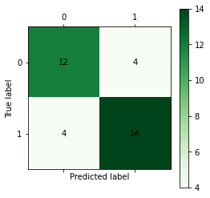
    


<h2><a name='5.1.6F'>5.1.6 分类与预测算法评价</a></h2>

### 绝对误差与相对误差

设Y表示真是值，
$
\hat{Y}
$
表示预测值，E为绝对误差。计算公式：
$$
E=Y-\hat{Y}
$$
e为相对误差。计算公式：
$$
e=\frac{Y-\hat{Y}}{Y}
$$

### 平均绝对误差

平均绝对误差(Mean Absolute Error,MAE)。计算公式：
$$
MAE=\frac{1}{n} \sum_{i=1}^{n} | E_{i} |=\frac{1}{n} \sum_{i=1}^{n} | Y_{i}-\hat{Y_{i}} |
$$
MAE表示平均绝对误差，
$
E_{i}
$
表示第i个实际值与预测值的绝对误差，
$
Y_{i}
$
表示第i个实际值
$
\hat{Y_{i}}
$
表示第i个预测值

### 均方误差

均方误差(Mean Squared Error,MSE)。计算公式：
$$
MSE=\frac{1}{n} \sum_{i=1}^{n} E_{i}^{2}=\frac{1}{n} \sum_{i=1}^{n} ( Y_{i}-\hat{Y_{i}} )^{2}
$$
均方误差是预测误差平方和的平均数，它避免了正负误差不能相加的问题。由于对误差E进行了平方，加强了数值大的误差在指标中的作用，从而提高了这个指标的灵敏性。

### 均方根误差

均方误差(Root Mean Squared Error,RMSE)。计算公式：
$$
RMSE=\sqrt{\frac{1}{n} \sum_{i=1}^{n} E_{i}^{2}}=\sqrt{\frac{1}{n} \sum_{i=1}^{n} ( Y_{i}-\hat{Y_{i}} )^{2}}
$$
均方误差的平方根。代表了预测值的离散程度，也叫标准误差。最佳拟合情况为RMSE=0

### 平均绝对百分误差

平均绝对百分误差(Mean Absolute Percentage Error, MAPE)。计算公式：
$$
MAPE=\frac{1}{n} \sum_{i=1}^{n} | E_{i}/Y_{i} |=\frac{1}{n} \sum_{i=1}^{n} | ( Y_{i}-\hat{Y_{i}} ) / Y_{i} |
$$
一般MAPE小于10时，预测精度较高。

### Kappa统计

kappa统计是比较两个过多个观测者对同一事物或观测者对同一事物的两次或多次观测结果是否一致，
以由机遇造成的一致性和实际观测的一致性之间的差别大小作为评价基础的统计标准。<br>

Kappa取值在区间[-1，1]内。其值的大小均有不同意义
<ol>
    <li>当Kappa=1时，说明两次判断的结果完全一致。</li>
    <li>当Kappa=-1时，说明两次判断的结果完全不一致。</li>
    <li>当Kappa=0时，说明两次判断的结果是机遇造成的。</li>
    <li>当Kappa< 0时，说明一致程度比机遇造成的还差。两次检查结果很不一致。在实际应用中无意义。</li>
    <li>当Kappa>0时，说明有意义，Kapppa越大，说明一致性越好。</li>
    <li>当Kappa>=0.75时，说明已经取得相当满意的一致程度。</li>
    <li>当Kappa< 0.4时，说明一致程度不够。</li>
</ol>


### 识别准确度

识别准确度(Accuracy)。计算公式：


### 识别精确率

识别精确率(Precision)。计算公式：


### 反馈率

反馈率(Recall)。计算公式：


### ROC曲线

受试者工作特性(Receiver Operating Characteristic, ROC)。可为选定临界值给出定量提示。
将灵敏度(Sensitivity)设在纵轴，1-特异性(1-Specificity)设在横轴，就可得出ROC曲线。
该曲线下的积分面积大小与每种方法优劣密切相关，反映分类器正确分类的统计概率，其值越接近1说明该算法效果越好。

### 混淆矩阵

混淆矩阵(Confusion Matrix)是模式识别领域中一种常用的表达式。 它描绘样本数据的真实属性于识别结果类型之间的关系，是评价分类器性能的一种常用方法。

<h2><a name='5.1.7F'>5.1.7 Python分类预测模型特点</a></h2>

| 模型 | 模型特点 | 位于 |
| :--- | :--- | :--- |
| 逻辑回归 | 比较基础的线性分类模型 | sklearn.linear_model |
| SVM | 强大的模型，可以用来回归、预测、分类等，而根据选取的核函数不同，模型可以线性/非线性 | sklearn.SVM |
| 决策树 | 基于“分类讨论、逐步细化”思想的分类模型，直观、易解释 | sklearn.tree |
| 随机森林 | 精度通常比决策树高，缺点是由于其随机性，丧失了决策树的可解释性 | sklearn.ensemble |
| 朴素贝叶斯 | 基于概率思想的简单有效分类模型，能够给出容易理解的概率解释 | sklearn.naive_bayes |
| 神经网络 | 具有强大的拟合能力，可以用于拟合、分类等，有很多增强版本，如：递归、卷积、自编码器 | Keras |

# 5.2 聚类分析

<h2><a name='5.2.1F'>5.2.1 常用聚类分析算法</a></h2>

与分类不同，聚类分析是在没有给定划分类别的情况下，根据数据相似度进行样本分组的一种方法。是一种无监督的学习算法。聚类的输入是一组未被标记的样本，聚类根据数据自身的距离或相似度将它们划分为若干组，划分的原则是组内样本最小化而组间(外部)距离最大化。

| |  常用聚类方法 | |
| :--- | :--- | :--- |
| 类别 | 主要算法 |
| 划分(分类)方法 | K-Means算法(K-平均)，K-MEDOIDS算法(K-中心点)，CLARANS算法 |
| 层次分析方法 | BIRCH算法，CURE算法，CHAMELEON算法 |
| 基于密度的方法 | DBSCAN算法，DENCLUE算法，OPTICS算法 |
| 基于网格的方法 | STING算法，CLIOUE算法，WAVE-CLUSTER算法 |
| 基于模型的方法 | 统计学、神经网络 |

<h2><a name='5.2.2F'>5.2.2 K-Means聚类算法</a></h2>

### 1.算法过程

<ol>
    <li>从n个样本数据中随机选取k个对象作为初始的聚类中心。</li>
    <li>分别计算每个样本到各个聚类中心的距离，将对象分配到距离最近的聚类中。</li>
    <li>所有对象分配完成后，重新计算k个聚类中心</li>
    <li>与前一次计算得到的k个聚类中心比较，如果聚类中心发生变化，转至步骤2，否则转至步骤5</li>
    <li>当质心不发生变化时，停止</li>
</ol>

### 2.数据类型与相似性的度量

<ol>
    <li>连续属性</li>
    <p>对于连续属性，要先对各属性值进行零 - 均值规范，在进行距离的计算。K-Means聚类算法中，一般需要度量样本之间的距离、样本与簇之间的距离，以及簇与簇之间的距离。最常用的方法是欧式距离(5-23)、曼哈顿距离(5-24)、闵可夫斯基距离(5-25)。</p>
    
</ol>

### 3.目标函数

使用误差平方和SSE作为度量聚类质量的目标函数，对于两种不同的聚类结果，选择误差平方和较小的分类结果。<br>
连续型SSE计算公式

文档数据的SSE计算公式

为簇E的聚类中心e的计算公式


### 使用K-Means算法聚类消费行为特征数据


```python
import pandas as pd
inputfile = '/Users/MacJ/Desktop/Python數據分析與挖掘實戰/Python数据分析与挖掘实战（第2版）/chapter5/demo/data/consumption_data.xls'
outputfile = '/Users/MacJ/Desktop/Python數據分析與挖掘實戰/markdown/tmp/data_type.xls'

k = 3 #聚类的类别
iteration = 500 #聚类最大循环数量

data = pd.read_excel(inputfile,index_col='Id')

data_zs = 1.0 * (data-data.mean()) / data.std() # 数据标准化

data
```


<div>
<style scoped>
    .dataframe tbody tr th:only-of-type {
        vertical-align: middle;
    }

    .dataframe tbody tr th {
        vertical-align: top;
    }

    .dataframe thead th {
        text-align: right;
    }
</style>
<table border="1" class="dataframe">
  <thead>
    <tr style="text-align: right;">
      <th></th>
      <th>R</th>
      <th>F</th>
      <th>M</th>
    </tr>
    <tr>
      <th>Id</th>
      <th></th>
      <th></th>
      <th></th>
    </tr>
  </thead>
  <tbody>
    <tr>
      <th>1</th>
      <td>27</td>
      <td>6</td>
      <td>232.61</td>
    </tr>
    <tr>
      <th>2</th>
      <td>3</td>
      <td>5</td>
      <td>1507.11</td>
    </tr>
    <tr>
      <th>3</th>
      <td>4</td>
      <td>16</td>
      <td>817.62</td>
    </tr>
    <tr>
      <th>4</th>
      <td>3</td>
      <td>11</td>
      <td>232.81</td>
    </tr>
    <tr>
      <th>5</th>
      <td>14</td>
      <td>7</td>
      <td>1913.05</td>
    </tr>
    <tr>
      <th>...</th>
      <td>...</td>
      <td>...</td>
      <td>...</td>
    </tr>
    <tr>
      <th>938</th>
      <td>19</td>
      <td>4</td>
      <td>1163.08</td>
    </tr>
    <tr>
      <th>939</th>
      <td>9</td>
      <td>7</td>
      <td>1007.06</td>
    </tr>
    <tr>
      <th>940</th>
      <td>27</td>
      <td>7</td>
      <td>1322.94</td>
    </tr>
    <tr>
      <th>941</th>
      <td>30</td>
      <td>4</td>
      <td>860.41</td>
    </tr>
    <tr>
      <th>942</th>
      <td>22</td>
      <td>1</td>
      <td>776.70</td>
    </tr>
  </tbody>
</table>
<p>940 rows × 3 columns</p>
</div>


```python
from sklearn.cluster import KMeans

model = KMeans(n_clusters = k,n_jobs = 4,max_iter = iteration,random_state = 1234)
model.fit(data_zs)
```

    /Users/MacJ/anaconda3/lib/python3.7/site-packages/sklearn/cluster/_kmeans.py:939: FutureWarning: 'n_jobs' was deprecated in version 0.23 and will be removed in 0.25.
      " removed in 0.25.", FutureWarning)


    KMeans(max_iter=500, n_clusters=3, n_jobs=4, random_state=1234)


```python
# 简单打印结果
r1 = pd.Series(model.labels_).value_counts() #统计各个类别的数目
r2 = pd.DataFrame(model.cluster_centers_) #找出聚类中心
r = pd.concat([r2,r1],axis=1) # 横向连接(0是纵向)，得到聚类中心对应的类别下的数目

r.columns = list(data.columns) + ['类别数目'] # 重命名表头
print(r)
```

              R         F         M  类别数目
    0 -0.149254 -0.660412 -0.272527   559
    1 -0.160580  1.112094  0.392121   341
    2  3.455055 -0.295654  0.449123    40


```python
# 详细输出原始数据及其类别 
r = pd.concat([data,pd.Series(model.labels_,index=data.index)],axis=1) #详细输出每个样本对应的类别
r.columns = list(data.columns) + ['聚类类别'] # 重命名表头
r.to_excel(outputfile)
```


```python
output_data = pd.read_excel(outputfile)
output_data
```


<div>
<style scoped>
    .dataframe tbody tr th:only-of-type {
        vertical-align: middle;
    }

    .dataframe tbody tr th {
        vertical-align: top;
    }

    .dataframe thead th {
        text-align: right;
    }
</style>
<table border="1" class="dataframe">
  <thead>
    <tr style="text-align: right;">
      <th></th>
      <th>Id</th>
      <th>R</th>
      <th>F</th>
      <th>M</th>
      <th>聚类类别</th>
    </tr>
  </thead>
  <tbody>
    <tr>
      <th>0</th>
      <td>1</td>
      <td>27</td>
      <td>6</td>
      <td>232.61</td>
      <td>0</td>
    </tr>
    <tr>
      <th>1</th>
      <td>2</td>
      <td>3</td>
      <td>5</td>
      <td>1507.11</td>
      <td>0</td>
    </tr>
    <tr>
      <th>2</th>
      <td>3</td>
      <td>4</td>
      <td>16</td>
      <td>817.62</td>
      <td>1</td>
    </tr>
    <tr>
      <th>3</th>
      <td>4</td>
      <td>3</td>
      <td>11</td>
      <td>232.81</td>
      <td>0</td>
    </tr>
    <tr>
      <th>4</th>
      <td>5</td>
      <td>14</td>
      <td>7</td>
      <td>1913.05</td>
      <td>0</td>
    </tr>
    <tr>
      <th>...</th>
      <td>...</td>
      <td>...</td>
      <td>...</td>
      <td>...</td>
      <td>...</td>
    </tr>
    <tr>
      <th>935</th>
      <td>938</td>
      <td>19</td>
      <td>4</td>
      <td>1163.08</td>
      <td>0</td>
    </tr>
    <tr>
      <th>936</th>
      <td>939</td>
      <td>9</td>
      <td>7</td>
      <td>1007.06</td>
      <td>0</td>
    </tr>
    <tr>
      <th>937</th>
      <td>940</td>
      <td>27</td>
      <td>7</td>
      <td>1322.94</td>
      <td>0</td>
    </tr>
    <tr>
      <th>938</th>
      <td>941</td>
      <td>30</td>
      <td>4</td>
      <td>860.41</td>
      <td>0</td>
    </tr>
    <tr>
      <th>939</th>
      <td>942</td>
      <td>22</td>
      <td>1</td>
      <td>776.70</td>
      <td>0</td>
    </tr>
  </tbody>
</table>
<p>940 rows × 5 columns</p>
</div>


### 绘制聚类后的概率密度图


```python
def density_plot(data): # 自定义作图函数
    import matplotlib.pyplot as plt
    plt.rcParams['font.sans-serif'] = ['SimHei'] # 用来正常显示中文
    plt.rcParams['axes.unicode_minus'] = False #用来正常显示负号
    p = data.plot(kind='kde',linewidth=2,subplots=True,sharex=False)
    [p[i].set_ylabel('midu') for i in range(k)]
    plt.legend()
    return plt

pic_output = '/Users/MacJ/Desktop/Python數據分析與挖掘實戰/markdown/tmp/pd' # 概率密度图文件名前缀
for i in range(k):
    density_plot(data[r['聚类类别']==i]).savefig('%s%s.png' %(pic_output,i))
```

    findfont: Font family ['sans-serif'] not found. Falling back to DejaVu Sans.


    
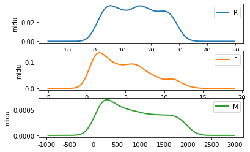
    


    
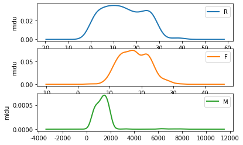
    


    
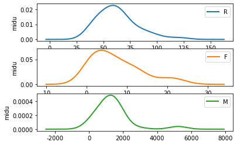
    


利用三组图可以分析客户价值：<br>
<ol>
    <li>分群1：R间隔分布在0～30天；消费次数集中在0～12次；消费金额哎0～1800元</li>
    <li>分群2:R间隔相对较小，主要集中在0～30天；消费次数集中在10～25次；消费金额在500～2000元</li>
    <li>分群3：R间隔相对较大，间隔分布在30～80天；消费次数集中在0～15次；消费金额在0～2000元</li>
</ol>

<h2><a name='5.2.3F'>5.2.3 聚类分析算法评价</a></h2>

聚类分析仅根据样本数据本身将样本进行分组。其目标是组内的对象相互之间是相似的，而不同组中对象是不同的。组内的相似性越大，组间差别越大，聚类效果就越好。

### 1.purity评价法

purity评价法是极为简单的一种聚类评价方法，只需计算正确聚类数占总数的比例。


### 2.RI评价法

RI评价法是一种用排列组合原理来对聚类进行评价的手段，RI评价公式：

R：指被聚在一类的两个对象被正确分类了，W指不应该被聚在一类的两个对象被正确分开了，M指不应该放在一类的对象被错误地放在了一类，D指不应该分开的对象被错误地分开了

### 3.F值评价法

基于RI衍生出的方法

RI方法将准确率P，召回率r看得同等重要。

<h2><a name='5.2.4F'>5.2.4 Python主要聚类分析方法</a></h2>

| |  聚类主要函数列表 | |
| :--- | :--- | :--- |
| 对象名 | 函数功能 | 所属工具箱 |
| KMeans | K均值聚类 | sklearn.cluster |
| Affinity Propagation | 吸引力传播，2007提出，几乎优于所有方法，不需要指定聚类数 | sklearn.cluster |
| Mean Shift | 均值漂移聚类算法 | sklearn.cluster |
| Spectral Clustering | 谱聚类 | sklearn.cluster |
| Agglomerative Clustering | 层次聚类 | sklearn.cluster |
| DBSCAN | 具有噪声的基于密度的聚类方法 | sklearn.cluster |
| BIRCH | 总和的层次聚类算法 | sklearn.cluster |

### 用TSNE进行数据降维并展示聚类结果


```python
from sklearn.manifold import TSNE

tsne = TSNE(random_state=105)
tsne.fit_transform(data_zs) #进行数据降维
tsne = pd.DataFrame(tsne.embedding_,index=data_zs.index) #转换数据格式

import matplotlib.pyplot as plt
# plt.rcParams['font.sans-serif'] = ['SimHei']
plt.rcParams['axes.unicode_minus'] = False

# 不同类别用不同颜色
d = tsne[r['聚类类别'] == 0]
plt.plot(d[0],d[1],'r.')
d = tsne[r['聚类类别'] == 1]
plt.plot(d[0],d[1],'go')
d = tsne[r['聚类类别'] == 2]
plt.plot(d[0],d[1],'b*')

plt.show()
```


    
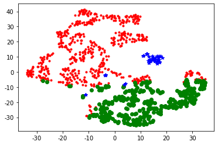
    


# 5.3 关联规则

<h2><a name='5.3.1F'>5.3.1 常用关联规则算法</a></h2>

| |  常用关联规则算法 | |
| :--- | :--- | :--- |
| 算法名称 | 算法描述 |
| Apriori | 关联规则是最常用的挖掘频繁项集的算法 |
| FP-Tree | 针对Apriori算法固有的多次扫描事务数据集的缺陷，提出的方法 |
| Eclat算法 | Eclat是一种深度优先算法 |
| 灰色关联法 | 分析和确定各因素之间的影响程度 |

<h2><a name='5.3.2F'>5.3.2 Apriori算法</a></h2>

### 1.关联规则和频繁项集

<ol>
    <li>关联规则的一般形式</li>
    <p>项集A、B同时发生的概率称为关联规则的支持度，如式：</p>
    
    <p>项集A发生，则项集B发生的概率为关联规则的置信度，如式：</p> <br>
      
    <li>最小支持度和最小置信度</li>
    <p>最小支持度是用户或专家定义的衡量支持度的一个阈值，表示项目集在统计意义上的最低重要性；最小置信度是用户或专家定义的衡量置信度的一个阈值，表示关联规则的最低可靠性。同时满足最小支持度阈值和最小置信度阈值的规则称为强规则</p>
    <li>项集</li>
    <p>项集是项的集合。包含k个项的项集称为k项集，如集合{牛奶，麦片，糖}是一个3项集。</p>
    <li>支持度计数</li>
    <p>项集A的支持度计数是事务数据集中包含项集A的事务个数，简称为项集的频率或计数。</p>
</ol>

### 使用Apriori算法挖掘菜品订单关联规则


```python
from __future__ import print_function
import pandas as pd
from apriori import *
```


```python
inputfile = '/Users/MacJ/Desktop/Python數據分析與挖掘實戰/Python数据分析与挖掘实战（第2版）/chapter5/demo/data/menu_orders.xls'
outputfile = './tmp/apriori_rules.xls'

data = pd.read_excel(inputfile,header=None)
data.head()
```


<div>
<style scoped>
    .dataframe tbody tr th:only-of-type {
        vertical-align: middle;
    }

    .dataframe tbody tr th {
        vertical-align: top;
    }

    .dataframe thead th {
        text-align: right;
    }
</style>
<table border="1" class="dataframe">
  <thead>
    <tr style="text-align: right;">
      <th></th>
      <th>0</th>
      <th>1</th>
      <th>2</th>
      <th>3</th>
    </tr>
  </thead>
  <tbody>
    <tr>
      <th>0</th>
      <td>a</td>
      <td>c</td>
      <td>e</td>
      <td>NaN</td>
    </tr>
    <tr>
      <th>1</th>
      <td>b</td>
      <td>d</td>
      <td>NaN</td>
      <td>NaN</td>
    </tr>
    <tr>
      <th>2</th>
      <td>b</td>
      <td>c</td>
      <td>NaN</td>
      <td>NaN</td>
    </tr>
    <tr>
      <th>3</th>
      <td>a</td>
      <td>b</td>
      <td>c</td>
      <td>d</td>
    </tr>
    <tr>
      <th>4</th>
      <td>a</td>
      <td>b</td>
      <td>NaN</td>
      <td>NaN</td>
    </tr>
  </tbody>
</table>
</div>


```python
print('\n转换原始数据至0-1矩阵')
ct = lambda x :pd.Series(1,index=x[pd.notnull(x)]) #转换0-1矩阵的过度函数
# b = map(ct,data.as_matrix()) # 用map方式执行
b = map(ct,data.iloc[:,:].values) # 用map方式执行
data = pd.DataFrame(list(b)).fillna(0) # 实现矩阵转换，空值用0填充
print('\n转换完毕')
del b
```

    
    转换原始数据至0-1矩阵
    
    转换完毕


```python
support = 0.2 # 最小支持度
confidence = 0.5 #
ms = '---' # 连接符

find_rule(data,support,confidence,ms).to_excel(outputfile)
```

    
    正在进行第1次搜索...
    数目：6...
    
    正在进行第2次搜索...
    数目：3...
    
    正在进行第3次搜索...
    数目：0...
    
    结果为：
               support  confidence
    e---a          0.3    1.000000
    e---c          0.3    1.000000
    c---e---a      0.3    1.000000
    a---e---c      0.3    1.000000
    c---a          0.5    0.714286
    a---c          0.5    0.714286
    a---b          0.5    0.714286
    c---b          0.5    0.714286
    b---a          0.5    0.625000
    b---c          0.5    0.625000
    a---c---e      0.3    0.600000
    b---c---a      0.3    0.600000
    a---c---b      0.3    0.600000
    a---b---c      0.3    0.600000


其中，’e---a‘表示e发生能够推出a发生，置信度为100%，支持度为30%；‘b---c---a'表示b、c同时发生能够推出a发生，置信度为60%，支持度为30%。

# 5.4 时序模式

<h2><a name='5.4.1F'>5.4.1 时间序列算法</a></h2>


<h2><a name='5.4.2F'>5.4.2 时间序列的预处理</a></h2>

### 1.平稳性检验

拿到一个观察值序列后，首先要对它的纯随机性和平稳性进行检验，这两个重要的检验称为序列的预处理。根据检验结果可以将序列分为不同的类型，对不同类型的序列会采取不同的分析方法。<br>
纯随机序列又叫白噪声序列，序列的各项之间没有任何相关关系，序列在进行完全无序的随机波动，可以终止对该序列的分析。白噪声序列是没有信息可提取的平稳序列。<br>
对于平稳非白噪声序列，它的均值和方差是常数，现已有一套非常成熟的平稳序列的建模方法。通常是建立一个线性模型来拟合该序列的发展，借此提取该序列的有用信息。ARMA模型时最常用的平稳序列拟合模型。


### 2.纯随机性检验

<h2><a name='5.4.3F'>5.4.3 平稳时间序列分析</a></h2>

自回归移动平均模型(Autoreg Ressive Moving Average Model，简称ARMA模型)，是目前最常用的拟合平稳序列的模型。它又可以细分为AR、MA、ARMA，都可以看作是多元线性回归模型

### 平稳时间序列建模


| |  ARMA模型识别原则 | |
| :--- | :--- | :--- |
| 模型 | 自相关系数(ACF) | 偏自相关系数(PACF) |
| AR(p) | 拖尾 | p阶截尾 |
| MA(q) | q阶截尾 | 拖尾 |
| ARMA(p,q) | p阶拖尾 | q阶拖尾 |

<h2><a name='5.4.4F'>5.4.4 非平稳时间序列分析</a></h2>


```python
# 实现ARIMA模型
import pandas as pd
```


```python
# 参数初始化
discfile = '../Python数据分析与挖掘实战（第2版）/chapter5/demo/data/arima_data.xls'
forecastnum = 5
```


```python
# 读取数据，指定日期列为指标，pandas自动将‘日期’列识别为Datetime格式
data = pd.read_excel( discfile, index_col='日期' )
data.head()
```


<div>
<style scoped>
    .dataframe tbody tr th:only-of-type {
        vertical-align: middle;
    }

    .dataframe tbody tr th {
        vertical-align: top;
    }

    .dataframe thead th {
        text-align: right;
    }
</style>
<table border="1" class="dataframe">
  <thead>
    <tr style="text-align: right;">
      <th></th>
      <th>销量</th>
    </tr>
    <tr>
      <th>日期</th>
      <th></th>
    </tr>
  </thead>
  <tbody>
    <tr>
      <th>2015-01-01</th>
      <td>3023</td>
    </tr>
    <tr>
      <th>2015-01-02</th>
      <td>3039</td>
    </tr>
    <tr>
      <th>2015-01-03</th>
      <td>3056</td>
    </tr>
    <tr>
      <th>2015-01-04</th>
      <td>3138</td>
    </tr>
    <tr>
      <th>2015-01-05</th>
      <td>3188</td>
    </tr>
  </tbody>
</table>
</div>


```python
# 时序图
import matplotlib.pyplot as plt

plt.rcParams["font.family"] = 'Arial Unicode MS'  # 用来正常显示中文标签
plt.rcParams['axes.unicode_minus'] = False  # 用来正常显示负号
```


```python
data.plot()
plt.show()
```


    
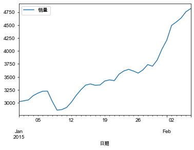
    


```python
# 自相关图
from statsmodels.graphics.tsaplots import plot_acf
plot_acf(data).show()
```

    /Users/MacJ/anaconda3/lib/python3.7/site-packages/ipykernel_launcher.py:3: UserWarning: Matplotlib is currently using module://ipykernel.pylab.backend_inline, which is a non-GUI backend, so cannot show the figure.
      This is separate from the ipykernel package so we can avoid doing imports until


    
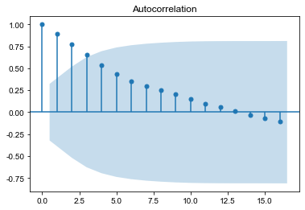
    


```python
# 平稳性检测
from statsmodels.tsa.stattools import adfuller as ADF
print('原始序列的ADF检验结果：', ADF(data['销量']))
# 返回值依次为：adf\pvalue\usedlag\nobs\critical values\icbest\regresults\resstore
```

    原始序列的ADF检验结果： (1.813771015094526, 0.9983759421514264, 10, 26, {'1%': -3.7112123008648155, '5%': -2.981246804733728, '10%': -2.6300945562130176}, 299.46989866024177)


```python
# 差分后的结果
D_data = data.diff().dropna()
D_data.columns = ['销量差分']
D_data.plot() #时序图
plt.show()
plot_acf(D_data).show() # 自相关图
```


    
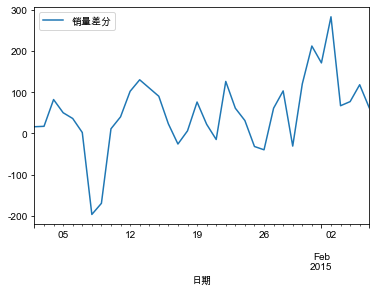
    


    /Users/MacJ/anaconda3/lib/python3.7/site-packages/ipykernel_launcher.py:6: UserWarning: Matplotlib is currently using module://ipykernel.pylab.backend_inline, which is a non-GUI backend, so cannot show the figure.
      


    
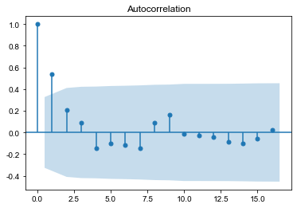
    


```python
from statsmodels.graphics.tsaplots import plot_pacf

plot_pacf(D_data).show() #偏自相关
print('差分序列的ADF检验结果为：', ADF(D_data['销量差分'])) # 平稳性检测
```

    /Users/MacJ/anaconda3/lib/python3.7/site-packages/ipykernel_launcher.py:3: UserWarning: Matplotlib is currently using module://ipykernel.pylab.backend_inline, which is a non-GUI backend, so cannot show the figure.
      This is separate from the ipykernel package so we can avoid doing imports until


    差分序列的ADF检验结果为： (-3.1560562366723537, 0.022673435440048798, 0, 35, {'1%': -3.6327426647230316, '5%': -2.9485102040816327, '10%': -2.6130173469387756}, 287.5909090780334)


    
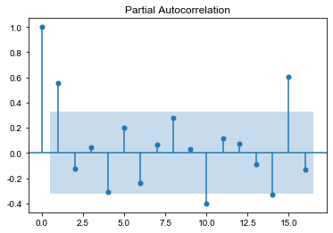
    


```python
# 定阶
data['销量'] = data['销量'].astype(float)
pmax = int(len(D_data) / 10) # 一般阶数不超过length/10
qmax = int(len(D_data) / 10) # 一般阶数不超过length/10
bic_matrix = [] # BIC矩阵
for p in range(pmax+1):
    tmp = []
    for q in range(qmax + 1):
        try:
            tmp.append(ARIMA(data, (p,1,q)).fit().bic)
        except:
            tmp.append(None)
    bic_matrix.append(tmp)
    
bic_matrix = pd.DataFrame(bic_matrix) # 从中可以找出最小值
```


```python
p,q = bic_matrix.stack().idxmin() # 先用stack展平，然后用idxmin找出最小值位置
print('BIC最小的p值和q值为：%s、%s' %(p,q))
model = ARIMA(data, (p,1,q)).fit() # 建立ARIMA(0,1,1)模型
    
print('模型报告为：\n',model.summary2())
print('预测未来5天，其预测结果、标准误差、置信区间如下： \n', model.forecast(5))
```

<h2><a name='5.4.5F'>5.4.5 Python主要时序模式算法</a></h2>

Python实现时序模式的主要库是StatsModels，算法主要是ARIMA模型，在使用该模型进行建模时，需要进行一系列判别操作，主要包含平稳性检验、白噪声检验、是否差分、AIC和BIC指标值、模型定阶，最后再做预测。与其相关的函数如下表

|| 时序模式算法函数列表 ||
| :--- | :--- | :--- |
| 函数名 | 函数功能 | 所属工具箱 |
| acf() | 计算自相关系数 | statsmodels.tsa.stattools |
| plot_acf() | 画自相关系数 | statsmodels.graphics.tsaplots |
| pacf() | 计算偏自相关系数 | statsmodels.tsa.stattools |
| plot_pacf() | 画偏自相关系数 | statsmodels.graphics.tsaplots |
| adfuller() | 对观测值序列进行单位根检验 | statsmodels.tsa.stattools |
| diff() | 对观测值序列进行差分计算 | pandas对象自带的方法 |
| ARIMA() | 创建一个ARIMA时序模型 | statsmodels.tsa.arima_model |
| summary() or summary2 | 给出一份ARIMA模型的报告 | ARIMA模型对象自带的方法 |
| aic/bic/hqic | 计算ARIMA模型的AIC/BIC/HQIC指标值 | ARIMA模型对象自带的方法 |
| forecast() | 应用构建的时序模型进行预测 | ARIMA模型对象自带的方法 |
| acorr_ljungbox() | Ljung-Box检验，检验是否为白噪声 | statsmodels.stats.diagnostic |

<ol>
    <li>acf()</li>
    <p>计算自相关系数</p>
    <p>autocorr=acf(data, unbiased=False, nlags=40, qstat=False, fft=False, alpha=None)</p>
    <br>
    <li>plot_acf()</li>
    <p>绘制自相关系数图</p>
    <p>p = plot_acf(data)</p>
    <br>
    <li>pacf()/plot_pacf()</li>
    <p>计算偏自相关系数，绘制偏自相关系数图</p>
    <br>
    <li>adfuller()</li>
    <p>对观测值序列进行单位根检验(ADF test)</p>
    <p>h = adffuller(Series, maxlag=None, regression='c', autolag='AIC', store=False, regresults=False)</p>
    <br>
    <li>diff()</li>
    <p>对观测值序列进行差分计算</p>
    <p>D.diff()</p>
    <br>
    <li>ARIMA</li>
    <p>设置时序模式的建模参数，查u你更加爱你ARIMA时序模型</p>
    <p>arima = ARIMA(data, (p,1,q)).fit()</p>
    <br>
    <li>summary()/summary2()</li>
    <br>
    <li>aic/bic/hqic</li>
    <p>arima.aic/arima.bic/arima.hqic</p>
    <br>
    <li>forecast()</li>
    <p>用的得到时序模型进行预测</p>
    <p>a,b,c = arima.forecast(num)</p>
    <br>
    <li>acorr_ljungbox(data,lags=1)</li>
</ol>

<h1>5.5 离群点检测</h1>

<h2><a name='5.5.1F'>5.5.1 离群点的成因及类型</a></h2>

|| 离群点的大致分类 ||
| :--- | :--- | :--- |
| 分类标准 | 分类名称 | 分类描述 |
| 数据范围 | 全局离群点和局部离群点 | 从整体来看，某些对象没有离群特征；但从局部来看，却显示了一定的离群性。 |
| 数据类型 | 数值型离群点和粉类型离群点 | 这是一数据集的属性类型进行划分的 |
| 属性个数 | 一维离群点和多维离群点 | 一个对象可能有一个或多个属性 |

<h2><a name='5.5.2F'>5.5.2 离群点检测方法</a></h2>

基于统计；基于邻近度；基于密度；基于聚类

<h2><a name='5.5.3F'>5.5.3 基于模型的离群点检测方法</a></h2>

一元正态分布中的离群点检测<br>
混合模型的离群啊点检测

<h2><a name='5.5.4F'>5.5.4 基于聚类的离群点检测方法</a></h2>


```python
import numpy as np
import pandas as pd
```


```python
# 参数初始化
inputfile = '../Python数据分析与挖掘实战（第2版）/chapter5/demo/data/consumption_data.xls' # 销量及其他属性数据
k = 3                                                                                  # 聚类的类别
threshold = 2                                                                          # 离散点阈值
iteration = 500                                                                        # 聚类最大循环次数
data = pd.read_excel(inputfile, index_col='Id')                                        # 读取数据
data_zs = 1.0 * (data - data.mean()) / data.std()                                      # 数据标准化

data.head()
```


<div>
<style scoped>
    .dataframe tbody tr th:only-of-type {
        vertical-align: middle;
    }

    .dataframe tbody tr th {
        vertical-align: top;
    }

    .dataframe thead th {
        text-align: right;
    }
</style>
<table border="1" class="dataframe">
  <thead>
    <tr style="text-align: right;">
      <th></th>
      <th>R</th>
      <th>F</th>
      <th>M</th>
    </tr>
    <tr>
      <th>Id</th>
      <th></th>
      <th></th>
      <th></th>
    </tr>
  </thead>
  <tbody>
    <tr>
      <th>1</th>
      <td>27</td>
      <td>6</td>
      <td>232.61</td>
    </tr>
    <tr>
      <th>2</th>
      <td>3</td>
      <td>5</td>
      <td>1507.11</td>
    </tr>
    <tr>
      <th>3</th>
      <td>4</td>
      <td>16</td>
      <td>817.62</td>
    </tr>
    <tr>
      <th>4</th>
      <td>3</td>
      <td>11</td>
      <td>232.81</td>
    </tr>
    <tr>
      <th>5</th>
      <td>14</td>
      <td>7</td>
      <td>1913.05</td>
    </tr>
  </tbody>
</table>
</div>


```python
from sklearn.cluster import KMeans

model = KMeans(n_clusters=k, n_jobs=4, max_iter=iteration) # 分为k类，并发数4
model.fit(data_zs)                                         # 开始聚类
```

    /Users/MacJ/anaconda3/lib/python3.7/site-packages/sklearn/cluster/_kmeans.py:939: FutureWarning: 'n_jobs' was deprecated in version 0.23 and will be removed in 0.25.
      " removed in 0.25.", FutureWarning)


    KMeans(max_iter=500, n_clusters=3, n_jobs=4)


```python
# 标准化数据及其类别
r = pd.concat([data_zs, pd.Series(model.labels_, index=data.index)], axis=1)    # 每个样本对应的类别
r.columns = list(data.columns) + ['聚类类别']                                    # 重命名表头

norm = []

for i in range(k):
    norm_tmp = r[['R','F','M']][r['聚类类别'] == i] - model.cluster_centers_[i]
    norm_tmp = norm_tmp.apply(np.linalg.norm, axis=1)                          # 求出绝对距离
    norm.append(norm_tmp / norm_tmp.median())                                  # 求相对距离并添加

norm = pd.concat(norm)                                                         # 合并
```


```python
import matplotlib.pyplot as plt

plt.rcParams["font.family"] = 'Arial Unicode MS'  # 用来正常显示中文标签
plt.rcParams['axes.unicode_minus'] = False        # 用来正常显示负号
norm[norm <= threshold].plot(style='go')          # 正常的点

discrete_points = norm[norm > threshold]          # 离群点
discrete_points.plot(style='ro')

for i in range(len(discrete_points)):
    id = discrete_points.index[i]
    n = discrete_points.iloc[i]
    plt.annotate('(%s, %.2f)' %(id, n), xy=(id, n), xytext=(id, n))
    
plt.xlabel('编号')
plt.ylabel('相对距离')
plt.show()
```


    
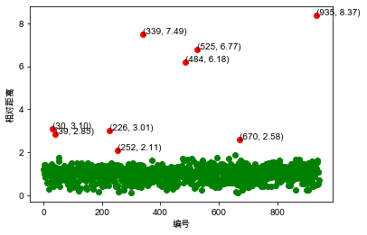
    

