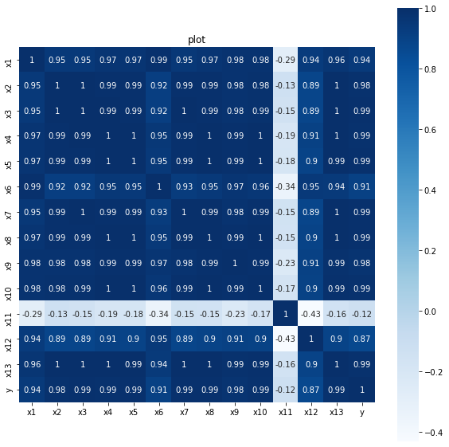
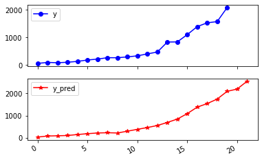

<font size="5" color="#f76a57">第6章 财政收入影响因素分析及预测:</font><br/>
<div>
    <h3>6.1 背景与挖掘目标</h3>
    <h3>6.2 分析方法与过程</h3>
    <ul>
        <font size="2" color="#FF8C00">
        <li>6.2.1 分析步骤与流程</li>
        <li><a href='#6.2.2F'>6.2.2 数据探索分析</a></li>
        <li><a href='#6.2.3F'>6.2.3 数据预处理</a></li>
        <li><a href='#6.2.4F'>6.2.4 模型构建</a></li>
        </font>
    </ul>
</div>

## 6.2 分析方法与过程

<h3><a name='6.2.2F'>6.2.2 数据探索分析</a></h3>


```python
# 描述性统计分析
import numpy as np
import pandas as pd
```


```python
inputfile = '/Users/MacJ/Desktop/Python數據分析與挖掘實戰/Python数据分析与挖掘实战（第2版）/' \
'chapter6/demo/data/data.csv'
data = pd.read_csv(inputfile)
data.head()
```


<div>
<style scoped>
    .dataframe tbody tr th:only-of-type {
        vertical-align: middle;
    }

    .dataframe tbody tr th {
        vertical-align: top;
    }

    .dataframe thead th {
        text-align: right;
    }
</style>
<table border="1" class="dataframe">
  <thead>
    <tr style="text-align: right;">
      <th></th>
      <th>x1</th>
      <th>x2</th>
      <th>x3</th>
      <th>x4</th>
      <th>x5</th>
      <th>x6</th>
      <th>x7</th>
      <th>x8</th>
      <th>x9</th>
      <th>x10</th>
      <th>x11</th>
      <th>x12</th>
      <th>x13</th>
      <th>y</th>
    </tr>
  </thead>
  <tbody>
    <tr>
      <th>0</th>
      <td>3831732</td>
      <td>181.54</td>
      <td>448.19</td>
      <td>7571.00</td>
      <td>6212.70</td>
      <td>6370241</td>
      <td>525.71</td>
      <td>985.31</td>
      <td>60.62</td>
      <td>65.66</td>
      <td>120.0</td>
      <td>1.029</td>
      <td>5321</td>
      <td>64.87</td>
    </tr>
    <tr>
      <th>1</th>
      <td>3913824</td>
      <td>214.63</td>
      <td>549.97</td>
      <td>9038.16</td>
      <td>7601.73</td>
      <td>6467115</td>
      <td>618.25</td>
      <td>1259.20</td>
      <td>73.46</td>
      <td>95.46</td>
      <td>113.5</td>
      <td>1.051</td>
      <td>6529</td>
      <td>99.75</td>
    </tr>
    <tr>
      <th>2</th>
      <td>3928907</td>
      <td>239.56</td>
      <td>686.44</td>
      <td>9905.31</td>
      <td>8092.82</td>
      <td>6560508</td>
      <td>638.94</td>
      <td>1468.06</td>
      <td>81.16</td>
      <td>81.16</td>
      <td>108.2</td>
      <td>1.064</td>
      <td>7008</td>
      <td>88.11</td>
    </tr>
    <tr>
      <th>3</th>
      <td>4282130</td>
      <td>261.58</td>
      <td>802.59</td>
      <td>10444.60</td>
      <td>8767.98</td>
      <td>6664862</td>
      <td>656.58</td>
      <td>1678.12</td>
      <td>85.72</td>
      <td>91.70</td>
      <td>102.2</td>
      <td>1.092</td>
      <td>7694</td>
      <td>106.07</td>
    </tr>
    <tr>
      <th>4</th>
      <td>4453911</td>
      <td>283.14</td>
      <td>904.57</td>
      <td>11255.70</td>
      <td>9422.33</td>
      <td>6741400</td>
      <td>758.83</td>
      <td>1893.52</td>
      <td>88.88</td>
      <td>114.61</td>
      <td>97.7</td>
      <td>1.200</td>
      <td>8027</td>
      <td>137.32</td>
    </tr>
  </tbody>
</table>
</div>


```python
# 描述性统计分析，依次计算最小值、最大值、均值、标准差
description = [data.min(), data.max(), data.mean(), data.std()]
# 将结果存入数据框
description = pd.DataFrame(description, index = ['Min', 'Max', 'Mean', 'STD']).T
print('描述性统计结果：\n', np.round(description, 2)) # 保留两位小数
```

    描述性统计结果：
                 Min         Max        Mean         STD
    x1   3831732.00  7599295.00  5579519.95  1262194.72
    x2       181.54     2110.78      765.04      595.70
    x3       448.19     6882.85     2370.83     1919.17
    x4      7571.00    42049.14    19644.69    10203.02
    x5      6212.70    33156.83    15870.95     8199.77
    x6   6370241.00  8323096.00  7350513.60   621341.85
    x7       525.71     4454.55     1712.24     1184.71
    x8       985.31    15420.14     5705.80     4478.40
    x9        60.62      228.46      129.49       50.51
    x10       65.66      852.56      340.22      251.58
    x11       97.50      120.00      103.31        5.51
    x12        1.03        1.91        1.42        0.25
    x13     5321.00    41972.00    17273.80    11109.19
    y         64.87     2088.14      618.08      609.25


```python
corr = data.corr(method='pearson')
print('相关系数矩阵为：\n',np.round(corr,2)) # 保留两位小数
```

    相关系数矩阵为：
            x1    x2    x3    x4    x5    x6    x7    x8    x9   x10   x11   x12  \
    x1   1.00  0.95  0.95  0.97  0.97  0.99  0.95  0.97  0.98  0.98 -0.29  0.94   
    x2   0.95  1.00  1.00  0.99  0.99  0.92  0.99  0.99  0.98  0.98 -0.13  0.89   
    x3   0.95  1.00  1.00  0.99  0.99  0.92  1.00  0.99  0.98  0.99 -0.15  0.89   
    x4   0.97  0.99  0.99  1.00  1.00  0.95  0.99  1.00  0.99  1.00 -0.19  0.91   
    x5   0.97  0.99  0.99  1.00  1.00  0.95  0.99  1.00  0.99  1.00 -0.18  0.90   
    x6   0.99  0.92  0.92  0.95  0.95  1.00  0.93  0.95  0.97  0.96 -0.34  0.95   
    x7   0.95  0.99  1.00  0.99  0.99  0.93  1.00  0.99  0.98  0.99 -0.15  0.89   
    x8   0.97  0.99  0.99  1.00  1.00  0.95  0.99  1.00  0.99  1.00 -0.15  0.90   
    x9   0.98  0.98  0.98  0.99  0.99  0.97  0.98  0.99  1.00  0.99 -0.23  0.91   
    x10  0.98  0.98  0.99  1.00  1.00  0.96  0.99  1.00  0.99  1.00 -0.17  0.90   
    x11 -0.29 -0.13 -0.15 -0.19 -0.18 -0.34 -0.15 -0.15 -0.23 -0.17  1.00 -0.43   
    x12  0.94  0.89  0.89  0.91  0.90  0.95  0.89  0.90  0.91  0.90 -0.43  1.00   
    x13  0.96  1.00  1.00  1.00  0.99  0.94  1.00  1.00  0.99  0.99 -0.16  0.90   
    y    0.94  0.98  0.99  0.99  0.99  0.91  0.99  0.99  0.98  0.99 -0.12  0.87   
    
          x13     y  
    x1   0.96  0.94  
    x2   1.00  0.98  
    x3   1.00  0.99  
    x4   1.00  0.99  
    x5   0.99  0.99  
    x6   0.94  0.91  
    x7   1.00  0.99  
    x8   1.00  0.99  
    x9   0.99  0.98  
    x10  0.99  0.99  
    x11 -0.16 -0.12  
    x12  0.90  0.87  
    x13  1.00  0.99  
    y    0.99  1.00  


```python
# 绘制相关性热力图
import matplotlib.pyplot as plt
import seaborn as sns
```


```python
plt.subplots(figsize=(10, 10)) #设置画面大小
sns.heatmap(corr, annot=True, vmax=1, square=True, cmap='Blues')
plt.title('plot') # 相关性热力图
plt.show()
plt.close
```


    

    


    <function matplotlib.pyplot.close(fig=None)>


<h3><a name='6.2.3F'>6.2.3 数据预处理</a></h3>

Lasso回归方法属于正则化方法的一种，是压缩估计。它通过构造一个惩罚函数得到一个较为精炼的模型，使得它压缩一些系数，同时设定一些系数为零，保留了子集收缩的有点，是一种处理具有复共线性数据的有偏估计。<br>
Lasso以缩小特征集(降阶)为思想，是一种收缩估计方法。可以讲特征的系数进行压缩并使某些回归系数变为0，可以广泛地应用于模型改进与选择。通过选择惩罚函数，借用Lasso思想和方法实现特征选择的目的。


```python
import numpy as np
import pandas as pd
from sklearn.linear_model import Lasso
```


```python
inputfile = '/Users/MacJ/Desktop/Python數據分析與挖掘實戰/Python数据分析与挖掘实战（第2版）/' \
'chapter6/demo/data/data.csv'
data = pd.read_csv(inputfile)
data.head()
```


<div>
<style scoped>
    .dataframe tbody tr th:only-of-type {
        vertical-align: middle;
    }

    .dataframe tbody tr th {
        vertical-align: top;
    }

    .dataframe thead th {
        text-align: right;
    }
</style>
<table border="1" class="dataframe">
  <thead>
    <tr style="text-align: right;">
      <th></th>
      <th>x1</th>
      <th>x2</th>
      <th>x3</th>
      <th>x4</th>
      <th>x5</th>
      <th>x6</th>
      <th>x7</th>
      <th>x8</th>
      <th>x9</th>
      <th>x10</th>
      <th>x11</th>
      <th>x12</th>
      <th>x13</th>
      <th>y</th>
    </tr>
  </thead>
  <tbody>
    <tr>
      <th>0</th>
      <td>3831732</td>
      <td>181.54</td>
      <td>448.19</td>
      <td>7571.00</td>
      <td>6212.70</td>
      <td>6370241</td>
      <td>525.71</td>
      <td>985.31</td>
      <td>60.62</td>
      <td>65.66</td>
      <td>120.0</td>
      <td>1.029</td>
      <td>5321</td>
      <td>64.87</td>
    </tr>
    <tr>
      <th>1</th>
      <td>3913824</td>
      <td>214.63</td>
      <td>549.97</td>
      <td>9038.16</td>
      <td>7601.73</td>
      <td>6467115</td>
      <td>618.25</td>
      <td>1259.20</td>
      <td>73.46</td>
      <td>95.46</td>
      <td>113.5</td>
      <td>1.051</td>
      <td>6529</td>
      <td>99.75</td>
    </tr>
    <tr>
      <th>2</th>
      <td>3928907</td>
      <td>239.56</td>
      <td>686.44</td>
      <td>9905.31</td>
      <td>8092.82</td>
      <td>6560508</td>
      <td>638.94</td>
      <td>1468.06</td>
      <td>81.16</td>
      <td>81.16</td>
      <td>108.2</td>
      <td>1.064</td>
      <td>7008</td>
      <td>88.11</td>
    </tr>
    <tr>
      <th>3</th>
      <td>4282130</td>
      <td>261.58</td>
      <td>802.59</td>
      <td>10444.60</td>
      <td>8767.98</td>
      <td>6664862</td>
      <td>656.58</td>
      <td>1678.12</td>
      <td>85.72</td>
      <td>91.70</td>
      <td>102.2</td>
      <td>1.092</td>
      <td>7694</td>
      <td>106.07</td>
    </tr>
    <tr>
      <th>4</th>
      <td>4453911</td>
      <td>283.14</td>
      <td>904.57</td>
      <td>11255.70</td>
      <td>9422.33</td>
      <td>6741400</td>
      <td>758.83</td>
      <td>1893.52</td>
      <td>88.88</td>
      <td>114.61</td>
      <td>97.7</td>
      <td>1.200</td>
      <td>8027</td>
      <td>137.32</td>
    </tr>
  </tbody>
</table>
</div>


```python
lasso = Lasso(1000)                                # 调用Lasso()函数，设置labmda的值为1000
lasso.fit(data.iloc[:, 0:13],data['y'])
print('相关系数为：' , np.round(lasso.coef_, 5))     # 输出结果，保留五位小数

print('相关系数非零个数: ', np.sum(lasso.coef_ != 0)) # 计算相关系数非零个数

mask = lasso.coef_ != 0
mask = np.append(mask,True)
print('相关系数是否为零：', mask)

outputfile = './tmp/ch6_new_reg_data.csv'
new_reg_data = data.iloc[:, mask]                   # 返回相关系数非零的数据
new_reg_data.to_csv(outputfile)                     # 存储数据
print('输出数据的维度为：', new_reg_data.shape)        # 查看输出数据的维度
```

    相关系数为： [-1.8000e-04 -0.0000e+00  1.2414e-01 -1.0310e-02  6.5400e-02  1.2000e-04
      3.1741e-01  3.4900e-02 -0.0000e+00  0.0000e+00  0.0000e+00  0.0000e+00
     -4.0300e-02]
    相关系数非零个数:  8
    相关系数是否为零： [ True False  True  True  True  True  True  True False False False False
      True  True]
    输出数据的维度为： (20, 9)


    /Users/MacJ/anaconda3/lib/python3.7/site-packages/sklearn/linear_model/_coordinate_descent.py:531: ConvergenceWarning: Objective did not converge. You might want to increase the number of iterations. Duality gap: 34165.31873662009, tolerance: 705.2629842279999
      positive)


<h3><a name='6.2.4F'>6.2.4 模型构建</a></h3>

<ol>
    <li>灰色预测算法</li>
    <li>SVR算法</li>
</ol>

### 构建财政收入预测模型


```python
# 构建灰色预测模型并预测
import sys

sys.path.append('/Users/MacJ/Desktop/Python數據分析與挖掘實戰/markdown')

import numpy as np
import pandas as pd
from GM11 import GM11
```


```python
inputfile1 = './tmp/ch6_new_reg_data.csv'
inputfile2 = '/Users/MacJ/Desktop/Python數據分析與挖掘實戰/Python数据分析与挖掘实战（第2版）/' \
'chapter6/demo/data/data.csv'

new_reg_data = pd.read_csv(inputfile1)
new_reg_data.head()
```


<div>
<style scoped>
    .dataframe tbody tr th:only-of-type {
        vertical-align: middle;
    }

    .dataframe tbody tr th {
        vertical-align: top;
    }

    .dataframe thead th {
        text-align: right;
    }
</style>
<table border="1" class="dataframe">
  <thead>
    <tr style="text-align: right;">
      <th></th>
      <th>Unnamed: 0</th>
      <th>x1</th>
      <th>x3</th>
      <th>x4</th>
      <th>x5</th>
      <th>x6</th>
      <th>x7</th>
      <th>x8</th>
      <th>x13</th>
    </tr>
  </thead>
  <tbody>
    <tr>
      <th>0</th>
      <td>0</td>
      <td>3831732</td>
      <td>448.19</td>
      <td>7571.00</td>
      <td>6212.70</td>
      <td>6370241</td>
      <td>525.71</td>
      <td>985.31</td>
      <td>5321</td>
    </tr>
    <tr>
      <th>1</th>
      <td>1</td>
      <td>3913824</td>
      <td>549.97</td>
      <td>9038.16</td>
      <td>7601.73</td>
      <td>6467115</td>
      <td>618.25</td>
      <td>1259.20</td>
      <td>6529</td>
    </tr>
    <tr>
      <th>2</th>
      <td>2</td>
      <td>3928907</td>
      <td>686.44</td>
      <td>9905.31</td>
      <td>8092.82</td>
      <td>6560508</td>
      <td>638.94</td>
      <td>1468.06</td>
      <td>7008</td>
    </tr>
    <tr>
      <th>3</th>
      <td>3</td>
      <td>4282130</td>
      <td>802.59</td>
      <td>10444.60</td>
      <td>8767.98</td>
      <td>6664862</td>
      <td>656.58</td>
      <td>1678.12</td>
      <td>7694</td>
    </tr>
    <tr>
      <th>4</th>
      <td>4</td>
      <td>4453911</td>
      <td>904.57</td>
      <td>11255.70</td>
      <td>9422.33</td>
      <td>6741400</td>
      <td>758.83</td>
      <td>1893.52</td>
      <td>8027</td>
    </tr>
  </tbody>
</table>
</div>


```python
data = pd.read_csv(inputfile2)
data.head()
```


<div>
<style scoped>
    .dataframe tbody tr th:only-of-type {
        vertical-align: middle;
    }

    .dataframe tbody tr th {
        vertical-align: top;
    }

    .dataframe thead th {
        text-align: right;
    }
</style>
<table border="1" class="dataframe">
  <thead>
    <tr style="text-align: right;">
      <th></th>
      <th>x1</th>
      <th>x2</th>
      <th>x3</th>
      <th>x4</th>
      <th>x5</th>
      <th>x6</th>
      <th>x7</th>
      <th>x8</th>
      <th>x9</th>
      <th>x10</th>
      <th>x11</th>
      <th>x12</th>
      <th>x13</th>
      <th>y</th>
    </tr>
  </thead>
  <tbody>
    <tr>
      <th>0</th>
      <td>3831732</td>
      <td>181.54</td>
      <td>448.19</td>
      <td>7571.00</td>
      <td>6212.70</td>
      <td>6370241</td>
      <td>525.71</td>
      <td>985.31</td>
      <td>60.62</td>
      <td>65.66</td>
      <td>120.0</td>
      <td>1.029</td>
      <td>5321</td>
      <td>64.87</td>
    </tr>
    <tr>
      <th>1</th>
      <td>3913824</td>
      <td>214.63</td>
      <td>549.97</td>
      <td>9038.16</td>
      <td>7601.73</td>
      <td>6467115</td>
      <td>618.25</td>
      <td>1259.20</td>
      <td>73.46</td>
      <td>95.46</td>
      <td>113.5</td>
      <td>1.051</td>
      <td>6529</td>
      <td>99.75</td>
    </tr>
    <tr>
      <th>2</th>
      <td>3928907</td>
      <td>239.56</td>
      <td>686.44</td>
      <td>9905.31</td>
      <td>8092.82</td>
      <td>6560508</td>
      <td>638.94</td>
      <td>1468.06</td>
      <td>81.16</td>
      <td>81.16</td>
      <td>108.2</td>
      <td>1.064</td>
      <td>7008</td>
      <td>88.11</td>
    </tr>
    <tr>
      <th>3</th>
      <td>4282130</td>
      <td>261.58</td>
      <td>802.59</td>
      <td>10444.60</td>
      <td>8767.98</td>
      <td>6664862</td>
      <td>656.58</td>
      <td>1678.12</td>
      <td>85.72</td>
      <td>91.70</td>
      <td>102.2</td>
      <td>1.092</td>
      <td>7694</td>
      <td>106.07</td>
    </tr>
    <tr>
      <th>4</th>
      <td>4453911</td>
      <td>283.14</td>
      <td>904.57</td>
      <td>11255.70</td>
      <td>9422.33</td>
      <td>6741400</td>
      <td>758.83</td>
      <td>1893.52</td>
      <td>88.88</td>
      <td>114.61</td>
      <td>97.7</td>
      <td>1.200</td>
      <td>8027</td>
      <td>137.32</td>
    </tr>
  </tbody>
</table>
</div>


```python
new_reg_data.index = range(1994, 2014)
new_reg_data.loc[2014] = None
new_reg_data.loc[2015] = None
cols = ['x1', 'x3', 'x4', 'x5', 'x6', 'x7', 'x8', 'x13']

for i in cols:
    # f = GM11(new_reg_data.loc[range(1994,2014),i].as_matrix())[0]
    f = GM11(new_reg_data.loc[range(1994,2014),i].values)[0]
    new_reg_data.loc[2014,i] = f(len(new_reg_data)-1) # 2014年预测结果
    new_reg_data.loc[2015,i] = f(len(new_reg_data))   # 2015年预测结果
    new_reg_data[i] = new_reg_data[i].round(2)        # 保留两位小数
    
outputfile = './tmp/ch6_new_reg_data_GM11.xls'

y = list(data['y'].values)                             # 提取财政收入列，合并至新数据框中
y.extend([np.nan,np.nan])

new_reg_data['y'] = y
new_reg_data.to_excel(outputfile)
print('预测结果为：\n', new_reg_data.loc[2014:2015, :])
```

    预测结果为：
           Unnamed: 0          x1       x3        x4        x5          x6  \
    2014         NaN  8142148.24  7042.31  43611.84  35046.63  8505522.58   
    2015         NaN  8460489.28  8166.92  47792.22  38384.22  8627139.31   
    
               x7        x8       x13   y  
    2014  4600.40  18686.28  44506.47 NaN  
    2015  5214.78  21474.47  49945.88 NaN  


```python
# 构建支持向量回归预测模型
import matplotlib.pyplot as plt
from sklearn.svm import LinearSVR
```


```python
inputfile = './tmp/ch6_new_reg_data_GM11.xls'
data = pd.read_excel(inputfile)
feature = ['x1', 'x3', 'x4', 'x5', 'x6', 'x7', 'x8', 'x13'] # 属性所在列
data_train = data.iloc[range(0,20)].copy()
data_mean = data_train.mean()
data_std = data_train.std()
data_train  = (data_train - data_mean) / data_std           # 数据标准化

x_train = data_train[feature].values
y_train = data_train['y'].values
```


```python
linearsvr = LinearSVR()
linearsvr.fit(x_train,y_train)
x = ((data[feature] - data_mean[feature]) / data_std[feature]).values

data[u'y_pred'] = linearsvr.predict(x) * data_std['y'] + data_mean['y']
outputfile = './tmp/ch6_new_reg_data_GM11_revenue.xls'
data.to_excel(outputfile)

print('真实值与预测值分别为：\n',data[['y','y_pred']])

fig = data[['y','y_pred']].plot(subplots = True,style=['b-o','r-*'])
plt.show()
```

    /Users/MacJ/anaconda3/lib/python3.7/site-packages/sklearn/svm/_base.py:977: ConvergenceWarning: Liblinear failed to converge, increase the number of iterations.
      "the number of iterations.", ConvergenceWarning)


    真实值与预测值分别为：
               y       y_pred
    0     64.87    36.156540
    1     99.75    82.885810
    2     88.11    93.819524
    3    106.07   105.636196
    4    137.32   150.264011
    5    188.14   187.401296
    6    219.91   219.000633
    7    271.91   229.890066
    8    269.10   219.217782
    9    300.55   300.167067
    10   338.45   383.274445
    11   408.86   463.196598
    12   476.72   555.022923
    13   838.99   691.721482
    14   843.14   843.666992
    15  1107.67  1088.591689
    16  1399.16  1380.403243
    17  1535.14  1538.395462
    18  1579.68  1741.241551
    19  2088.14  2088.140000
    20      NaN  2190.318335
    21      NaN  2541.818368


    

    

